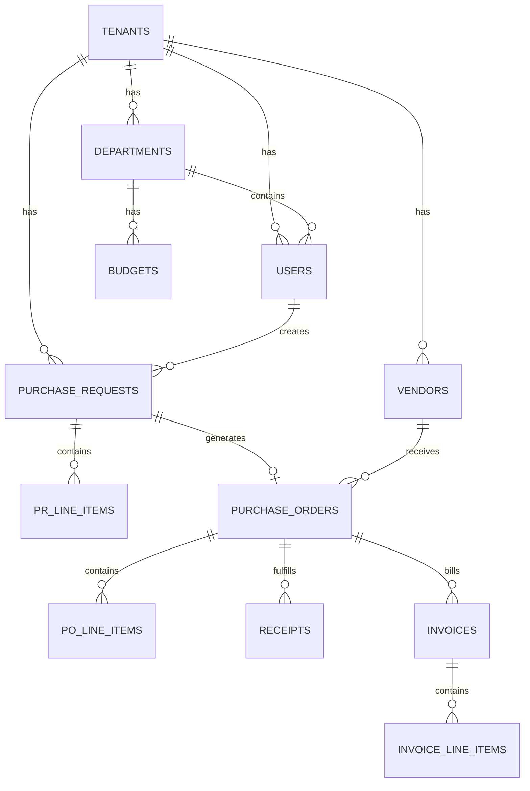
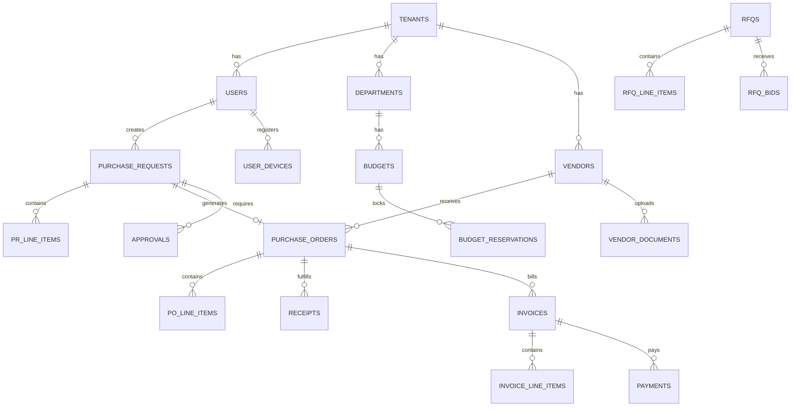

# SVPMS Backend Specification
## Complete Data Model, API, Business Logic, State Machines, Testing & Supporting Specs

**Version:** 4.1 Solo-Optimized | **Stack:** FastAPI + Neon Postgres + R2 + Firebase FCM + BackgroundTasks  
**AI-Executability:** 95% — All code blocks are copy-paste ready  
**Read 00_MANIFEST.md FIRST for tech stack context**

---

## TABLE OF CONTENTS

1. [Data Model (Complete DDL)](#1-data-model)
2. [OpenAPI Specification (40+ endpoints)](#2-openapi-specification)
3. [Business Logic Algorithms](#3-business-logic-algorithms)
4. [State Machines (PR, PO, Invoice, Vendor, RFQ)](#4-state-machines)
5. [Background Jobs (FastAPI BackgroundTasks)](#5-background-jobs)
6. [Error Catalog (100+ codes)](#6-error-catalog)
7. [Validation Schemas (Zod + Pydantic)](#7-validation-schemas)
8. [Roles & Permissions (Canonical RBAC)](#8-roles--permissions)
9. [Notification Dispatch Matrix](#9-notification-dispatch)
10. [Business Logic Edge Cases](#10-edge-cases)
11. [Testing Specifications](#11-testing)
12. [Seed Data](#12-seed-data)

---

## 1. DATA MODEL

### Stack-Specific Notes
- **Database:** Neon Postgres (serverless). Use `?sslmode=require` on all connection strings.
- **Connection pooling:** Use Neon's built-in pooler endpoint (`-pooler` suffix in hostname). Max ~100 concurrent.
- **Extensions:** `uuid-ossp`, `pgcrypto`, `pg_trgm` (for fuzzy vendor search). Request via Neon dashboard.
- **RLS:** PostgreSQL Row-Level Security for tenant isolation. Set `app.current_tenant_id` per session.
- **Money:** All monetary values as `BIGINT` cents. Never use `DECIMAL` or `FLOAT`.

### 1.1 Multi-Tenancy & Identity

**tenants**
```sql
CREATE TABLE tenants (
    id UUID PRIMARY KEY DEFAULT gen_random_uuid(),
    name VARCHAR(200) NOT NULL,
    slug VARCHAR(50) UNIQUE NOT NULL,
    status VARCHAR(20) DEFAULT 'ACTIVE',
    settings JSONB DEFAULT '{}',
    created_at TIMESTAMP DEFAULT CURRENT_TIMESTAMP,
    updated_at TIMESTAMP DEFAULT CURRENT_TIMESTAMP
);
CREATE INDEX idx_tenants_slug ON tenants(slug);
CREATE INDEX idx_tenants_status ON tenants(status);
```

**users**
```sql
CREATE TABLE users (
    id UUID PRIMARY KEY DEFAULT gen_random_uuid(),
    tenant_id UUID NOT NULL REFERENCES tenants(id),
    email VARCHAR(255) UNIQUE NOT NULL,
    password_hash VARCHAR(255),
    first_name VARCHAR(100),
    last_name VARCHAR(100),
    role VARCHAR(50) NOT NULL,
    department_id UUID REFERENCES departments(id),
    is_active BOOLEAN DEFAULT TRUE,
    mfa_enabled BOOLEAN DEFAULT FALSE,
    fcm_token TEXT,
    created_at TIMESTAMP DEFAULT CURRENT_TIMESTAMP,
    last_login_at TIMESTAMP,
    deleted_at TIMESTAMP
);
CREATE INDEX idx_users_tenant ON users(tenant_id);
CREATE INDEX idx_users_email ON users(email);
CREATE INDEX idx_users_role ON users(role);
```

**Roles:** admin, manager, finance, finance_head, cfo, procurement, procurement_lead, vendor

#### 3.2 Organization Structure

**departments**
```sql
CREATE TABLE departments (
    id UUID PRIMARY KEY DEFAULT gen_random_uuid(),
    tenant_id UUID NOT NULL REFERENCES tenants(id),
    name VARCHAR(200) NOT NULL,
    code VARCHAR(50),
    manager_id UUID REFERENCES users(id),
    parent_department_id UUID REFERENCES departments(id),
    created_at TIMESTAMP DEFAULT CURRENT_TIMESTAMP,
    UNIQUE(tenant_id, code)
);
```

**budgets**
```sql
CREATE TABLE budgets (
    id UUID PRIMARY KEY DEFAULT gen_random_uuid(),
    tenant_id UUID NOT NULL REFERENCES tenants(id),
    department_id UUID NOT NULL REFERENCES departments(id),
    fiscal_year INT NOT NULL,
    quarter INT CHECK (quarter IN (1,2,3,4)),
    total_cents BIGINT NOT NULL CHECK (total_cents > 0),
    spent_cents BIGINT DEFAULT 0,
    currency VARCHAR(3) DEFAULT 'INR',
    created_at TIMESTAMP DEFAULT CURRENT_TIMESTAMP,
    updated_at TIMESTAMP DEFAULT CURRENT_TIMESTAMP,
    UNIQUE(tenant_id, department_id, fiscal_year, quarter)
);
CREATE INDEX idx_budgets_dept ON budgets(department_id, fiscal_year);
```

**budget_reservations**
```sql
CREATE TABLE budget_reservations (
    id UUID PRIMARY KEY DEFAULT gen_random_uuid(),
    budget_id UUID NOT NULL REFERENCES budgets(id),
    entity_type VARCHAR(20) NOT NULL CHECK (entity_type IN ('PR', 'PO', 'INVOICE')),
    entity_id UUID NOT NULL,
    amount_cents BIGINT NOT NULL CHECK (amount_cents > 0),
    status VARCHAR(20) DEFAULT 'COMMITTED' CHECK (status IN ('COMMITTED', 'SPENT', 'RELEASED')),
    created_at TIMESTAMP DEFAULT CURRENT_TIMESTAMP,
    updated_at TIMESTAMP DEFAULT CURRENT_TIMESTAMP,
    released_at TIMESTAMP,
    UNIQUE(entity_type, entity_id)
);
CREATE INDEX idx_budget_res_budget ON budget_reservations(budget_id, status);
CREATE INDEX idx_budget_res_entity ON budget_reservations(entity_type, entity_id);
```

**audit_logs**
```sql
CREATE TABLE audit_logs (
    id UUID PRIMARY KEY DEFAULT gen_random_uuid(),
    tenant_id UUID NOT NULL REFERENCES tenants(id),
    actor_id UUID REFERENCES users(id),
    actor_email VARCHAR(255),
    action VARCHAR(100) NOT NULL,
    entity_type VARCHAR(50) NOT NULL,
    entity_id UUID NOT NULL,
    before_state JSONB,
    after_state JSONB,
    changed_fields TEXT[],
    ip_address INET,
    user_agent TEXT,
    request_id UUID,
    metadata JSONB DEFAULT '{}',
    created_at TIMESTAMP DEFAULT CURRENT_TIMESTAMP
);
CREATE INDEX idx_audit_tenant ON audit_logs(tenant_id);
CREATE INDEX idx_audit_entity ON audit_logs(entity_type, entity_id);
CREATE INDEX idx_audit_actor ON audit_logs(actor_id);
CREATE INDEX idx_audit_created ON audit_logs(created_at DESC);
-- Partition by month for performance (optional, for scale)
-- CREATE TABLE audit_logs_2026_01 PARTITION OF audit_logs FOR VALUES FROM ('2026-01-01') TO ('2026-02-01');
```

**Audit Log Helper Function:**
```python
# api/services/audit.py

async def create_audit_log(
    session: AsyncSession,
    tenant_id: str,
    actor_id: str,
    action: str,          # e.g., 'PR_SUBMITTED', 'PO_CANCELLED', 'VENDOR_APPROVED'
    entity_type: str,     # e.g., 'PurchaseRequest', 'Vendor', 'Invoice'
    entity_id: str,
    before_state: dict = None,
    after_state: dict = None,
    changed_fields: list[str] = None,
    ip_address: str = None,
    request_id: str = None,
):
    """
    Create immutable audit log entry.
    Called as a side effect of every state transition.
    """
    log = AuditLog(
        tenant_id=tenant_id,
        actor_id=actor_id,
        action=action,
        entity_type=entity_type,
        entity_id=entity_id,
        before_state=before_state,
        after_state=after_state,
        changed_fields=changed_fields or [],
        ip_address=ip_address,
        request_id=request_id,
    )
    session.add(log)
    await session.flush()
    return log
```

#### 3.3 Vendor Management

**vendors**
```sql
CREATE TABLE vendors (
    id UUID PRIMARY KEY DEFAULT gen_random_uuid(),
    tenant_id UUID NOT NULL REFERENCES tenants(id),
    legal_name VARCHAR(200) NOT NULL,
    tax_id VARCHAR(50),
    email VARCHAR(255) NOT NULL,
    phone VARCHAR(20),
    status VARCHAR(50) DEFAULT 'DRAFT',
    risk_score INT CHECK (risk_score BETWEEN 0 AND 100),
    rating DECIMAL(3,2) CHECK (rating BETWEEN 0 AND 10),
    bank_account_number_encrypted TEXT,
    bank_name VARCHAR(200),
    ifsc_code VARCHAR(20),
    created_at TIMESTAMP DEFAULT CURRENT_TIMESTAMP,
    updated_at TIMESTAMP DEFAULT CURRENT_TIMESTAMP,
    deleted_at TIMESTAMP
);
CREATE INDEX idx_vendors_tenant ON vendors(tenant_id);
CREATE INDEX idx_vendors_status ON vendors(status);
CREATE INDEX idx_vendors_email ON vendors(email);
```

**Status:** DRAFT, PENDING_REVIEW, ACTIVE, BLOCKED, SUSPENDED

#### 3.4 Purchase Requests

**purchase_requests**
```sql
CREATE TABLE purchase_requests (
    id UUID PRIMARY KEY DEFAULT gen_random_uuid(),
    tenant_id UUID NOT NULL REFERENCES tenants(id),
    pr_number VARCHAR(50) UNIQUE NOT NULL,
    requester_id UUID NOT NULL REFERENCES users(id),
    department_id UUID NOT NULL REFERENCES departments(id),
    status VARCHAR(50) DEFAULT 'DRAFT',
    total_cents BIGINT NOT NULL,
    currency VARCHAR(3) DEFAULT 'INR',
    description TEXT,
    justification TEXT,
    created_at TIMESTAMP DEFAULT CURRENT_TIMESTAMP,
    updated_at TIMESTAMP DEFAULT CURRENT_TIMESTAMP,
    submitted_at TIMESTAMP,
    approved_at TIMESTAMP,
    deleted_at TIMESTAMP
);
CREATE INDEX idx_pr_tenant ON purchase_requests(tenant_id);
CREATE INDEX idx_pr_status ON purchase_requests(status);
CREATE INDEX idx_pr_requester ON purchase_requests(requester_id);
```

**Status:** DRAFT, PENDING, APPROVED, REJECTED, CANCELLED

**pr_line_items**
```sql
CREATE TABLE pr_line_items (
    id UUID PRIMARY KEY DEFAULT gen_random_uuid(),
    pr_id UUID NOT NULL REFERENCES purchase_requests(id) ON DELETE CASCADE,
    line_number INT NOT NULL,
    description TEXT NOT NULL,
    quantity INT NOT NULL CHECK (quantity > 0),
    unit_price_cents BIGINT NOT NULL CHECK (unit_price_cents > 0),
    category VARCHAR(50),
    notes TEXT,
    created_at TIMESTAMP DEFAULT CURRENT_TIMESTAMP,
    UNIQUE(pr_id, line_number)
);
CREATE INDEX idx_pr_items_pr ON pr_line_items(pr_id);
```

#### 3.5 Purchase Orders

**purchase_orders**
```sql
CREATE TABLE purchase_orders (
    id UUID PRIMARY KEY DEFAULT gen_random_uuid(),
    tenant_id UUID NOT NULL REFERENCES tenants(id),
    po_number VARCHAR(50) UNIQUE NOT NULL,
    pr_id UUID REFERENCES purchase_requests(id),
    vendor_id UUID NOT NULL REFERENCES vendors(id),
    status VARCHAR(50) DEFAULT 'DRAFT',
    total_cents BIGINT NOT NULL,
    currency VARCHAR(3) DEFAULT 'INR',
    expected_delivery_date DATE,
    terms_and_conditions TEXT,
    created_at TIMESTAMP DEFAULT CURRENT_TIMESTAMP,
    updated_at TIMESTAMP DEFAULT CURRENT_TIMESTAMP,
    deleted_at TIMESTAMP
);
CREATE INDEX idx_po_tenant ON purchase_orders(tenant_id);
CREATE INDEX idx_po_vendor ON purchase_orders(vendor_id);
CREATE INDEX idx_po_status ON purchase_orders(status);
```

**Status:** DRAFT, SENT, ACKNOWLEDGED, PARTIALLY_FULFILLED, FULFILLED, CANCELLED

#### 3.6 Invoices

**invoices**
```sql
CREATE TABLE invoices (
    id UUID PRIMARY KEY DEFAULT gen_random_uuid(),
    tenant_id UUID NOT NULL REFERENCES tenants(id),
    invoice_number VARCHAR(100) NOT NULL,
    po_id UUID REFERENCES purchase_orders(id),
    vendor_id UUID NOT NULL REFERENCES vendors(id),
    status VARCHAR(50) DEFAULT 'UPLOADED',
    invoice_date DATE NOT NULL,
    due_date DATE,
    total_cents BIGINT NOT NULL,
    currency VARCHAR(3) DEFAULT 'INR',
    document_url TEXT,
    ocr_status VARCHAR(50),
    ocr_data JSONB,
    match_status VARCHAR(50),
    match_exceptions JSONB,
    created_at TIMESTAMP DEFAULT CURRENT_TIMESTAMP,
    updated_at TIMESTAMP DEFAULT CURRENT_TIMESTAMP
);
CREATE INDEX idx_invoices_tenant ON invoices(tenant_id);
CREATE INDEX idx_invoices_po ON invoices(po_id);
CREATE INDEX idx_invoices_status ON invoices(status);
```

**Status:** UPLOADED, OCR_PENDING, OCR_COMPLETE, MATCHED, EXCEPTION, APPROVED, PAID

#### 3.7 Approval Workflows

**approvals**
```sql
CREATE TABLE approvals (
    id UUID PRIMARY KEY DEFAULT gen_random_uuid(),
    tenant_id UUID NOT NULL REFERENCES tenants(id),
    entity_type VARCHAR(50) NOT NULL,
    entity_id UUID NOT NULL,
    approver_id UUID NOT NULL REFERENCES users(id),
    approval_level INT NOT NULL,
    status VARCHAR(50) DEFAULT 'PENDING',
    comments TEXT,
    approved_at TIMESTAMP,
    created_at TIMESTAMP DEFAULT CURRENT_TIMESTAMP
);
CREATE INDEX idx_approvals_entity ON approvals(entity_type, entity_id);
CREATE INDEX idx_approvals_approver ON approvals(approver_id, status);
```

#### 3.8 Audit Logs

**audit_logs**
```sql
CREATE TABLE audit_logs (
    id UUID PRIMARY KEY DEFAULT gen_random_uuid(),
    tenant_id UUID NOT NULL REFERENCES tenants(id),
    user_id UUID REFERENCES users(id),
    entity_type VARCHAR(50) NOT NULL,
    entity_id UUID NOT NULL,
    action VARCHAR(50) NOT NULL,
    changes JSONB,
    ip_address INET,
    user_agent TEXT,
    created_at TIMESTAMP DEFAULT CURRENT_TIMESTAMP
);
CREATE INDEX idx_audit_tenant ON audit_logs(tenant_id);
CREATE INDEX idx_audit_entity ON audit_logs(entity_type, entity_id);
CREATE INDEX idx_audit_created ON audit_logs(created_at DESC);
```

### Entity Relationship Diagram



---


### 1.2 Additional Tables (Receipts, RFQs, Payments)

**receipts**
```sql
CREATE TABLE receipts (
    id UUID PRIMARY KEY DEFAULT gen_random_uuid(),
    tenant_id UUID NOT NULL REFERENCES tenants(id),
    receipt_number VARCHAR(50) UNIQUE NOT NULL,
    po_id UUID NOT NULL REFERENCES purchase_orders(id),
    received_by UUID NOT NULL REFERENCES users(id),
    receipt_date DATE NOT NULL DEFAULT CURRENT_DATE,
    status VARCHAR(20) DEFAULT 'DRAFT' CHECK (status IN ('DRAFT','CONFIRMED','CANCELLED')),
    notes TEXT,
    created_at TIMESTAMP DEFAULT CURRENT_TIMESTAMP
);
CREATE INDEX idx_receipts_po ON receipts(po_id);
```

**receipt_line_items**
```sql
CREATE TABLE receipt_line_items (
    id UUID PRIMARY KEY DEFAULT gen_random_uuid(),
    receipt_id UUID NOT NULL REFERENCES receipts(id) ON DELETE CASCADE,
    po_line_item_id UUID NOT NULL,
    quantity_received INT NOT NULL CHECK (quantity_received > 0),
    condition VARCHAR(20) DEFAULT 'GOOD' CHECK (condition IN ('GOOD','DAMAGED','PARTIAL')),
    notes TEXT
);
```

**po_line_items**
```sql
CREATE TABLE po_line_items (
    id UUID PRIMARY KEY DEFAULT gen_random_uuid(),
    po_id UUID NOT NULL REFERENCES purchase_orders(id) ON DELETE CASCADE,
    line_number INT NOT NULL,
    description TEXT NOT NULL,
    quantity INT NOT NULL CHECK (quantity > 0),
    unit_price_cents BIGINT NOT NULL CHECK (unit_price_cents > 0),
    received_quantity INT DEFAULT 0,
    UNIQUE(po_id, line_number)
);
CREATE INDEX idx_po_items_po ON po_line_items(po_id);
```

**invoice_line_items**
```sql
CREATE TABLE invoice_line_items (
    id UUID PRIMARY KEY DEFAULT gen_random_uuid(),
    invoice_id UUID NOT NULL REFERENCES invoices(id) ON DELETE CASCADE,
    line_number INT NOT NULL,
    description TEXT NOT NULL,
    quantity INT NOT NULL CHECK (quantity > 0),
    unit_price_cents BIGINT NOT NULL CHECK (unit_price_cents > 0),
    UNIQUE(invoice_id, line_number)
);
```

**rfqs**
```sql
CREATE TABLE rfqs (
    id UUID PRIMARY KEY DEFAULT gen_random_uuid(),
    tenant_id UUID NOT NULL REFERENCES tenants(id),
    rfq_number VARCHAR(50) UNIQUE NOT NULL,
    title VARCHAR(300) NOT NULL,
    pr_id UUID REFERENCES purchase_requests(id),
    status VARCHAR(20) DEFAULT 'DRAFT' CHECK (status IN ('DRAFT','OPEN','CLOSED','AWARDED','CANCELLED')),
    deadline TIMESTAMP NOT NULL,
    created_by UUID NOT NULL REFERENCES users(id),
    created_at TIMESTAMP DEFAULT CURRENT_TIMESTAMP
);
```

**rfq_line_items**
```sql
CREATE TABLE rfq_line_items (
    id UUID PRIMARY KEY DEFAULT gen_random_uuid(),
    rfq_id UUID NOT NULL REFERENCES rfqs(id) ON DELETE CASCADE,
    description TEXT NOT NULL,
    quantity INT NOT NULL CHECK (quantity > 0),
    specifications TEXT
);
```

**rfq_bids**
```sql
CREATE TABLE rfq_bids (
    id UUID PRIMARY KEY DEFAULT gen_random_uuid(),
    rfq_id UUID NOT NULL REFERENCES rfqs(id),
    vendor_id UUID NOT NULL REFERENCES vendors(id),
    total_cents BIGINT NOT NULL,
    delivery_days INT,
    notes TEXT,
    score DECIMAL(5,2),
    submitted_at TIMESTAMP DEFAULT CURRENT_TIMESTAMP,
    UNIQUE(rfq_id, vendor_id)
);
```

**vendor_documents**
```sql
CREATE TABLE vendor_documents (
    id UUID PRIMARY KEY DEFAULT gen_random_uuid(),
    vendor_id UUID NOT NULL REFERENCES vendors(id) ON DELETE CASCADE,
    document_type VARCHAR(50) NOT NULL,
    file_url TEXT NOT NULL,
    file_name VARCHAR(255),
    file_size_bytes BIGINT,
    expiry_date DATE,
    uploaded_at TIMESTAMP DEFAULT CURRENT_TIMESTAMP
);
CREATE INDEX idx_vdocs_vendor ON vendor_documents(vendor_id);
CREATE INDEX idx_vdocs_expiry ON vendor_documents(expiry_date) WHERE expiry_date IS NOT NULL;
```

**payments**
```sql
CREATE TABLE payments (
    id UUID PRIMARY KEY DEFAULT gen_random_uuid(),
    tenant_id UUID NOT NULL REFERENCES tenants(id),
    invoice_id UUID NOT NULL REFERENCES invoices(id),
    amount_cents BIGINT NOT NULL CHECK (amount_cents > 0),
    currency VARCHAR(3) DEFAULT 'INR',
    status VARCHAR(20) DEFAULT 'PENDING' CHECK (status IN ('PENDING','PROCESSING','COMPLETED','FAILED')),
    stripe_payment_intent_id VARCHAR(255),
    paid_at TIMESTAMP,
    created_at TIMESTAMP DEFAULT CURRENT_TIMESTAMP
);
CREATE INDEX idx_payments_invoice ON payments(invoice_id);
CREATE INDEX idx_payments_status ON payments(status);
```

**user_devices** (FCM push notification tokens)
```sql
CREATE TABLE user_devices (
    id UUID PRIMARY KEY DEFAULT gen_random_uuid(),
    user_id UUID NOT NULL REFERENCES users(id) ON DELETE CASCADE,
    tenant_id UUID NOT NULL REFERENCES tenants(id),
    fcm_token VARCHAR(500) NOT NULL,
    device_type VARCHAR(10) NOT NULL CHECK (device_type IN ('android', 'ios', 'web')),
    device_name VARCHAR(200),
    is_active BOOLEAN DEFAULT TRUE,
    registered_at TIMESTAMP DEFAULT CURRENT_TIMESTAMP,
    updated_at TIMESTAMP DEFAULT CURRENT_TIMESTAMP,
    UNIQUE(user_id, fcm_token)
);
CREATE INDEX idx_user_devices_user ON user_devices(user_id, is_active);
CREATE INDEX idx_user_devices_tenant ON user_devices(tenant_id);
```

### 1.3 Performance Indexes

```sql
-- Dashboard queries
CREATE INDEX idx_pr_tenant_status_date ON purchase_requests(tenant_id, status, created_at DESC);
CREATE INDEX idx_pr_dept_status ON purchase_requests(department_id, status);
CREATE INDEX idx_invoices_vendor_status ON invoices(vendor_id, status);
CREATE INDEX idx_invoices_match_status ON invoices(match_status, created_at DESC);
CREATE INDEX idx_po_status_delivery ON purchase_orders(status, expected_delivery_date);
CREATE INDEX idx_approvals_user_status ON approvals(approver_id, status, created_at DESC);
CREATE INDEX idx_budgets_dept_year_quarter ON budgets(department_id, fiscal_year, quarter);
CREATE INDEX idx_budget_reservations_budget_status ON budget_reservations(budget_id, status);
-- Enable pg_trgm extension first: CREATE EXTENSION IF NOT EXISTS pg_trgm;
CREATE INDEX idx_vendors_name_trgm ON vendors USING gin (legal_name gin_trgm_ops);
CREATE INDEX idx_users_email_active ON users(email, is_active) WHERE deleted_at IS NULL;
```

### 1.4 Data Integrity Constraints

```sql
ALTER TABLE budgets ADD CONSTRAINT chk_budget_spent CHECK (spent_cents <= total_cents);
ALTER TABLE budgets ADD CONSTRAINT chk_budget_positive CHECK (total_cents > 0);
ALTER TABLE invoices ADD CONSTRAINT uq_invoice_vendor UNIQUE (tenant_id, invoice_number, vendor_id);
ALTER TABLE invoices ADD CONSTRAINT chk_invoice_date_not_future CHECK (invoice_date <= CURRENT_DATE);
ALTER TABLE invoices ADD CONSTRAINT chk_invoice_due_after_invoice CHECK (due_date IS NULL OR due_date >= invoice_date);
ALTER TABLE approvals ADD CONSTRAINT chk_approval_level_positive CHECK (approval_level > 0);
```

### 1.5 Row-Level Security (RLS)

```sql
-- Enable RLS on ALL tenant-scoped tables
ALTER TABLE users ENABLE ROW LEVEL SECURITY;
ALTER TABLE departments ENABLE ROW LEVEL SECURITY;
ALTER TABLE budgets ENABLE ROW LEVEL SECURITY;
ALTER TABLE budget_reservations ENABLE ROW LEVEL SECURITY;
ALTER TABLE vendors ENABLE ROW LEVEL SECURITY;
ALTER TABLE vendor_documents ENABLE ROW LEVEL SECURITY;
ALTER TABLE purchase_requests ENABLE ROW LEVEL SECURITY;
ALTER TABLE pr_line_items ENABLE ROW LEVEL SECURITY;
ALTER TABLE purchase_orders ENABLE ROW LEVEL SECURITY;
ALTER TABLE po_line_items ENABLE ROW LEVEL SECURITY;
ALTER TABLE invoices ENABLE ROW LEVEL SECURITY;
ALTER TABLE invoice_line_items ENABLE ROW LEVEL SECURITY;
ALTER TABLE receipts ENABLE ROW LEVEL SECURITY;
ALTER TABLE receipt_line_items ENABLE ROW LEVEL SECURITY;
ALTER TABLE rfqs ENABLE ROW LEVEL SECURITY;
ALTER TABLE rfq_bids ENABLE ROW LEVEL SECURITY;
ALTER TABLE approvals ENABLE ROW LEVEL SECURITY;
ALTER TABLE audit_logs ENABLE ROW LEVEL SECURITY;
ALTER TABLE payments ENABLE ROW LEVEL SECURITY;
ALTER TABLE user_devices ENABLE ROW LEVEL SECURITY;

-- Create isolation policies (repeat for each table)
CREATE POLICY tenant_isolation ON users
    USING (tenant_id = current_setting('app.current_tenant_id')::uuid);
CREATE POLICY tenant_isolation ON departments
    USING (tenant_id = current_setting('app.current_tenant_id')::uuid);
CREATE POLICY tenant_isolation ON vendors
    USING (tenant_id = current_setting('app.current_tenant_id')::uuid);
CREATE POLICY tenant_isolation ON purchase_requests
    USING (tenant_id = current_setting('app.current_tenant_id')::uuid);
CREATE POLICY tenant_isolation ON purchase_orders
    USING (tenant_id = current_setting('app.current_tenant_id')::uuid);
CREATE POLICY tenant_isolation ON invoices
    USING (tenant_id = current_setting('app.current_tenant_id')::uuid);
CREATE POLICY tenant_isolation ON budgets
    USING (tenant_id = current_setting('app.current_tenant_id')::uuid);
CREATE POLICY tenant_isolation ON approvals
    USING (tenant_id = current_setting('app.current_tenant_id')::uuid);
CREATE POLICY tenant_isolation ON audit_logs
    USING (tenant_id = current_setting('app.current_tenant_id')::uuid);
CREATE POLICY tenant_isolation ON payments
    USING (tenant_id = current_setting('app.current_tenant_id')::uuid);
CREATE POLICY tenant_isolation ON user_devices
    USING (tenant_id = current_setting('app.current_tenant_id')::uuid);
CREATE POLICY tenant_isolation ON rfqs
    USING (tenant_id = current_setting('app.current_tenant_id')::uuid);
-- Note: Line item tables inherit tenant context via JOINs to parent tables
```

### 1.6 Entity Relationship Diagram



---

## 1. OpenAPI Specification

### 1.1 Complete API Contract

```yaml
openapi: 3.0.3
info:
  title: SVPMS API
  version: 1.0.0
  description: Smart Vendor & Purchasing Management System API
  contact:
    email: api@svpms.example.com

servers:
  - url: https://api.svpms.example.com
    description: Production
  - url: https://staging.api.svpms.example.com
    description: Staging
  - url: http://localhost:8000
    description: Local Development

security:
  - BearerAuth: []

components:
  securitySchemes:
    BearerAuth:
      type: http
      scheme: bearer
      bearerFormat: JWT
      description: "JWT access token obtained from /auth/login"
  
  schemas:
    # ==========================================
    # Common Schemas
    # ==========================================
    
    Error:
      type: object
      required:
        - error
      properties:
        error:
          type: object
          required:
            - code
            - message
          properties:
            code:
              type: string
              example: "BUDGET_EXCEEDED"
            message:
              type: string
              example: "Department budget remaining is $40,000, request is $50,000"
            details:
              type: object
              additionalProperties: true
            trace_id:
              type: string
              format: uuid
    
    Pagination:
      type: object
      properties:
        page:
          type: integer
          example: 1
        limit:
          type: integer
          example: 50
        total:
          type: integer
          example: 150
        total_pages:
          type: integer
          example: 3
        has_next:
          type: boolean
        has_prev:
          type: boolean
    
    # ==========================================
    # Entity Schemas
    # ==========================================
    
    Vendor:
      type: object
      required:
        - id
        - tenant_id
        - legal_name
        - status
      properties:
        id:
          type: string
          format: uuid
        tenant_id:
          type: string
          format: uuid
        legal_name:
          type: string
          minLength: 2
          maxLength: 200
          example: "Acme Supplies Inc."
        tax_id:
          type: string
          pattern: '^[A-Z0-9]{10,15}$'
          example: "GSTIN12345"
        email:
          type: string
          format: email
          example: "vendor@acme.com"
        phone:
          type: string
          pattern: '^\+?[1-9]\d{1,14}$'
          example: "+1234567890"
        status:
          type: string
          enum: [DRAFT, PENDING_REVIEW, ACTIVE, BLOCKED, SUSPENDED]
          example: "ACTIVE"
        risk_score:
          type: integer
          minimum: 0
          maximum: 100
          example: 45
        rating:
          type: number
          format: float
          minimum: 0
          maximum: 10
          example: 8.5
        created_at:
          type: string
          format: date-time
        deleted_at:
          type: string
          format: date-time
          nullable: true
    
    VendorCreate:
      type: object
      required:
        - legal_name
        - tax_id
        - email
      properties:
        legal_name:
          type: string
          minLength: 2
          maxLength: 200
        tax_id:
          type: string
          pattern: '^[A-Z0-9]{10,15}$'
        email:
          type: string
          format: email
        phone:
          type: string
          pattern: '^\+?[1-9]\d{1,14}$'
        bank_account_number:
          type: string
          minLength: 8
          maxLength: 34
        bank_name:
          type: string
        ifsc_code:
          type: string
          pattern: '^[A-Z]{4}0[A-Z0-9]{6}$'
    
    PurchaseRequest:
      type: object
      required:
        - id
        - tenant_id
        - pr_number
        - requester_id
        - department_id
        - status
        - total_cents
        - currency
      properties:
        id:
          type: string
          format: uuid
        tenant_id:
          type: string
          format: uuid
        pr_number:
          type: string
          example: "PR-2026-0001"
        requester_id:
          type: string
          format: uuid
        department_id:
          type: string
          format: uuid
        status:
          type: string
          enum: [DRAFT, PENDING, APPROVED, REJECTED, CANCELLED]
        total_cents:
          type: integer
          minimum: 1
          example: 500000
        currency:
          type: string
          enum: [INR, USD, EUR, GBP]
          default: INR
        description:
          type: string
          maxLength: 1000
        line_items:
          type: array
          items:
            $ref: '#/components/schemas/PRLineItem'
        created_at:
          type: string
          format: date-time
        updated_at:
          type: string
          format: date-time
    
    PRLineItem:
      type: object
      required:
        - line_number
        - description
        - quantity
        - unit_price_cents
      properties:
        id:
          type: string
          format: uuid
        line_number:
          type: integer
          minimum: 1
        description:
          type: string
          minLength: 3
          maxLength: 500
        quantity:
          type: integer
          minimum: 1
          maximum: 999999
        unit_price_cents:
          type: integer
          minimum: 1
        category:
          type: string
          enum: [HARDWARE, SOFTWARE, SERVICES, OFFICE_SUPPLIES, OTHER]
        notes:
          type: string
          maxLength: 1000
    
    PRCreate:
      type: object
      required:
        - department_id
        - line_items
      properties:
        department_id:
          type: string
          format: uuid
        description:
          type: string
          maxLength: 1000
        line_items:
          type: array
          minItems: 1
          maxItems: 100
          items:
            type: object
            required:
              - description
              - quantity
              - unit_price_cents
            properties:
              description:
                type: string
              quantity:
                type: integer
              unit_price_cents:
                type: integer
              category:
                type: string
              notes:
                type: string
    
    PurchaseOrder:
      type: object
      properties:
        id:
          type: string
          format: uuid
        po_number:
          type: string
          example: "PO-2026-0001"
        tenant_id:
          type: string
          format: uuid
        pr_id:
          type: string
          format: uuid
        vendor_id:
          type: string
          format: uuid
        status:
          type: string
          enum: [DRAFT, ISSUED, ACKNOWLEDGED, PARTIALLY_FULFILLED, FULFILLED, CLOSED, CANCELLED, AMENDED]
        version:
          type: integer
          minimum: 1
        amended_from_po_id:
          type: string
          format: uuid
          nullable: true
        total_cents:
          type: integer
        currency:
          type: string
        issued_at:
          type: string
          format: date-time
        expected_delivery_date:
          type: string
          format: date
        line_items:
          type: array
          items:
            $ref: '#/components/schemas/POLineItem'
        created_at:
          type: string
          format: date-time
    
    POLineItem:
      type: object
      properties:
        id:
          type: string
          format: uuid
        line_number:
          type: integer
        description:
          type: string
        quantity:
          type: integer
        unit_price_cents:
          type: integer
        tax_percent:
          type: number
          format: float
        notes:
          type: string
    
    Invoice:
      type: object
      properties:
        id:
          type: string
          format: uuid
        tenant_id:
          type: string
          format: uuid
        po_id:
          type: string
          format: uuid
        vendor_id:
          type: string
          format: uuid
        invoice_number:
          type: string
        invoice_date:
          type: string
          format: date
        due_date:
          type: string
          format: date
        total_cents:
          type: integer
        currency:
          type: string
        status:
          type: string
          enum: [UPLOADED, MATCH_PENDING, MATCHED, PAID, EXCEPTION, DISPUTED]
        exception_details:
          type: array
          items:
            type: object
        s3_url:
          type: string
        ocr_confidence:
          type: number
          format: float
        line_items:
          type: array
          items:
            $ref: '#/components/schemas/InvoiceLineItem'
        created_at:
          type: string
          format: date-time
    
    InvoiceLineItem:
      type: object
      properties:
        id:
          type: string
          format: uuid
        line_number:
          type: integer
        description:
          type: string
        quantity:
          type: integer
        unit_price_cents:
          type: integer
    
    Receipt:
      type: object
      properties:
        id:
          type: string
          format: uuid
        po_id:
          type: string
          format: uuid
        receiver_id:
          type: string
          format: uuid
        type:
          type: string
          enum: [GOOD, SERVICE]
        received_at:
          type: string
          format: date-time
        notes:
          type: string
        line_items:
          type: array
          items:
            $ref: '#/components/schemas/ReceiptLineItem'
    
    ReceiptLineItem:
      type: object
      properties:
        id:
          type: string
          format: uuid
        po_line_item_id:
          type: string
          format: uuid
        quantity_received:
          type: integer
        quality_status:
          type: string
          enum: [ACCEPTED, REJECTED, DAMAGED]
        notes:
          type: string
    
    Department:
      type: object
      properties:
        id:
          type: string
          format: uuid
        tenant_id:
          type: string
          format: uuid
        name:
          type: string
        manager_id:
          type: string
          format: uuid
        created_at:
          type: string
          format: date-time
    
    Budget:
      type: object
      properties:
        id:
          type: string
          format: uuid
        tenant_id:
          type: string
          format: uuid
        department_id:
          type: string
          format: uuid
        total_cents:
          type: integer
        reserved_cents:
          type: integer
        spent_cents:
          type: integer
        available_cents:
          type: integer
          description: "Calculated: total - (reserved + spent)"
        fiscal_year:
          type: integer
        quarter:
          type: integer
          minimum: 1
          maximum: 4
        start_date:
          type: string
          format: date
        end_date:
          type: string
          format: date
  
  responses:
    UnauthorizedError:
      description: "Authentication required or token invalid"
      content:
        application/json:
          schema:
            $ref: '#/components/schemas/Error'
          example:
            error:
              code: "UNAUTHORIZED"
              message: "Authentication required"
    
    ForbiddenError:
      description: "Insufficient permissions"
      content:
        application/json:
          schema:
            $ref: '#/components/schemas/Error'
          example:
            error:
              code: "INSUFFICIENT_PERMISSIONS"
              message: "User does not have permission to perform this action"
    
    NotFoundError:
      description: "Resource not found"
      content:
        application/json:
          schema:
            $ref: '#/components/schemas/Error'
          example:
            error:
              code: "NOT_FOUND"
              message: "Resource not found"
    
    ConflictError:
      description: "Resource conflict"
      content:
        application/json:
          schema:
            $ref: '#/components/schemas/Error'
          example:
            error:
              code: "RESOURCE_CONFLICT"
              message: "Resource already exists or state conflict"

paths:
  # ==========================================
  # Authentication
  # ==========================================
  
  /auth/login:
    post:
      summary: User login
      tags:
        - Authentication
      security: []
      requestBody:
        required: true
        content:
          application/json:
            schema:
              type: object
              required:
                - email
                - password
              properties:
                email:
                  type: string
                  format: email
                password:
                  type: string
                  format: password
                mfa_code:
                  type: string
                  pattern: '^\d{6}$'
      responses:
        '200':
          description: Login successful
          content:
            application/json:
              schema:
                type: object
                properties:
                  access_token:
                    type: string
                  refresh_token:
                    type: string
                  token_type:
                    type: string
                    example: "Bearer"
                  expires_in:
                    type: integer
                    example: 900
        '401':
          description: Invalid credentials
        '403':
          description: MFA required
  
  /auth/refresh:
    post:
      summary: Refresh access token
      tags:
        - Authentication
      security: []
      requestBody:
        required: true
        content:
          application/json:
            schema:
              type: object
              required:
                - refresh_token
              properties:
                refresh_token:
                  type: string
      responses:
        '200':
          description: Token refreshed
          content:
            application/json:
              schema:
                type: object
                properties:
                  access_token:
                    type: string
                  refresh_token:
                    type: string
                  expires_in:
                    type: integer
  
  # ==========================================
  # Devices (FCM Push Token Registration)
  # ==========================================

  /api/v1/users/me/devices:
    post:
      summary: Register FCM device token
      description: Called by Flutter app on startup and onTokenRefresh
      tags: [Devices]
      requestBody:
        required: true
        content:
          application/json:
            schema:
              type: object
              required: [fcm_token, device_type]
              properties:
                fcm_token:
                  type: string
                  minLength: 10
                  maxLength: 500
                device_type:
                  type: string
                  enum: [android, ios, web]
                device_name:
                  type: string
                  maxLength: 200
      responses:
        "201":
          description: Device registered
        "401":
          description: Unauthorized
    get:
      summary: List user's registered devices
      tags: [Devices]
      responses:
        "200":
          description: Active devices list

  /api/v1/users/me/devices/{device_id}:
    delete:
      summary: Unregister device (on logout)
      tags: [Devices]
      parameters:
        - in: path
          name: device_id
          required: true
          schema:
            type: string
            format: uuid
      responses:
        "204":
          description: Device deactivated

  # ==========================================
  # Vendors
  # ==========================================
  
  /api/v1/vendors:
    get:
      summary: List all vendors
      tags:
        - Vendors
      parameters:
        - name: status
          in: query
          schema:
            type: string
            enum: [DRAFT, PENDING_REVIEW, ACTIVE, BLOCKED, SUSPENDED]
        - name: risk_score_max
          in: query
          schema:
            type: integer
        - name: search
          in: query
          description: "Search by legal_name or tax_id"
          schema:
            type: string
        - name: page
          in: query
          schema:
            type: integer
            default: 1
        - name: limit
          in: query
          schema:
            type: integer
            default: 50
            maximum: 100
      responses:
        '200':
          description: List of vendors
          content:
            application/json:
              schema:
                type: object
                properties:
                  data:
                    type: array
                    items:
                      $ref: '#/components/schemas/Vendor'
                  pagination:
                    $ref: '#/components/schemas/Pagination'
        '401':
          $ref: '#/components/responses/UnauthorizedError'
    
    post:
      summary: Create new vendor
      tags:
        - Vendors
      requestBody:
        required: true
        content:
          application/json:
            schema:
              $ref: '#/components/schemas/VendorCreate'
      responses:
        '201':
          description: Vendor created
          content:
            application/json:
              schema:
                $ref: '#/components/schemas/Vendor'
        '400':
          description: Validation error
          content:
            application/json:
              schema:
                $ref: '#/components/schemas/Error'
              examples:
                invalid_tax_id:
                  value:
                    error:
                      code: "INVALID_TAX_ID"
                      message: "Tax ID must be 10-15 alphanumeric characters"
        '409':
          description: Vendor already exists
  
  /api/v1/vendors/{vendor_id}:
    get:
      summary: Get vendor by ID
      tags:
        - Vendors
      parameters:
        - name: vendor_id
          in: path
          required: true
          schema:
            type: string
            format: uuid
      responses:
        '200':
          description: Vendor details
          content:
            application/json:
              schema:
                $ref: '#/components/schemas/Vendor'
        '404':
          $ref: '#/components/responses/NotFoundError'
    
    put:
      summary: Update vendor
      tags:
        - Vendors
      parameters:
        - name: vendor_id
          in: path
          required: true
          schema:
            type: string
            format: uuid
      requestBody:
        required: true
        content:
          application/json:
            schema:
              type: object
              properties:
                legal_name:
                  type: string
                email:
                  type: string
                phone:
                  type: string
      responses:
        '200':
          description: Vendor updated
          content:
            application/json:
              schema:
                $ref: '#/components/schemas/Vendor'
        '404':
          $ref: '#/components/responses/NotFoundError'
    
    delete:
      summary: Delete vendor (soft delete)
      tags:
        - Vendors
      parameters:
        - name: vendor_id
          in: path
          required: true
          schema:
            type: string
            format: uuid
      responses:
        '204':
          description: Vendor deleted
        '409':
          description: Cannot delete vendor with active POs
  
  /api/v1/vendors/{vendor_id}/approve:
    post:
      summary: Approve vendor
      tags:
        - Vendors
      parameters:
        - name: vendor_id
          in: path
          required: true
          schema:
            type: string
            format: uuid
      responses:
        '200':
          description: Vendor approved
          content:
            application/json:
              schema:
                $ref: '#/components/schemas/Vendor'
        '400':
          description: Invalid state transition
        '403':
          description: Insufficient permissions (requires MANAGER role)
  
  /api/v1/vendors/{vendor_id}/block:
    post:
      summary: Block vendor
      tags:
        - Vendors
      parameters:
        - name: vendor_id
          in: path
          required: true
          schema:
            type: string
            format: uuid
      requestBody:
        required: true
        content:
          application/json:
            schema:
              type: object
              required:
                - reason
              properties:
                reason:
                  type: string
                  minLength: 10
      responses:
        '200':
          description: Vendor blocked
  
  # ==========================================
  # Purchase Requests
  # ==========================================
  
  /api/v1/purchase-requests:
    get:
      summary: List purchase requests
      tags:
        - Purchase Requests
      parameters:
        - name: status
          in: query
          schema:
            type: string
            enum: [DRAFT, PENDING, APPROVED, REJECTED, CANCELLED]
        - name: department_id
          in: query
          schema:
            type: string
            format: uuid
        - name: requester_id
          in: query
          schema:
            type: string
            format: uuid
        - name: from_date
          in: query
          schema:
            type: string
            format: date
        - name: to_date
          in: query
          schema:
            type: string
            format: date
        - name: page
          in: query
          schema:
            type: integer
            default: 1
        - name: limit
          in: query
          schema:
            type: integer
            default: 50
      responses:
        '200':
          description: List of purchase requests
          content:
            application/json:
              schema:
                type: object
                properties:
                  data:
                    type: array
                    items:
                      $ref: '#/components/schemas/PurchaseRequest'
                  pagination:
                    $ref: '#/components/schemas/Pagination'
    
    post:
      summary: Create purchase request
      tags:
        - Purchase Requests
      requestBody:
        required: true
        content:
          application/json:
            schema:
              $ref: '#/components/schemas/PRCreate'
      responses:
        '201':
          description: PR created
          content:
            application/json:
              schema:
                $ref: '#/components/schemas/PurchaseRequest'
        '400':
          description: Validation error
          content:
            application/json:
              schema:
                $ref: '#/components/schemas/Error'
              examples:
                budget_exceeded:
                  value:
                    error:
                      code: "BUDGET_EXCEEDED"
                      message: "Department budget remaining is $40,000, request is $50,000"
                      details:
                        available_cents: 4000000
                        requested_cents: 5000000
  
  /api/v1/purchase-requests/{pr_id}:
    get:
      summary: Get purchase request by ID
      tags:
        - Purchase Requests
      parameters:
        - name: pr_id
          in: path
          required: true
          schema:
            type: string
            format: uuid
      responses:
        '200':
          description: PR details
          content:
            application/json:
              schema:
                $ref: '#/components/schemas/PurchaseRequest'
        '404':
          $ref: '#/components/responses/NotFoundError'
    
    put:
      summary: Update purchase request (DRAFT only)
      tags:
        - Purchase Requests
      parameters:
        - name: pr_id
          in: path
          required: true
          schema:
            type: string
            format: uuid
      requestBody:
        required: true
        content:
          application/json:
            schema:
              $ref: '#/components/schemas/PRCreate'
      responses:
        '200':
          description: PR updated
        '400':
          description: Cannot update PR in non-DRAFT status
  
  /api/v1/purchase-requests/{pr_id}/submit:
    post:
      summary: Submit PR for approval
      tags:
        - Purchase Requests
      parameters:
        - name: pr_id
          in: path
          required: true
          schema:
            type: string
            format: uuid
      responses:
        '200':
          description: PR submitted
          content:
            application/json:
              schema:
                $ref: '#/components/schemas/PurchaseRequest'
        '400':
          description: Budget check failed or invalid state
  
  /api/v1/purchase-requests/{pr_id}/approve:
    post:
      summary: Approve purchase request
      tags:
        - Purchase Requests
      parameters:
        - name: pr_id
          in: path
          required: true
          schema:
            type: string
            format: uuid
      requestBody:
        content:
          application/json:
            schema:
              type: object
              properties:
                comment:
                  type: string
                  maxLength: 500
      responses:
        '200':
          description: PR approved
        '400':
          description: Invalid state transition or budget exceeded
        '403':
          description: Not authorized to approve
  
  /api/v1/purchase-requests/{pr_id}/reject:
    post:
      summary: Reject purchase request
      tags:
        - Purchase Requests
      parameters:
        - name: pr_id
          in: path
          required: true
          schema:
            type: string
            format: uuid
      requestBody:
        required: true
        content:
          application/json:
            schema:
              type: object
              required:
                - reason
              properties:
                reason:
                  type: string
                  minLength: 10
                  maxLength: 1000
      responses:
        '200':
          description: PR rejected
  
  # ==========================================
  # Purchase Orders
  # ==========================================
  
  /api/v1/purchase-orders:
    get:
      summary: List purchase orders
      tags:
        - Purchase Orders
      parameters:
        - name: status
          in: query
          schema:
            type: string
        - name: vendor_id
          in: query
          schema:
            type: string
            format: uuid
        - name: pr_id
          in: query
          schema:
            type: string
            format: uuid
        - name: page
          in: query
          schema:
            type: integer
            default: 1
        - name: limit
          in: query
          schema:
            type: integer
            default: 50
      responses:
        '200':
          description: List of purchase orders
          content:
            application/json:
              schema:
                type: object
                properties:
                  data:
                    type: array
                    items:
                      $ref: '#/components/schemas/PurchaseOrder'
                  pagination:
                    $ref: '#/components/schemas/Pagination'
    
    post:
      summary: Create/Issue purchase order
      tags:
        - Purchase Orders
      requestBody:
        required: true
        content:
          application/json:
            schema:
              type: object
              required:
                - pr_id
                - vendor_id
              properties:
                pr_id:
                  type: string
                  format: uuid
                vendor_id:
                  type: string
                  format: uuid
                expected_delivery_date:
                  type: string
                  format: date
      responses:
        '201':
          description: PO created and issued
          content:
            application/json:
              schema:
                $ref: '#/components/schemas/PurchaseOrder'
        '400':
          description: Vendor not active or PR not approved
        '409':
          description: Budget conflict
  
  /api/v1/purchase-orders/{po_id}:
    get:
      summary: Get purchase order by ID
      tags:
        - Purchase Orders
      parameters:
        - name: po_id
          in: path
          required: true
          schema:
            type: string
            format: uuid
      responses:
        '200':
          description: PO details
          content:
            application/json:
              schema:
                $ref: '#/components/schemas/PurchaseOrder'
        '404':
          $ref: '#/components/responses/NotFoundError'
  
  /api/v1/purchase-orders/{po_id}/acknowledge:
    post:
      summary: Vendor acknowledges PO
      tags:
        - Purchase Orders
      parameters:
        - name: po_id
          in: path
          required: true
          schema:
            type: string
            format: uuid
      responses:
        '200':
          description: PO acknowledged
        '400':
          description: PO not in ISSUED status
        '403':
          description: Only vendor can acknowledge
  
  /api/v1/purchase-orders/{po_id}/amend:
    post:
      summary: Create PO amendment
      tags:
        - Purchase Orders
      parameters:
        - name: po_id
          in: path
          required: true
          schema:
            type: string
            format: uuid
      requestBody:
        required: true
        content:
          application/json:
            schema:
              type: object
              properties:
                line_items:
                  type: array
                  items:
                    type: object
                expected_delivery_date:
                  type: string
                  format: date
      responses:
        '201':
          description: Amendment created (new PO with version++)
          content:
            application/json:
              schema:
                $ref: '#/components/schemas/PurchaseOrder'
        '400':
          description: Cannot amend cancelled/closed PO
  
  /api/v1/purchase-orders/{po_id}/cancel:
    post:
      summary: Cancel purchase order
      tags:
        - Purchase Orders
      parameters:
        - name: po_id
          in: path
          required: true
          schema:
            type: string
            format: uuid
      requestBody:
        required: true
        content:
          application/json:
            schema:
              type: object
              required:
                - reason
              properties:
                reason:
                  type: string
      responses:
        '200':
          description: PO cancelled
        '400':
          description: Cannot cancel fulfilled/closed PO
  
  # ==========================================
  # Receipts (GRN/SES)
  # ==========================================
  
  /api/v1/receipts:
    post:
      summary: Record goods/service receipt
      tags:
        - Receipts
      requestBody:
        required: true
        content:
          application/json:
            schema:
              type: object
              required:
                - po_id
                - type
                - line_items
              properties:
                po_id:
                  type: string
                  format: uuid
                type:
                  type: string
                  enum: [GOOD, SERVICE]
                notes:
                  type: string
                line_items:
                  type: array
                  items:
                    type: object
                    required:
                      - po_line_item_id
                      - quantity_received
                      - quality_status
                    properties:
                      po_line_item_id:
                        type: string
                        format: uuid
                      quantity_received:
                        type: integer
                      quality_status:
                        type: string
                        enum: [ACCEPTED, REJECTED, DAMAGED]
                      notes:
                        type: string
      responses:
        '201':
          description: Receipt created
          content:
            application/json:
              schema:
                $ref: '#/components/schemas/Receipt'
        '400':
          description: Quantity exceeds ordered amount
  
  /api/v1/receipts/{receipt_id}:
    get:
      summary: Get receipt by ID
      tags:
        - Receipts
      parameters:
        - name: receipt_id
          in: path
          required: true
          schema:
            type: string
            format: uuid
      responses:
        '200':
          description: Receipt details
          content:
            application/json:
              schema:
                $ref: '#/components/schemas/Receipt'
  
  # ==========================================
  # Invoices
  # ==========================================
  
  /api/v1/invoices:
    get:
      summary: List invoices
      tags:
        - Invoices
      parameters:
        - name: status
          in: query
          schema:
            type: string
        - name: vendor_id
          in: query
          schema:
            type: string
            format: uuid
        - name: po_id
          in: query
          schema:
            type: string
            format: uuid
        - name: page
          in: query
          schema:
            type: integer
        - name: limit
          in: query
          schema:
            type: integer
      responses:
        '200':
          description: List of invoices
          content:
            application/json:
              schema:
                type: object
                properties:
                  data:
                    type: array
                    items:
                      $ref: '#/components/schemas/Invoice'
                  pagination:
                    $ref: '#/components/schemas/Pagination'
    
    post:
      summary: Upload invoice
      tags:
        - Invoices
      requestBody:
        required: true
        content:
          multipart/form-data:
            schema:
              type: object
              required:
                - invoice_pdf
                - po_id
                - invoice_number
                - invoice_date
                - total_cents
              properties:
                invoice_pdf:
                  type: string
                  format: binary
                po_id:
                  type: string
                  format: uuid
                invoice_number:
                  type: string
                invoice_date:
                  type: string
                  format: date
                due_date:
                  type: string
                  format: date
                total_cents:
                  type: integer
      responses:
        '201':
          description: Invoice uploaded and queued for OCR
          content:
            application/json:
              schema:
                $ref: '#/components/schemas/Invoice'
        '400':
          description: Invalid file or missing PO
        '409':
          description: Duplicate invoice detected
  
  /api/v1/invoices/{invoice_id}:
    get:
      summary: Get invoice by ID
      tags:
        - Invoices
      parameters:
        - name: invoice_id
          in: path
          required: true
          schema:
            type: string
            format: uuid
      responses:
        '200':
          description: Invoice details
          content:
            application/json:
              schema:
                $ref: '#/components/schemas/Invoice'
  
  /api/v1/invoices/{invoice_id}/dispute:
    post:
      summary: Vendor disputes invoice exception
      tags:
        - Invoices
      parameters:
        - name: invoice_id
          in: path
          required: true
          schema:
            type: string
            format: uuid
      requestBody:
        required: true
        content:
          application/json:
            schema:
              type: object
              required:
                - reason
              properties:
                reason:
                  type: string
                attachments:
                  type: array
                  items:
                    type: string
                    format: uri
      responses:
        '200':
          description: Dispute recorded
        '400':
          description: Invoice not in EXCEPTION status
  
  /api/v1/invoices/{invoice_id}/override:
    post:
      summary: Override invoice exception and approve payment
      tags:
        - Invoices
      parameters:
        - name: invoice_id
          in: path
          required: true
          schema:
            type: string
            format: uuid
      requestBody:
        required: true
        content:
          application/json:
            schema:
              type: object
              required:
                - reason
              properties:
                reason:
                  type: string
      responses:
        '200':
          description: Exception overridden
        '403':
          description: Requires FINANCE_MANAGER or CFO role
  
  # ==========================================
  # 3-Way Match
  # ==========================================
  
  /api/v1/match:
    post:
      summary: Run 3-way match for invoice
      tags:
        - Matching
      requestBody:
        required: true
        content:
          application/json:
            schema:
              type: object
              required:
                - po_id
                - invoice_id
              properties:
                po_id:
                  type: string
                  format: uuid
                invoice_id:
                  type: string
                  format: uuid
                tolerance_percent:
                  type: number
                  format: float
                  default: 0.02
      responses:
        '200':
          description: Match result
          content:
            application/json:
              schema:
                type: object
                properties:
                  result:
                    type: string
                    enum: [MATCHED, EXCEPTION]
                  exceptions:
                    type: array
                    items:
                      type: object
                      properties:
                        type:
                          type: string
                          enum: [QTY_MISMATCH, PRICE_VARIANCE, MISSING_INVOICE_LINE]
                        details:
                          type: object
                  details:
                    type: object
  
  # ==========================================
  # Departments & Budgets
  # ==========================================
  
  /api/v1/departments:
    get:
      summary: List departments
      tags:
        - Departments
      responses:
        '200':
          description: List of departments
          content:
            application/json:
              schema:
                type: object
                properties:
                  data:
                    type: array
                    items:
                      $ref: '#/components/schemas/Department'
  
  /api/v1/budgets:
    get:
      summary: List budgets
      tags:
        - Budgets
      parameters:
        - name: department_id
          in: query
          schema:
            type: string
            format: uuid
        - name: fiscal_year
          in: query
          schema:
            type: integer
        - name: quarter
          in: query
          schema:
            type: integer
      responses:
        '200':
          description: List of budgets
          content:
            application/json:
              schema:
                type: object
                properties:
                  data:
                    type: array
                    items:
                      $ref: '#/components/schemas/Budget'
  
  /api/v1/budgets/{budget_id}:
    get:
      summary: Get budget details
      tags:
        - Budgets
      parameters:
        - name: budget_id
          in: path
          required: true
          schema:
            type: string
            format: uuid
      responses:
        '200':
          description: Budget details with real-time availability
          content:
            application/json:
              schema:
                $ref: '#/components/schemas/Budget'
  
  # ==========================================
  # Analytics & Reporting
  # ==========================================
  
  /api/v1/analytics/spend:
    get:
      summary: Get spend analytics
      tags:
        - Analytics
      parameters:
        - name: department_id
          in: query
          schema:
            type: string
            format: uuid
        - name: from_date
          in: query
          schema:
            type: string
            format: date
        - name: to_date
          in: query
          schema:
            type: string
            format: date
        - name: group_by
          in: query
          schema:
            type: string
            enum: [category, vendor, month]
      responses:
        '200':
          description: Spend analytics
          content:
            application/json:
              schema:
                type: object
                properties:
                  total_cents:
                    type: integer
                  breakdown:
                    type: array
                    items:
                      type: object
  
  /api/v1/analytics/vendors:
    get:
      summary: Get vendor performance metrics
      tags:
        - Analytics
      parameters:
        - name: vendor_id
          in: query
          schema:
            type: string
            format: uuid
      responses:
        '200':
          description: Vendor metrics
          content:
            application/json:
              schema:
                type: object
                properties:
                  on_time_delivery_pct:
                    type: number
                  exception_rate_pct:
                    type: number
                  total_spend_cents:
                    type: integer
```

### 1.2 API Visibility Rules (RLS / Authorization)

**Critical for Multi-tenancy and Security**

```python
# api/middleware/tenant.py

from fastapi import Request, HTTPException
from typing import Annotated
from fastapi import Depends

async def get_current_tenant(request: Request) -> str:
    """
    Extract tenant_id from JWT token or X-Tenant-ID header.
    
    This function MUST be called as a dependency for all endpoints.
    Sets PostgreSQL session variable for RLS enforcement.
    """
    # Step 1: Check JWT claims
    if hasattr(request.state, 'user'):
        tenant_id = request.state.user.get('tenant_id')
    else:
        # Step 2: Fallback to header (for testing)
        tenant_id = request.headers.get('X-Tenant-ID')
    
    if not tenant_id:
        raise HTTPException(
            status_code=401,
            detail={
                "error": {
                    "code": "MISSING_TENANT_CONTEXT",
                    "message": "Tenant context not found in token or headers"
                }
            }
        )
    
    return tenant_id

async def get_current_user(request: Request) -> dict:
    """
    Extract user from JWT token.
    
    Returns dict with: user_id, tenant_id, role, email
    """
    if not hasattr(request.state, 'user'):
        raise HTTPException(
            status_code=401,
            detail={
                "error": {
                    "code": "UNAUTHORIZED",
                    "message": "Authentication required"
                }
            }
        )
    
    return request.state.user

# Type aliases for dependency injection
TenantID = Annotated[str, Depends(get_current_tenant)]
CurrentUser = Annotated[dict, Depends(get_current_user)]


# Usage in route handlers:

@router.get('/api/v1/vendors')
async def list_vendors(
    tenant_id: TenantID,  # <-- Automatically injected
    current_user: CurrentUser,  # <-- Automatically injected
    status: str | None = None,
    db: AsyncSession = Depends(get_db)
):
    """
    List vendors for current tenant.
    
    RLS automatically filters by tenant_id at database level.
    Additional filtering based on user role:
    - ADMIN/MANAGER: See all vendors
    - VENDOR: See only their own vendor record
    """
    
    # Set PostgreSQL session variable for RLS
    await db.execute(text(f"SET app.current_tenant = '{tenant_id}'"))
    
    # Role-based filtering
    query = select(Vendor).where(Vendor.deleted_at == None)
    
    if current_user['role'] == 'vendor':
        # Vendors can only see their own record
        query = query.where(Vendor.id == current_user['vendor_id'])
    
    if status:
        query = query.where(Vendor.status == status)
    
    result = await db.execute(query)
    vendors = result.scalars().all()
    
    return {"data": vendors}
```

**Data Visibility Matrix:**

| Endpoint | Role | Filter Logic |
|----------|------|--------------|
| GET /vendors | ADMIN | All vendors (tenant-scoped via RLS) |
| GET /vendors | MANAGER | All vendors (tenant-scoped) |
| GET /vendors | VENDOR | WHERE vendor_id = current_user.vendor_id |
| GET /purchase-orders | ADMIN | All POs (tenant-scoped) |
| GET /purchase-orders | MANAGER | WHERE department_id = current_user.department_id |
| GET /purchase-orders | VENDOR | WHERE vendor_id = current_user.vendor_id |
| GET /budgets | MANAGER | WHERE department_id IN (managed_departments) |
| GET /budgets | FINANCE | All budgets (tenant-scoped) |

---

## 2. Business Logic Algorithms

### 2.1 Budget Check Algorithm

```python
# api/services/budget.py

from sqlalchemy import select, func, text
from sqlalchemy.orm import Session
from decimal import Decimal
from dataclasses import dataclass

@dataclass
class BudgetCheckResult:
    success: bool
    available_cents: int
    requested_cents: int
    error_code: str | None = None
    message: str | None = None

async def check_budget_availability(
    session: Session,
    department_id: str,
    amount_cents: int,
    fiscal_period: dict  # {'fiscal_year': 2026, 'quarter': 1}
) -> BudgetCheckResult:
    """
    Check if department has sufficient budget and reserve if available.
    
    Uses pessimistic locking to prevent race conditions.
    MUST be called within an active transaction.
    
    Algorithm:
    1. Lock budget row (SELECT FOR UPDATE)
    2. Calculate committed reservations
    3. Calculate available = total - (reserved + spent)
    4. If sufficient: return success
    5. If insufficient: rollback and return error
    
    Args:
        session: SQLAlchemy async session (active transaction)
        department_id: UUID of department
        amount_cents: Amount to check in cents
        fiscal_period: Dict with fiscal_year and quarter
    
    Returns:
        BudgetCheckResult with success status and details
    
    Raises:
        NoBudgetFoundError: If no budget exists for period
    """
    
    # Step 1: Lock the budget row (pessimistic lock)
    budget_query = select(Budget).where(
        Budget.department_id == department_id,
        Budget.fiscal_year == fiscal_period['fiscal_year'],
        Budget.quarter == fiscal_period.get('quarter')  # None for annual
    ).with_for_update()
    
    result = await session.execute(budget_query)
    budget = result.scalar_one_or_none()
    
    if not budget:
        raise NoBudgetFoundError(
            f"No budget found for department {department_id}, "
            f"FY{fiscal_period['fiscal_year']} Q{fiscal_period.get('quarter', 'Annual')}"
        )
    
    # Step 2: Calculate committed reservations
    reservations_query = select(
        func.sum(BudgetReservation.amount_cents)
    ).where(
        BudgetReservation.budget_id == budget.id,
        BudgetReservation.status == 'COMMITTED'
    )
    
    result = await session.execute(reservations_query)
    committed_cents = result.scalar() or 0
    
    # Step 3: Calculate available balance
    available_cents = budget.total_cents - (committed_cents + budget.spent_cents)
    
    # Step 4: Check if sufficient
    if available_cents < amount_cents:
        await session.rollback()
        return BudgetCheckResult(
            success=False,
            available_cents=available_cents,
            requested_cents=amount_cents,
            error_code="BUDGET_EXCEEDED",
            message=(
                f"Department budget remaining is ${available_cents/100:.2f}, "
                f"request is ${amount_cents/100:.2f}"
            )
        )
    
    # Success - budget is available (reservation happens in calling function)
    return BudgetCheckResult(
        success=True,
        available_cents=available_cents,
        requested_cents=amount_cents
    )


async def reserve_budget(
    session: Session,
    budget_id: str,
    entity_type: str,  # 'PR', 'PO', 'INVOICE'
    entity_id: str,
    amount_cents: int
) -> BudgetReservation:
    """
    Create budget reservation.
    
    Called after successful budget check.
    """
    reservation = BudgetReservation(
        budget_id=budget_id,
        entity_type=entity_type,
        entity_id=entity_id,
        amount_cents=amount_cents,
        status='COMMITTED'
    )
    
    session.add(reservation)
    await session.flush()
    
    return reservation


async def release_budget_reservation(
    session: Session,
    entity_type: str,
    entity_id: str
):
    """
    Release budget reservation when PR/PO is cancelled.
    """
    query = select(BudgetReservation).where(
        BudgetReservation.entity_type == entity_type,
        BudgetReservation.entity_id == entity_id,
        BudgetReservation.status == 'COMMITTED'
    )
    
    result = await session.execute(query)
    reservations = result.scalars().all()
    
    for reservation in reservations:
        reservation.status = 'RELEASED'
    
    await session.flush()
```

### 2.2 Three-Way Match Algorithm

```python
# api/services/matching.py

from typing import List, Dict
from dataclasses import dataclass

@dataclass
class MatchException:
    type: str  # QTY_MISMATCH, PRICE_VARIANCE, MISSING_INVOICE_LINE
    po_line_id: str
    description: str
    details: dict

@dataclass
class MatchResult:
    status: str  # MATCHED, EXCEPTION
    invoice_id: str
    exceptions: List[MatchException]
    message: str

async def three_way_match_invoice(
    session: Session,
    po_id: str,
    invoice_id: str,
    tolerance_config: dict = None
) -> MatchResult:
    """
    Perform 3-way match: Purchase Order vs Receipt vs Invoice.
    
    Matching Rules:
    1. Line-by-line comparison of quantities and prices
    2. Quantity: ZERO tolerance (must match exactly)
    3. Price: Configurable tolerance (default 2%)
    4. Aggregate results into MATCHED or specific exception codes
    
    Args:
        session: SQLAlchemy session
        po_id: UUID of purchase order
        invoice_id: UUID of invoice
        tolerance_config: Dict with:
            - price_variance_percent: float (default 2.0)
            - min_variance_cents: int (default 1000)
    
    Returns:
        MatchResult with status and exception details
    """
    
    if tolerance_config is None:
        tolerance_config = {
            'price_variance_percent': 2.0,
            'min_variance_cents': 1000  # Ignore variances < $10
        }
    
    # Step 1: Load PO line items
    po_lines_query = select(POLineItem).where(POLineItem.po_id == po_id)
    result = await session.execute(po_lines_query)
    po_lines = result.scalars().all()
    
    # Step 2: Load Receipt line items (aggregate if multiple receipts)
    receipt_query = select(
        ReceiptLineItem.po_line_item_id,
        func.sum(ReceiptLineItem.quantity_received).label('total_received')
    ).join(Receipt).where(
        Receipt.po_id == po_id
    ).group_by(ReceiptLineItem.po_line_item_id)
    
    result = await session.execute(receipt_query)
    receipt_data = result.all()
    receipt_qty_map = {row.po_line_item_id: row.total_received for row in receipt_data}
    
    # Step 3: Load Invoice line items
    invoice_lines_query = select(InvoiceLineItem).where(
        InvoiceLineItem.invoice_id == invoice_id
    )
    result = await session.execute(invoice_lines_query)
    invoice_lines = result.scalars().all()
    
    # Create lookup map by description (in production, use fuzzy matching)
    invoice_map = {il.description.strip().lower(): il for il in invoice_lines}
    
    # Step 4: Line-by-line comparison
    exceptions = []
    
    for po_line in po_lines:
        # Find matching receipt
        received_qty = receipt_qty_map.get(po_line.id, 0)
        
        # Find matching invoice line (simplified - use fuzzy match in production)
        invoice_line = invoice_map.get(po_line.description.strip().lower())
        
        if not invoice_line:
            exceptions.append(MatchException(
                type='MISSING_INVOICE_LINE',
                po_line_id=str(po_line.id),
                description=po_line.description,
                details={
                    'ordered_qty': po_line.quantity,
                    'received_qty': received_qty
                }
            ))
            continue
        
        # Rule 1: Quantity Check (ZERO TOLERANCE)
        if invoice_line.quantity != received_qty:
            exceptions.append(MatchException(
                type='QTY_MISMATCH',
                po_line_id=str(po_line.id),
                description=po_line.description,
                details={
                    'ordered': po_line.quantity,
                    'received': received_qty,
                    'invoiced': invoice_line.quantity
                }
            ))
        
        # Rule 2: Price Check (WITH TOLERANCE)
        price_diff_cents = abs(invoice_line.unit_price_cents - po_line.unit_price_cents)
        tolerance_cents = max(
            tolerance_config['min_variance_cents'],
            int(po_line.unit_price_cents * tolerance_config['price_variance_percent'] / 100)
        )
        
        if price_diff_cents > tolerance_cents:
            exceptions.append(MatchException(
                type='PRICE_VARIANCE',
                po_line_id=str(po_line.id),
                description=po_line.description,
                details={
                    'po_price_cents': po_line.unit_price_cents,
                    'invoice_price_cents': invoice_line.unit_price_cents,
                    'variance_cents': price_diff_cents,
                    'tolerance_cents': tolerance_cents,
                    'variance_pct': (price_diff_cents / po_line.unit_price_cents) * 100
                }
            ))
    
    # Step 5: Update invoice and return results
    invoice = await session.get(Invoice, invoice_id)
    
    if not exceptions:
        # MATCHED - Queue payment
        invoice.status = 'MATCHED'
        await session.flush()
        
        # Trigger payment workflow (background job)
        from api.jobs import queue_payment_task
        await queue_payment_task(invoice_id)
        
        return MatchResult(
            status='MATCHED',
            invoice_id=invoice_id,
            exceptions=[],
            message='Invoice matched successfully. Payment queued.'
        )
    else:
        # EXCEPTION - Update invoice with exception details
        invoice.status = 'EXCEPTION'
        invoice.exception_details = [
            {
                'type': exc.type,
                'po_line_id': exc.po_line_id,
                'description': exc.description,
                'details': exc.details
            }
            for exc in exceptions
        ]
        await session.flush()
        
        # Notify admin and vendor
        from api.services.notification import notify_invoice_exception
        await notify_invoice_exception(invoice_id, exceptions)
        
        return MatchResult(
            status='EXCEPTION',
            invoice_id=invoice_id,
            exceptions=exceptions,
            message=f'{len(exceptions)} exception(s) found. Manual review required.'
        )
```

### 2.3 RFQ Scoring Algorithm

```python
# api/services/rfq.py

def score_rfq_bid(bid: RFQBid, rfq: RFQ, vendor: Vendor) -> float:
    """
    Score RFQ bid using weighted algorithm.
    
    Scoring Breakdown (0-100 scale):
    - Price (40%): Lower price = higher score
    - Vendor Rating (30%): Based on historical performance (0-10 scale)
    - Lead Time (20%): Faster delivery = higher score
    - Compliance (10%): All docs valid = full points
    
    Args:
        bid: RFQBid object with total_cents, lead_time_days
        rfq: RFQ object with all bids
        vendor: Vendor object with rating, document status
    
    Returns:
        float: Score from 0-100
    
    Example:
        Bid A: $10,000, 7.5 rating, 30 days, compliant -> 85.2
        Bid B: $12,000, 9.0 rating, 20 days, compliant -> 82.7
        Bid C: $9,000, 6.0 rating, 45 days, non-compliant -> 71.3
    """
    
    # Get all bids for comparison
    all_bids = rfq.bids
    
    # Price Score (40 points max)
    lowest_bid_amount = min(b.total_cents for b in all_bids)
    
    if bid.total_cents == 0:
        price_score = 0
    else:
        # Inverse proportion: lowest bid gets 40 points
        price_score = (lowest_bid_amount / bid.total_cents) * 40
        price_score = min(price_score, 40)  # Cap at 40
    
    # Vendor Rating Score (30 points max)
    # Vendor.rating is 0-10 scale
    vendor_score = vendor.rating * 3  # Convert to 0-30 scale
    
    # Lead Time Score (20 points max)
    fastest_delivery = min(b.lead_time_days for b in all_bids if b.lead_time_days > 0)
    
    if bid.lead_time_days == 0:
        leadtime_score = 0
    else:
        leadtime_score = (fastest_delivery / bid.lead_time_days) * 20
        leadtime_score = min(leadtime_score, 20)
    
    # Compliance Score (10 points max)
    all_docs_valid = vendor.all_documents_valid()
    compliance_score = 10 if all_docs_valid else 0
    
    # Total Score
    total_score = price_score + vendor_score + leadtime_score + compliance_score
    
    return round(total_score, 2)


def select_rfq_winner(rfq: RFQ) -> RFQBid | None:
    """
    Select winning bid based on scoring algorithm.
    
    Returns:
        RFQBid with highest score, or None if no valid bids
    """
    if not rfq.bids:
        return None
    
    # Score all bids
    scored_bids = []
    for bid in rfq.bids:
        score = score_rfq_bid(bid, rfq, bid.vendor)
        scored_bids.append((bid, score))
    
    # Sort by score (descending)
    scored_bids.sort(key=lambda x: x[1], reverse=True)
    
    # Return highest scoring bid
    winner_bid, winner_score = scored_bids[0]
    
    # Store score in bid
    winner_bid.score = winner_score
    
    return winner_bid
```

### 2.4 Approval Chain Routing

```python
# api/services/approval.py

from typing import List
from dataclasses import dataclass

@dataclass
class ApprovalStep:
    approver_role: str
    approver_id: str | None
    sequence: int

def get_approval_chain(
    entity_type: str,
    entity: object,  # PR, Vendor, etc.
    tenant_id: str
) -> List[ApprovalStep]:
    """
    Determine approval chain based on business rules.
    
    Rules:
    
    Purchase Request:
        - PR < $50k: Department Manager only
        - PR $50k - $200k: Dept Manager → Finance Head
        - PR > $200k: Dept Manager → Finance Head → CFO
    
    Vendor Onboarding:
        - All vendors: Procurement Lead
        - If risk_score > 50: + Finance Head
    
    Invoice Exception Override:
        - Override < $50k: Finance Manager
        - Override >= $50k: CFO
    
    Args:
        entity_type: "PR", "VENDOR", "INVOICE_OVERRIDE"
        entity: The entity object requiring approval
        tenant_id: Tenant ID for looking up approvers
    
    Returns:
        List of ApprovalStep in sequence order
    """
    
    chain = []
    
    if entity_type == "PR":
        pr: PurchaseRequest = entity
        
        # Step 1: Department Manager (always required)
        dept_manager = get_department_manager(pr.department_id)
        chain.append(ApprovalStep(
            approver_role="MANAGER",
            approver_id=dept_manager.id if dept_manager else None,
            sequence=1
        ))
        
        # Step 2: Finance Head (if >= $50k)
        if pr.total_cents >= 5000000:  # $50,000
            finance_head = get_role_user(tenant_id, "FINANCE_HEAD")
            chain.append(ApprovalStep(
                approver_role="FINANCE_HEAD",
                approver_id=finance_head.id if finance_head else None,
                sequence=2
            ))
        
        # Step 3: CFO (if >= $200k)
        if pr.total_cents >= 20000000:  # $200,000
            cfo = get_role_user(tenant_id, "CFO")
            chain.append(ApprovalStep(
                approver_role="CFO",
                approver_id=cfo.id if cfo else None,
                sequence=3
            ))
    
    elif entity_type == "VENDOR":
        vendor: Vendor = entity
        
        # Step 1: Procurement Lead (always)
        proc_lead = get_role_user(tenant_id, "PROCUREMENT_LEAD")
        chain.append(ApprovalStep(
            approver_role="PROCUREMENT_LEAD",
            approver_id=proc_lead.id if proc_lead else None,
            sequence=1
        ))
        
        # Step 2: Finance Head (if high risk)
        if vendor.risk_score > 50:
            finance_head = get_role_user(tenant_id, "FINANCE_HEAD")
            chain.append(ApprovalStep(
                approver_role="FINANCE_HEAD",
                approver_id=finance_head.id if finance_head else None,
                sequence=2
            ))
    
    elif entity_type == "INVOICE_OVERRIDE":
        invoice: Invoice = entity
        
        # Determine required approver based on amount
        if invoice.total_cents < 5000000:  # < $50k
            finance_mgr = get_role_user(tenant_id, "FINANCE_MANAGER")
            chain.append(ApprovalStep(
                approver_role="FINANCE_MANAGER",
                approver_id=finance_mgr.id if finance_mgr else None,
                sequence=1
            ))
        else:  # >= $50k
            cfo = get_role_user(tenant_id, "CFO")
            chain.append(ApprovalStep(
                approver_role="CFO",
                approver_id=cfo.id if cfo else None,
                sequence=1
            ))
    
    return chain


async def create_approval_workflow(
    session: Session,
    entity_type: str,
    entity_id: str,
    tenant_id: str
) -> List[Approval]:
    """
    Create approval records for the approval chain.
    """
    entity = await get_entity_by_type(session, entity_type, entity_id)
    chain = get_approval_chain(entity_type, entity, tenant_id)
    
    approvals = []
    for step in chain:
        approval = Approval(
            tenant_id=tenant_id,
            entity_type=entity_type,
            entity_id=entity_id,
            approver_id=step.approver_id,
            status='PENDING',
            sequence=step.sequence
        )
        session.add(approval)
        approvals.append(approval)
    
    await session.flush()
    
    # Notify first approver
    if approvals:
        await notify_approver(approvals[0])
    
    return approvals
```

---

## 3. State Machines

### 3.1 Purchase Request State Machine

```json
{
  "entity": "PurchaseRequest",
  "states": ["DRAFT", "PENDING", "APPROVED", "REJECTED", "CANCELLED"],
  "initial_state": "DRAFT",
  
  "transitions": [
    {
      "from": "DRAFT",
      "to": "PENDING",
      "action": "submit_for_approval",
      "roles": ["admin", "procurement", "requester"],
      "guards": [
        "has_line_items",
        "total_calculated_correctly"
      ],
      "side_effects": [
        "create_approval_workflow",
        "notify_approver",
        "audit_log"
      ]
    },
    {
      "from": "PENDING",
      "to": "APPROVED",
      "action": "approve",
      "roles": ["manager", "finance"],
      "guards": [
        "is_current_approver",
        "budget_check_passes"
      ],
      "side_effects": [
        "reserve_budget",
        "create_po_if_no_rfq",
        "advance_approval_chain",
        "audit_log"
      ],
      "locking": "select_for_update"
    },
    {
      "from": "PENDING",
      "to": "REJECTED",
      "action": "reject",
      "roles": ["manager", "finance"],
      "guards": [
        "is_current_approver"
      ],
      "required_fields": ["rejection_reason"],
      "side_effects": [
        "notify_requester",
        "audit_log"
      ]
    },
    {
      "from": "DRAFT",
      "to": "CANCELLED",
      "action": "cancel",
      "roles": ["admin", "requester"],
      "guards": [],
      "side_effects": [
        "audit_log"
      ]
    },
    {
      "from": "PENDING",
      "to": "CANCELLED",
      "action": "cancel",
      "roles": ["admin"],
      "guards": [],
      "side_effects": [
        "cancel_approvals",
        "audit_log"
      ]
    },
    {
      "from": "APPROVED",
      "to": "CANCELLED",
      "action": "cancel",
      "roles": ["admin"],
      "guards": [
        "no_po_issued"
      ],
      "side_effects": [
        "release_budget",
        "audit_log"
      ]
    }
  ],
  
  "validation": {
    "DRAFT": {
      "can_edit": true,
      "can_delete": true
    },
    "PENDING": {
      "can_edit": false,
      "can_delete": false
    },
    "APPROVED": {
      "can_edit": false,
      "can_delete": false
    },
    "REJECTED": {
      "can_edit": false,
      "can_delete": true
    },
    "CANCELLED": {
      "can_edit": false,
      "can_delete": false
    }
  }
}
```

### 3.2 Purchase Order State Machine

```json
{
  "entity": "PurchaseOrder",
  "states": ["DRAFT", "ISSUED", "ACKNOWLEDGED", "PARTIALLY_FULFILLED", "FULFILLED", "CLOSED", "CANCELLED", "AMENDED"],
  "initial_state": "DRAFT",
  
  "transitions": [
    {
      "from": "DRAFT",
      "to": "ISSUED",
      "action": "issue_po",
      "roles": ["procurement", "procurement_lead", "admin"],
      "guards": ["pr_approved", "vendor_active", "budget_reserved"],
      "side_effects": ["notify_vendor_po_issued", "audit_log"]
    },
    {
      "from": "ISSUED",
      "to": "ACKNOWLEDGED",
      "action": "vendor_acknowledge",
      "roles": ["vendor"],
      "side_effects": ["notify_po_creator", "audit_log"]
    },
    {
      "from": ["ISSUED", "ACKNOWLEDGED"],
      "to": "PARTIALLY_FULFILLED",
      "action": "partial_receipt",
      "roles": ["procurement", "procurement_lead", "admin"],
      "guards": ["has_receipt_lines"],
      "side_effects": ["update_received_quantities", "audit_log"]
    },
    {
      "from": ["PARTIALLY_FULFILLED", "ACKNOWLEDGED", "ISSUED"],
      "to": "FULFILLED",
      "action": "complete_receipt",
      "roles": ["procurement", "procurement_lead", "admin"],
      "guards": ["all_lines_received"],
      "side_effects": ["update_received_quantities", "audit_log"]
    },
    {
      "from": ["FULFILLED"],
      "to": "CLOSED",
      "action": "close_po",
      "automated": true,
      "trigger": "all_invoices_paid",
      "side_effects": ["move_budget_reserved_to_spent", "audit_log"]
    },
    {
      "from": ["DRAFT", "ISSUED", "ACKNOWLEDGED"],
      "to": "CANCELLED",
      "action": "cancel",
      "roles": ["admin", "procurement_lead"],
      "side_effects": ["release_budget_reservation", "notify_vendor_po_cancelled", "audit_log"]
    },
    {
      "from": ["ISSUED", "ACKNOWLEDGED"],
      "to": "AMENDED",
      "action": "amend",
      "roles": ["procurement", "procurement_lead"],
      "side_effects": ["increment_version", "create_amended_po", "notify_vendor_po_amended", "audit_log"]
    }
  ]
}
```

### 3.5 RFQ State Machine

```json
{
  "entity": "RFQ",
  "states": ["DRAFT", "OPEN", "CLOSED", "AWARDED", "CANCELLED"],
  "initial_state": "DRAFT",
  
  "transitions": [
    {
      "from": "DRAFT",
      "to": "OPEN",
      "action": "publish",
      "roles": ["procurement", "procurement_lead", "admin"],
      "guards": [
        "has_line_items",
        "has_invited_vendors",
        "deadline_in_future"
      ],
      "required_fields": ["deadline", "invited_vendor_ids"],
      "side_effects": [
        "send_rfq_invitation_to_vendors",
        "schedule_deadline_reminder",
        "audit_log"
      ]
    },
    {
      "from": "OPEN",
      "to": "OPEN",
      "action": "submit_bid",
      "roles": ["vendor"],
      "guards": [
        "vendor_is_invited",
        "deadline_not_passed",
        "bid_has_required_fields"
      ],
      "side_effects": [
        "store_bid",
        "notify_procurement_bid_received",
        "audit_log"
      ]
    },
    {
      "from": "OPEN",
      "to": "CLOSED",
      "action": "close_bidding",
      "roles": ["procurement", "procurement_lead", "admin"],
      "guards": ["deadline_passed_or_manual_close"],
      "side_effects": [
        "score_all_bids",
        "notify_all_vendors_rfq_closed",
        "audit_log"
      ],
      "note": "Also triggered automatically by Cloud Scheduler when deadline passes"
    },
    {
      "from": "CLOSED",
      "to": "AWARDED",
      "action": "award",
      "roles": ["procurement_lead", "admin"],
      "guards": ["has_scored_bids"],
      "required_fields": ["winning_bid_id"],
      "side_effects": [
        "notify_winner_rfq_awarded",
        "notify_losers_rfq_not_awarded",
        "create_po_from_winning_bid",
        "audit_log"
      ]
    },
    {
      "from": ["DRAFT", "OPEN"],
      "to": "CANCELLED",
      "action": "cancel",
      "roles": ["procurement_lead", "admin"],
      "required_fields": ["cancellation_reason"],
      "side_effects": [
        "notify_all_vendors_rfq_cancelled",
        "audit_log"
      ]
    },
    {
      "from": "OPEN",
      "to": "OPEN",
      "action": "extend_deadline",
      "roles": ["procurement", "procurement_lead"],
      "guards": ["new_deadline_after_current"],
      "required_fields": ["new_deadline"],
      "side_effects": [
        "update_deadline",
        "notify_vendors_deadline_extended",
        "reschedule_deadline_reminder",
        "audit_log"
      ]
    }
  ],

  "automated_triggers": {
    "auto_close": {
      "trigger": "Cloud Scheduler checks every hour",
      "condition": "RFQ.status == 'OPEN' AND RFQ.deadline < now()",
      "action": "close_bidding"
    },
    "deadline_reminder": {
      "trigger": "Cloud Scheduler",
      "condition": "24 hours before deadline",
      "action": "send reminder to vendors who haven't submitted bids"
    }
  }
}
```

### 3.3 Invoice State Machine

```json
{
  "entity": "Invoice",
  "states": ["UPLOADED", "MATCH_PENDING", "MATCHED", "PAID", "EXCEPTION", "DISPUTED"],
  "initial_state": "UPLOADED",
  
  "transitions": [
    {
      "from": "UPLOADED",
      "to": "MATCH_PENDING",
      "action": "queue_for_matching",
      "automated": true,
      "trigger": "ocr_complete_or_skipped",
      "side_effects": [
        "enqueue_three_way_match_job"
      ]
    },
    {
      "from": "MATCH_PENDING",
      "to": "MATCHED",
      "action": "match_successful",
      "automated": true,
      "trigger": "three_way_match_worker",
      "guards": [
        "all_checks_passed"
      ],
      "side_effects": [
        "create_payment_record",
        "notify_finance",
        "audit_log"
      ]
    },
    {
      "from": "MATCH_PENDING",
      "to": "EXCEPTION",
      "action": "match_failed",
      "automated": true,
      "trigger": "three_way_match_worker",
      "side_effects": [
        "store_exception_details",
        "notify_admin_and_vendor",
        "audit_log"
      ]
    },
    {
      "from": "EXCEPTION",
      "to": "DISPUTED",
      "action": "vendor_dispute",
      "roles": ["vendor"],
      "required_fields": ["dispute_reason"],
      "side_effects": [
        "notify_admin",
        "audit_log"
      ]
    },
    {
      "from": "EXCEPTION",
      "to": "MATCHED",
      "action": "override_exception",
      "roles": ["finance_manager", "cfo"],
      "guards": [
        "has_override_permission"
      ],
      "required_fields": ["override_reason"],
      "side_effects": [
        "create_payment_record",
        "audit_log"
      ]
    },
    {
      "from": "MATCHED",
      "to": "PAID",
      "action": "mark_paid",
      "roles": ["finance"],
      "guards": [
        "payment_completed"
      ],
      "side_effects": [
        "move_budget_reserved_to_spent",
        "update_po_status",
        "notify_vendor",
        "audit_log"
      ]
    }
  ]
}
```

### 3.4 Vendor State Machine

```json
{
  "entity": "Vendor",
  "states": ["DRAFT", "PENDING_REVIEW", "ACTIVE", "BLOCKED", "SUSPENDED"],
  "initial_state": "DRAFT",
  
  "transitions": [
    {
      "from": "DRAFT",
      "to": "PENDING_REVIEW",
      "action": "submit_for_review",
      "roles": ["vendor", "admin"],
      "guards": [
        "all_required_documents_uploaded",
        "bank_details_provided"
      ],
      "side_effects": [
        "create_approval_workflow",
        "notify_procurement_lead"
      ]
    },
    {
      "from": "PENDING_REVIEW",
      "to": "ACTIVE",
      "action": "approve",
      "roles": ["manager", "procurement_lead"],
      "guards": [
        "documents_verified",
        "background_check_passed"
      ],
      "side_effects": [
        "notify_vendor",
        "audit_log"
      ]
    },
    {
      "from": "PENDING_REVIEW",
      "to": "DRAFT",
      "action": "reject",
      "roles": ["manager"],
      "required_fields": ["rejection_reason"],
      "side_effects": [
        "notify_vendor",
        "audit_log"
      ]
    },
    {
      "from": "ACTIVE",
      "to": "BLOCKED",
      "action": "block",
      "roles": ["admin", "manager"],
      "required_fields": ["block_reason"],
      "side_effects": [
        "cancel_open_rfqs",
        "notify_vendor",
        "audit_log"
      ]
    },
    {
      "from": "BLOCKED",
      "to": "ACTIVE",
      "action": "unblock",
      "roles": ["manager"],
      "guards": [
        "issue_resolved"
      ],
      "side_effects": [
        "notify_vendor",
        "audit_log"
      ]
    },
    {
      "from": "ACTIVE",
      "to": "SUSPENDED",
      "action": "suspend",
      "roles": ["finance", "cfo"],
      "required_fields": ["suspension_reason"],
      "side_effects": [
        "cancel_all_open_pos",
        "notify_vendor",
        "audit_log"
      ]
    },
    {
      "from": "ACTIVE",
      "to": "PENDING_REVIEW",
      "action": "document_expired",
      "automated": true,
      "trigger": "document_expiry_checker",
      "side_effects": [
        "notify_vendor_and_admin"
      ]
    }
  ]
}
```

---


## 5. BACKGROUND JOBS (FastAPI BackgroundTasks + Cloud Run Jobs)

### Architecture Decision

**No Celery needed.** This solo-dev stack uses two job execution strategies:

| Job Type | Duration | Mechanism | Example |
|----------|----------|-----------|---------|
| Quick (<30s) | Short | `FastAPI BackgroundTasks` | Send email, invalidate cache, create audit log |
| Long (>30s) | Long | Cloud Run Jobs (triggered via Cloud Scheduler or API) | OCR processing, batch 3-way matching, report generation |

### 5.1 BackgroundTasks Usage Pattern

```python
# api/routes/invoices.py

from fastapi import BackgroundTasks, APIRouter, Depends
from sqlalchemy.ext.asyncio import AsyncSession

router = APIRouter()

@router.post("/api/v1/invoices")
async def upload_invoice(
    file: UploadFile,
    background_tasks: BackgroundTasks,
    db: AsyncSession = Depends(get_db),
    current_user: dict = Depends(get_current_user),
):
    """Upload invoice and trigger OCR + matching in background."""
    # 1. Save file to R2
    file_url = await r2_client.upload(file, bucket="invoices")
    
    # 2. Create invoice record
    invoice = Invoice(
        tenant_id=current_user["tenant_id"],
        vendor_id=current_user["vendor_id"],
        document_url=file_url,
        status="UPLOADED",
        ocr_status="PENDING",
    )
    db.add(invoice)
    await db.commit()
    
    # 3. Queue background jobs (runs in-process after response is sent)
    background_tasks.add_task(process_invoice_ocr, str(invoice.id), str(current_user["tenant_id"]))
    background_tasks.add_task(send_notification, "invoice_uploaded", {
        "invoice_id": str(invoice.id),
        "tenant_id": str(current_user["tenant_id"]),
    })
    
    return {"id": invoice.id, "status": "UPLOADED"}
```

### 5.2 Invoice OCR Worker (BackgroundTask)

```python
# api/jobs/invoice_ocr.py

from google.cloud import documentai_v1 as documentai
from api.database import AsyncSessionLocal, set_tenant_context
from api.services.three_way_match import run_three_way_match
import structlog

logger = structlog.get_logger()

async def process_invoice_ocr(invoice_id: str, tenant_id: str):
    """
    Process invoice OCR using Google Document AI.
    Runs as FastAPI BackgroundTask (in-process).
    
    For very large PDFs, consider Cloud Run Jobs instead.
    """
    async with AsyncSessionLocal() as session:
        await set_tenant_context(session, tenant_id)
        
        try:
            # 1. Fetch invoice
            invoice = await session.get(Invoice, invoice_id)
            if not invoice:
                logger.error("invoice_not_found", invoice_id=invoice_id)
                return
            
            # 2. Download from R2
            file_bytes = await r2_client.download(invoice.document_url)
            
            # 3. Run Google Document AI
            client = documentai.DocumentProcessorServiceAsyncClient()
            result = await client.process_document(
                request=documentai.ProcessRequest(
                    name=settings.DOCUMENT_AI_PROCESSOR,
                    raw_document=documentai.RawDocument(
                        content=file_bytes,
                        mime_type="application/pdf",
                    ),
                )
            )
            
            # 4. Extract structured data
            document = result.document
            ocr_data = extract_invoice_fields(document)
            confidence = calculate_confidence(document)
            
            # 5. Update invoice
            invoice.ocr_status = "COMPLETE" if confidence >= 0.85 else "LOW_CONFIDENCE"
            invoice.ocr_data = ocr_data
            invoice.invoice_number = ocr_data.get("invoice_number")
            invoice.invoice_date = ocr_data.get("invoice_date")
            invoice.total_cents = ocr_data.get("total_cents")
            invoice.status = "OCR_COMPLETE"
            
            await session.commit()
            logger.info("ocr_complete", invoice_id=invoice_id, confidence=confidence)
            
            # 6. Auto-trigger 3-way match if PO exists
            if invoice.po_id:
                await run_three_way_match(invoice_id, tenant_id)
                
        except Exception as e:
            invoice.ocr_status = "FAILED"
            invoice.status = "OCR_FAILED"
            await session.commit()
            logger.error("ocr_failed", invoice_id=invoice_id, error=str(e))


def extract_invoice_fields(document) -> dict:
    """Extract structured fields from Document AI response."""
    fields = {}
    for entity in document.entities:
        if entity.type_ == "invoice_id":
            fields["invoice_number"] = entity.mention_text
        elif entity.type_ == "invoice_date":
            fields["invoice_date"] = entity.mention_text
        elif entity.type_ == "total_amount":
            # Convert to cents
            amount = float(entity.mention_text.replace(",", ""))
            fields["total_cents"] = int(amount * 100)
        elif entity.type_ == "supplier_name":
            fields["vendor_name"] = entity.mention_text
    return fields
```

### 5.3 Three-Way Match Worker

```python
# api/jobs/three_way_match.py

async def run_three_way_match(invoice_id: str, tenant_id: str):
    """
    Run 3-way match: PO vs Receipt vs Invoice.
    Called as BackgroundTask after OCR completes.
    """
    async with AsyncSessionLocal() as session:
        await set_tenant_context(session, tenant_id)
        
        invoice = await session.get(Invoice, invoice_id)
        if not invoice or not invoice.po_id:
            return
        
        po = await session.get(PurchaseOrder, invoice.po_id)
        receipts = await session.execute(
            select(Receipt).where(Receipt.po_id == po.id, Receipt.status == "CONFIRMED")
        )
        
        # Run matching algorithm (from §3.2)
        exceptions = three_way_match(po, receipts.scalars().all(), invoice)
        
        if not exceptions:
            invoice.status = "MATCHED"
            invoice.match_status = "PASS"
        else:
            invoice.status = "EXCEPTION"
            invoice.match_status = "FAIL"
            invoice.match_exceptions = {"exceptions": exceptions}
        
        await session.commit()
```

### 5.4 Scheduled Jobs (Cloud Scheduler → Cloud Run Jobs)

```python
# api/jobs/scheduled.py
# These are triggered by Cloud Scheduler hitting API endpoints

@router.post("/internal/jobs/check-document-expiry", include_in_schema=False)
async def check_document_expiry(
    background_tasks: BackgroundTasks,
    db: AsyncSession = Depends(get_db),
    _auth: None = Depends(require_internal_auth),  # Verify Cloud Scheduler header
):
    """Daily: Check vendor documents nearing expiry. Triggered by Cloud Scheduler at 9:00 UTC."""
    expiring_30d = await db.execute(
        select(VendorDocument).where(
            VendorDocument.expiry_date.between(date.today(), date.today() + timedelta(days=30))
        )
    )
    for doc in expiring_30d.scalars():
        days = (doc.expiry_date - date.today()).days
        background_tasks.add_task(send_notification, "document_expiry_warning", {
            "vendor_id": str(doc.vendor_id),
            "document_type": doc.document_type,
            "days_remaining": days,
        })
    
    return {"processed": expiring_30d.rowcount}


@router.post("/internal/jobs/check-approval-timeouts", include_in_schema=False)
async def check_approval_timeouts(
    background_tasks: BackgroundTasks,
    db: AsyncSession = Depends(get_db),
    _auth: None = Depends(require_internal_auth),
):
    """Every 4 hours: Escalate approvals pending >48h. Triggered by Cloud Scheduler."""
    cutoff = datetime.utcnow() - timedelta(hours=48)
    stale = await db.execute(
        select(Approval).where(
            Approval.status == "PENDING",
            Approval.created_at < cutoff,
        )
    )
    for approval in stale.scalars():
        background_tasks.add_task(escalate_approval, str(approval.id))
    
    return {"escalated": stale.rowcount}


@router.post("/internal/jobs/budget-alerts", include_in_schema=False)
async def budget_utilization_alerts(
    background_tasks: BackgroundTasks,
    db: AsyncSession = Depends(get_db),
    _auth: None = Depends(require_internal_auth),
):
    """Weekly (Monday 8AM): Check budget utilization thresholds."""
    budgets = await db.execute(select(Budget))
    for budget in budgets.scalars():
        reserved = await get_reserved_amount(db, budget.id)
        utilization = (budget.spent_cents + reserved) / budget.total_cents
        if utilization >= 0.95:
            background_tasks.add_task(send_notification, "budget_near_exhaustion", {
                "budget_id": str(budget.id), "utilization_pct": round(utilization * 100, 1),
            })
        elif utilization >= 0.80:
            background_tasks.add_task(send_notification, "budget_threshold_warning", {
                "budget_id": str(budget.id), "utilization_pct": round(utilization * 100, 1),
            })
    return {"checked": budgets.rowcount}
```

### 5.5 Cloud Scheduler Configuration

```yaml
# Defined via gcloud CLI or Terraform (see 04_INFRASTRUCTURE.md)
# These cron jobs hit the internal API endpoints above

schedules:
  - name: check-document-expiry
    schedule: "0 9 * * *"          # Daily 9:00 UTC
    uri: https://svpms-api-xxxx.run.app/internal/jobs/check-document-expiry
    http_method: POST
    oidc_service_account: cloud-scheduler@project.iam.gserviceaccount.com

  - name: check-approval-timeouts
    schedule: "0 */4 * * *"        # Every 4 hours
    uri: https://svpms-api-xxxx.run.app/internal/jobs/check-approval-timeouts
    http_method: POST
    oidc_service_account: cloud-scheduler@project.iam.gserviceaccount.com

  - name: budget-utilization-alerts
    schedule: "0 8 * * 1"          # Monday 8:00 UTC
    uri: https://svpms-api-xxxx.run.app/internal/jobs/budget-alerts
    http_method: POST
    oidc_service_account: cloud-scheduler@project.iam.gserviceaccount.com
```

---


## 5.6 Middleware & Security

### Authentication Middleware

```python
# api/middleware/auth.py

from fastapi import Request, HTTPException
from fastapi.security import HTTPBearer, HTTPAuthorizationCredentials
from jose import jwt, JWTError
from api.config import settings
from google.cloud import secretmanager

security = HTTPBearer()

# Load JWT public key from Google Secret Manager (cached at startup)
_jwt_public_key = None

async def get_jwt_public_key() -> str:
    global _jwt_public_key
    if _jwt_public_key is None:
        client = secretmanager.SecretManagerServiceClient()
        response = client.access_secret_version(
            name=f"projects/{settings.GCP_PROJECT_ID}/secrets/jwt-public-key/versions/latest"
        )
        _jwt_public_key = response.payload.data.decode("UTF-8")
    return _jwt_public_key

async def get_current_user(credentials: HTTPAuthorizationCredentials = Depends(security)):
    token = credentials.credentials
    try:
        public_key = await get_jwt_public_key()
        payload = jwt.decode(token, public_key, algorithms=["RS256"])
        return {
            "user_id": payload["sub"],
            "tenant_id": payload["tenant_id"],
            "role": payload["role"],
            "email": payload["email"],
            "department_id": payload.get("department_id"),
        }
    except JWTError:
        raise HTTPException(status_code=401, detail={"error": {"code": "AUTH_TOKEN_INVALID", "message": "Invalid or expired token"}})
```

### Rate Limiting (Upstash Redis)

```python
# api/middleware/rate_limit.py
# Uses Upstash Redis via REST API for distributed rate limiting.
# See 04_INFRASTRUCTURE.md §4 for the UpstashClient implementation.

from fastapi import Request, HTTPException
from api.services.cache import cache

RATE_LIMITS = {
    "default": {"limit": 100, "window": 60},
    "auth": {"limit": 10, "window": 60},
    "upload": {"limit": 5, "window": 60},
    "report": {"limit": 3, "window": 60},
}

async def check_rate_limit(request: Request, preset: str = "default"):
    config = RATE_LIMITS.get(preset, RATE_LIMITS["default"])
    identifier = getattr(request.state, "tenant_id", request.client.host)
    key = f"rate:{identifier}:{request.url.path}"
    count = await cache.incr(key)
    if count == 1:
        await cache.expire(key, config["window"])
    if count > config["limit"]:
        raise HTTPException(
            status_code=429,
            detail={"error": {"code": "RATE_LIMIT_EXCEEDED", "message": f"Limit: {config['limit']}/{config['window']}s"}},
            headers={"Retry-After": str(config["window"])},
        )
```

### Tenant Context Middleware

```python
# api/middleware/tenant.py

from starlette.middleware.base import BaseHTTPMiddleware
from api.database import set_tenant_context

class TenantMiddleware(BaseHTTPMiddleware):
    async def dispatch(self, request, call_next):
        if request.url.path in ["/auth/login", "/auth/register", "/health", "/docs", "/openapi.json"]:
            return await call_next(request)
        
        if hasattr(request.state, "tenant_id"):
            # Tenant context will be set per-query in the DB dependency
            pass
        
        return await call_next(request)
```

---


## 6. ERROR CATALOG

## Error Code Structure

**Format:** `{MODULE}_{TYPE}_{ID}`

**Example:** `BUDGET_EXCEEDED_001`

**Components:**
- **MODULE:** BUDGET, MATCH, APPROVAL, VENDOR, PR, PO, INVOICE, AUTH, INTEGRATION
- **TYPE:** EXCEEDED, NOT_FOUND, INVALID, FAILED, CONFLICT, FORBIDDEN, TIMEOUT
- **ID:** 3-digit sequential number (001-999)

---

## HTTP Status Code Mapping

| Error Type | HTTP Status | Usage |
|------------|-------------|-------|
| NOT_FOUND | 404 | Resource doesn't exist |
| INVALID | 400 | Validation failed |
| EXCEEDED | 400 | Limit exceeded (budget, quota) |
| FORBIDDEN | 403 | Insufficient permissions |
| UNAUTHORIZED | 401 | Authentication failed |
| CONFLICT | 409 | Resource state conflict |
| FAILED | 500 | Internal processing error |
| TIMEOUT | 504 | External service timeout |

---

## BUDGET ERRORS (BUDGET_xxx_xxx)

| Code | HTTP | Message Template | User Action | Recovery |
|------|------|------------------|-------------|----------|
| BUDGET_EXCEEDED_001 | 400 | Department budget remaining is ${available}, request is ${requested} | Reduce PR amount or request budget increase from finance | Show budget availability in UI |
| BUDGET_NOT_FOUND_002 | 404 | No budget exists for {department} in FY{year} Q{quarter} | Contact finance team to create budget for this period | Suggest creating budget |
| BUDGET_LOCKED_003 | 409 | Budget is locked due to pending modifications | Wait for budget unlock or contact administrator | Show lock status and ETA |
| BUDGET_INVALID_PERIOD_004 | 400 | Invalid fiscal period: {year} Q{quarter} must be current or future | Check fiscal period and resubmit | Highlight current period |
| BUDGET_RESERVATION_FAILED_005 | 500 | Failed to create budget reservation for PR {pr_id} | Retry submission or contact support | Auto-retry once |
| BUDGET_RELEASE_FAILED_006 | 500 | Failed to release budget reservation for {entity_type} {entity_id} | Contact support - manual intervention required | Alert operations team |
| BUDGET_CONCURRENT_MODIFICATION_007 | 409 | Budget was modified by another user, please refresh and retry | Refresh page and resubmit | Show current budget state |
| BUDGET_INSUFFICIENT_008 | 400 | Cannot allocate ${amount} - only ${available} remaining in annual budget | Reduce allocation or request budget increase | Show annual vs quarterly breakdown |
| BUDGET_NEGATIVE_009 | 400 | Budget amount cannot be negative | Enter positive amount | Client-side validation |
| BUDGET_ZERO_010 | 400 | Budget total must be greater than zero | Enter amount greater than zero | Client-side validation |

---

## MATCHING ERRORS (MATCH_xxx_xxx)

| Code | HTTP | Message Template | User Action | Recovery |
|------|------|------------------|-------------|----------|
| MATCH_QTY_MISMATCH_001 | 400 | Line {line_number}: PO quantity {po_qty}, Receipt quantity {receipt_qty}, Invoice quantity {invoice_qty} mismatch | Contact vendor to issue corrected invoice | Show comparison table |
| MATCH_PRICE_VARIANCE_002 | 400 | Line {line_number}: Price variance {variance_pct}% exceeds tolerance {tolerance_pct}% | Request manager override or contact vendor for explanation | Highlight variance in UI |
| MATCH_MISSING_INVOICE_LINE_003 | 400 | Invoice line {line_number} "{description}" not found in PO | Verify invoice matches correct PO or request override | Show PO line items |
| MATCH_MISSING_PO_LINE_004 | 400 | PO line {line_number} "{description}" not found in invoice | Contact vendor - missing items in invoice | Show missing items |
| MATCH_TOTAL_MISMATCH_005 | 400 | Invoice total ${invoice_total} does not match PO total ${po_total} (variance: {variance_pct}%) | Verify line items or request finance override | Show detailed breakdown |
| MATCH_NO_RECEIPT_006 | 400 | Cannot match invoice - no receipt exists for PO {po_number} | Create goods receipt before invoice matching | Link to receipt creation |
| MATCH_PARTIAL_RECEIPT_007 | 400 | Invoice quantity {invoice_qty} exceeds received quantity {receipt_qty} for line {line_number} | Wait for full receipt or request partial payment | Show received vs invoiced |
| MATCH_ALREADY_MATCHED_008 | 409 | Invoice {invoice_number} already matched to PO {po_number} | No action needed - invoice already processed | Show match status |
| MATCH_PO_NOT_FOUND_009 | 404 | Purchase Order {po_number} not found | Verify PO number or create PO first | Search for similar POs |
| MATCH_DUPLICATE_INVOICE_010 | 409 | Invoice {invoice_number} already exists for vendor {vendor_name} | This invoice was already uploaded | Show existing invoice |

---

## APPROVAL ERRORS (APPROVAL_xxx_xxx)

| Code | HTTP | Message Template | User Action | Recovery |
|------|------|------------------|-------------|----------|
| APPROVAL_NOT_AUTHORIZED_001 | 403 | You are not authorized to approve this {entity_type} | Contact the assigned approver | Show assigned approver |
| APPROVAL_ALREADY_APPROVED_002 | 409 | {entity_type} {entity_id} already approved by {approver_name} | No action needed | Show approval history |
| APPROVAL_ALREADY_REJECTED_003 | 409 | {entity_type} {entity_id} already rejected by {approver_name} | Create new request if needed | Show rejection reason |
| APPROVAL_MISSING_REASON_004 | 400 | Rejection reason is required | Provide reason for rejection | Show reason input field |
| APPROVAL_CHAIN_INCOMPLETE_005 | 400 | Cannot complete approval - previous approvers pending | Wait for {approver_role} to approve first | Show approval chain status |
| APPROVAL_WORKFLOW_NOT_FOUND_006 | 404 | No approval workflow exists for {entity_type} {entity_id} | Contact administrator | Create workflow manually |
| APPROVAL_MANAGER_NOT_FOUND_007 | 404 | Department {dept_name} has no manager assigned | Assign manager to department or contact administrator | Link to department settings |
| APPROVAL_APPROVER_INACTIVE_008 | 400 | Approver {approver_name} is inactive | Request will be auto-escalated in 48 hours | Show escalation path |
| APPROVAL_SELF_APPROVAL_009 | 403 | You cannot approve your own {entity_type} | Request another approver | Show approval rules |
| APPROVAL_EXPIRED_010 | 400 | Approval request expired after {days} days | Resubmit request for approval | Show expiry policy |

---

## VENDOR ERRORS (VENDOR_xxx_xxx)

| Code | HTTP | Message Template | User Action | Recovery |
|------|------|------------------|-------------|----------|
| VENDOR_NOT_FOUND_001 | 404 | Vendor {vendor_id} not found | Verify vendor ID or create vendor profile | Search vendors |
| VENDOR_BLOCKED_002 | 403 | Vendor {vendor_name} is blocked - reason: {reason} | Contact procurement team to unblock vendor | Show block reason |
| VENDOR_DUPLICATE_TAX_ID_003 | 409 | Vendor with tax ID {tax_id} already exists: {vendor_name} | Use existing vendor or verify tax ID | Show existing vendor |
| VENDOR_DUPLICATE_EMAIL_004 | 409 | Vendor with email {email} already exists: {vendor_name} | Use existing vendor or use different email | Show existing vendor |
| VENDOR_INVALID_TAX_ID_005 | 400 | Invalid tax ID format: {tax_id} (expected: {format}) | Enter valid tax ID (e.g., GSTIN format) | Show format example |
| VENDOR_INVALID_IFSC_006 | 400 | Invalid IFSC code: {ifsc_code} (expected format: ABCD0123456) | Enter valid IFSC code | Show format example |
| VENDOR_MISSING_BANK_DETAILS_007 | 400 | Bank account details required for vendor payment | Add bank account number and IFSC code | Show required fields |
| VENDOR_PENDING_REVIEW_008 | 400 | Vendor {vendor_name} pending approval - cannot create PO | Wait for vendor approval or contact procurement | Show approval status |
| VENDOR_HIGH_RISK_009 | 400 | Vendor {vendor_name} has risk score {score}/100 - requires finance approval | Submit for risk review | Show risk factors |
| VENDOR_DOCUMENTS_MISSING_010 | 400 | Required documents missing: {document_list} | Upload required documents before activation | List missing docs |

---

## PURCHASE REQUEST ERRORS (PR_xxx_xxx)

| Code | HTTP | Message Template | User Action | Recovery |
|------|------|------------------|-------------|----------|
| PR_NOT_FOUND_001 | 404 | Purchase Request {pr_number} not found | Verify PR number | Search PRs |
| PR_INVALID_STATUS_002 | 400 | Cannot {action} PR in {current_status} status | PR must be in {required_status} status | Show status requirements |
| PR_NO_LINE_ITEMS_003 | 400 | Purchase Request must have at least one line item | Add line items to PR | Show line item form |
| PR_TOTAL_MISMATCH_004 | 400 | PR total ${calculated_total} does not match sum of line items ${line_items_total} | Verify line item prices and quantities | Show calculation breakdown |
| PR_DUPLICATE_NUMBER_005 | 409 | Purchase Request {pr_number} already exists | PR number auto-generated - this is a system error | Contact support |
| PR_ALREADY_SUBMITTED_006 | 409 | PR {pr_number} already submitted for approval | No action needed - check approval status | Show approval status |
| PR_CANNOT_EDIT_007 | 403 | Cannot edit PR in {status} status | Only DRAFT PRs can be edited | Create new PR |
| PR_CANNOT_DELETE_008 | 403 | Cannot delete PR in {status} status | Only DRAFT and REJECTED PRs can be deleted | Cancel instead of delete |
| PR_LINE_ITEM_LIMIT_009 | 400 | Maximum {max_items} line items allowed per PR | Split into multiple PRs | Show line item count |
| PR_EXCEEDS_LIMIT_010 | 400 | PR total ${total} exceeds single PR limit ${limit} | Split into multiple PRs or request special approval | Show limit policy |

---

## PURCHASE ORDER ERRORS (PO_xxx_xxx)

| Code | HTTP | Message Template | User Action | Recovery |
|------|------|------------------|-------------|----------|
| PO_NOT_FOUND_001 | 404 | Purchase Order {po_number} not found | Verify PO number | Search POs |
| PO_ALREADY_ISSUED_002 | 409 | PO {po_number} already issued to vendor | Cannot modify issued PO - create amendment | Link to amendment process |
| PO_CANNOT_CANCEL_003 | 400 | Cannot cancel PO {po_number} - status is {status} | POs can only be cancelled if not yet fulfilled | Show cancellation rules |
| PO_VENDOR_BLOCKED_004 | 403 | Cannot issue PO - vendor {vendor_name} is blocked | Unblock vendor or select different vendor | Show vendor status |
| PO_NO_PR_005 | 400 | Cannot create PO - no approved PR found | Create and approve PR first | Link to PR creation |
| PO_DUPLICATE_NUMBER_006 | 409 | Purchase Order {po_number} already exists | PO number auto-generated - this is a system error | Contact support |
| PO_AMENDMENT_FORBIDDEN_007 | 403 | Cannot amend PO {po_number} - already fulfilled | Fulfilled POs cannot be amended | Create new PO |
| PO_TOTAL_EXCEEDS_PR_008 | 400 | PO total ${po_total} exceeds approved PR total ${pr_total} | Reduce PO amount or request PR amendment | Show PR vs PO comparison |
| PO_MISSING_TERMS_009 | 400 | Terms and conditions required for PO issuance | Add payment terms and delivery terms | Show terms template |
| PO_DELIVERY_DATE_PAST_010 | 400 | Expected delivery date {date} is in the past | Enter future delivery date | Show current date |

---

## INVOICE ERRORS (INVOICE_xxx_xxx)

| Code | HTTP | Message Template | User Action | Recovery |
|------|------|------------------|-------------|----------|
| INVOICE_NOT_FOUND_001 | 404 | Invoice {invoice_number} not found | Verify invoice number | Search invoices |
| INVOICE_DUPLICATE_002 | 409 | Invoice {invoice_number} already uploaded by vendor {vendor_name} | This invoice already exists in system | Show existing invoice |
| INVOICE_FILE_TOO_LARGE_003 | 400 | Invoice file size {size_mb}MB exceeds limit {limit_mb}MB | Reduce file size or split into multiple files | Show file size limit |
| INVOICE_INVALID_FORMAT_004 | 400 | Invalid file format {format} - only PDF accepted | Upload invoice as PDF file | Show accepted formats |
| INVOICE_OCR_FAILED_005 | 500 | Failed to extract data from invoice - poor image quality | Re-scan invoice at higher quality or enter data manually | Retry upload |
| INVOICE_VIRUS_DETECTED_006 | 400 | File failed virus scan - upload rejected | Scan file on your device and re-upload | Security warning |
| INVOICE_ALREADY_PAID_007 | 409 | Invoice {invoice_number} already paid on {payment_date} | No action needed | Show payment details |
| INVOICE_AMOUNT_ZERO_008 | 400 | Invoice total must be greater than zero | Verify invoice amount | Show amount input |
| INVOICE_FUTURE_DATE_009 | 400 | Invoice date {invoice_date} is in the future | Enter valid invoice date | Show current date |
| INVOICE_NO_PO_010 | 400 | Cannot find PO {po_number} for invoice {invoice_number} | Verify PO number or upload invoice without PO | Link to PO search |

---

## AUTHENTICATION ERRORS (AUTH_xxx_xxx)

| Code | HTTP | Message Template | User Action | Recovery |
|------|------|------------------|-------------|----------|
| AUTH_INVALID_CREDENTIALS_001 | 401 | Invalid email or password | Check credentials and try again | Show password reset |
| AUTH_ACCOUNT_LOCKED_002 | 403 | Account locked after {attempts} failed login attempts | Reset password or contact support | Show unlock process |
| AUTH_TOKEN_EXPIRED_003 | 401 | Access token expired | Please log in again | Auto-redirect to login |
| AUTH_TOKEN_INVALID_004 | 401 | Invalid or malformed access token | Please log in again | Clear session and redirect |
| AUTH_MFA_REQUIRED_005 | 403 | Multi-factor authentication required for this account | Enter MFA code | Show MFA input |
| AUTH_MFA_INVALID_006 | 401 | Invalid MFA code | Enter correct 6-digit code | Show retry counter |
| AUTH_MFA_EXPIRED_007 | 401 | MFA code expired (30-second window) | Request new code | Generate new code |
| AUTH_PASSWORD_WEAK_008 | 400 | Password does not meet security requirements | Use password with {requirements} | Show password rules |
| AUTH_SAML_FAILED_009 | 500 | SAML authentication failed - {reason} | Contact IT administrator | Show SAML error details |
| AUTH_SESSION_EXPIRED_010 | 401 | Session expired after {hours} hours of inactivity | Please log in again | Redirect to login |
| AUTH_USER_INACTIVE_011 | 403 | User account is inactive | Contact administrator to reactivate account | Show support contact |
| AUTH_TENANT_INACTIVE_012 | 403 | Organization account is suspended | Contact support or account owner | Show billing status |

---

## INTEGRATION ERRORS (INTEGRATION_xxx_xxx)

| Code | HTTP | Message Template | User Action | Recovery |
|------|------|------------------|-------------|----------|
| INTEGRATION_NETSUITE_TIMEOUT_001 | 504 | NetSuite sync timeout after {seconds}s | Request queued for retry | Auto-retry in 5 min |
| INTEGRATION_NETSUITE_AUTH_002 | 500 | NetSuite authentication failed | Contact administrator to refresh OAuth token | Alert ops team |
| INTEGRATION_NETSUITE_NOT_FOUND_003 | 404 | PO {po_number} not found in NetSuite | Verify PO was synced or sync manually | Link to sync status |
| INTEGRATION_NETSUITE_CONFLICT_004 | 409 | PO {po_number} already exists in NetSuite with ID {netsuite_id} | No action needed - using existing PO | Show NetSuite ID |
| INTEGRATION_STRIPE_PAYMENT_FAILED_005 | 400 | Payment failed: {reason} | Verify payment method or contact vendor | Show payment error |
| INTEGRATION_STRIPE_INVALID_AMOUNT_006 | 400 | Payment amount ${amount} invalid (min: $0.50) | Verify invoice amount | Show minimum amount |
| INTEGRATION_DOCUMENT_AI_QUOTA_007 | 429 | OCR quota exceeded - {limit} pages/month | Processing queued for next month or upgrade plan | Show quota usage |
| INTEGRATION_DOCUMENT_AI_BAD_IMAGE_008 | 400 | Cannot extract text - image quality too low | Re-scan invoice at higher resolution | Show quality requirements |
| INTEGRATION_EMAIL_BOUNCE_009 | 500 | Email bounced: {email} - {reason} | Verify email address or contact recipient | Show bounce reason |
| INTEGRATION_EMAIL_RATE_LIMIT_010 | 429 | Email rate limit exceeded - {limit}/hour | Notification queued for retry | Auto-retry after 1 hour |
| INTEGRATION_WEBHOOK_FAILED_011 | 500 | Webhook delivery failed after {retries} attempts | Contact webhook endpoint administrator | Show retry schedule |
| INTEGRATION_WEBHOOK_TIMEOUT_012 | 504 | Webhook endpoint timeout after {seconds}s | Verify endpoint is responsive | Show endpoint URL |

---

## Error Response Format

### Standard Error Response Structure

```json
{
  "error": {
    "code": "BUDGET_EXCEEDED_001",
    "message": "Department budget remaining is $40,000, request is $50,000",
    "details": {
      "department_id": "dept-123-uuid",
      "department_name": "IT Department",
      "fiscal_year": 2026,
      "quarter": 1,
      "available_cents": 4000000,
      "requested_cents": 5000000,
      "total_budget_cents": 10000000,
      "spent_cents": 6000000
    },
    "trace_id": "req-abc-123-xyz",
    "timestamp": "2026-02-15T10:30:00Z",
    "user_action": "Reduce PR amount or request budget increase from finance",
    "recovery": {
      "type": "show_budget_availability",
      "link": "/budgets/dept-123-uuid"
    }
  }
}
```

### Error Response Fields

| Field | Type | Required | Description |
|-------|------|----------|-------------|
| code | string | Yes | Error code from catalog |
| message | string | Yes | Human-readable error message |
| details | object | No | Additional context (varies by error) |
| trace_id | string | Yes | Request trace ID for debugging |
| timestamp | string | Yes | ISO 8601 timestamp |
| user_action | string | No | Suggested action for user |
| recovery | object | No | Automated recovery suggestion |

---

## Frontend Error Handling Patterns

### Display Error in UI

```typescript
// Display error with user action
function displayError(error: APIError) {
  toast.error({
    title: error.code,
    description: error.message,
    action: error.user_action ? {
      label: 'Learn More',
      onClick: () => showErrorHelp(error.code)
    } : undefined
  });
  
  // Log to monitoring
  logError(error.code, error.trace_id, error.details);
}
```

### Retry Failed Requests

```typescript
// Auto-retry for transient errors
const RETRYABLE_ERRORS = [
  'INTEGRATION_NETSUITE_TIMEOUT_001',
  'INTEGRATION_EMAIL_RATE_LIMIT_010',
  'BUDGET_CONCURRENT_MODIFICATION_007'
];

async function requestWithRetry(fn: () => Promise<any>, maxRetries = 3) {
  for (let attempt = 1; attempt <= maxRetries; attempt++) {
    try {
      return await fn();
    } catch (error) {
      if (attempt === maxRetries || !RETRYABLE_ERRORS.includes(error.code)) {
        throw error;
      }
      await delay(Math.pow(2, attempt) * 1000); // Exponential backoff
    }
  }
}
```

### Handle Specific Errors

```typescript
// Handle budget exceeded
if (error.code === 'BUDGET_EXCEEDED_001') {
  showBudgetAvailability(error.details.department_id);
  suggestBudgetIncrease(error.details);
}

// Handle approval required
if (error.code === 'APPROVAL_NOT_AUTHORIZED_001') {
  showApprovalChain(error.details.entity_type, error.details.entity_id);
}

// Handle vendor blocked
if (error.code === 'VENDOR_BLOCKED_002') {
  showVendorBlockReason(error.details.vendor_id, error.details.reason);
  offerVendorSubstitution(error.details);
}
```

---

## Backend Error Handling Patterns

### Raise Errors

```python
# api/services/budget.py

from api.exceptions import BudgetExceededError

async def check_budget_availability(session, department_id, amount_cents, fiscal_period):
    budget = await get_budget(session, department_id, fiscal_period)
    
    available_cents = budget.total_cents - (budget.spent_cents + reserved_cents)
    
    if available_cents < amount_cents:
        raise BudgetExceededError(
            available_cents=available_cents,
            requested_cents=amount_cents,
            department_id=department_id,
            department_name=budget.department.name,
            fiscal_year=fiscal_period['fiscal_year'],
            quarter=fiscal_period.get('quarter')
        )
```

### Custom Exception Classes

```python
# api/exceptions.py

class SVPMSError(Exception):
    """Base exception for all SVPMS errors"""
    code: str
    http_status: int
    user_action: str
    
    def __init__(self, **details):
        self.details = details
        super().__init__(self.message.format(**details))
    
    def to_dict(self):
        return {
            'error': {
                'code': self.code,
                'message': str(self),
                'details': self.details,
                'trace_id': request_context.trace_id,
                'timestamp': datetime.utcnow().isoformat() + 'Z',
                'user_action': self.user_action
            }
        }

class BudgetExceededError(SVPMSError):
    code = 'BUDGET_EXCEEDED_001'
    http_status = 400
    message = "Department budget remaining is ${available_cents}, request is ${requested_cents}"
    user_action = "Reduce PR amount or request budget increase from finance"

class VendorBlockedError(SVPMSError):
    code = 'VENDOR_BLOCKED_002'
    http_status = 403
    message = "Vendor {vendor_name} is blocked - reason: {reason}"
    user_action = "Contact procurement team to unblock vendor"

# ... define all other exceptions
```

### Global Exception Handler

```python
# api/middleware/error_handler.py

from fastapi import Request, HTTPException
from fastapi.responses import JSONResponse

@app.exception_handler(SVPMSError)
async def svpms_error_handler(request: Request, exc: SVPMSError):
    return JSONResponse(
        status_code=exc.http_status,
        content=exc.to_dict()
    )

@app.exception_handler(Exception)
async def general_exception_handler(request: Request, exc: Exception):
    logger.error(f"Unhandled exception: {exc}", exc_info=True)
    
    return JSONResponse(
        status_code=500,
        content={
            'error': {
                'code': 'INTERNAL_ERROR_999',
                'message': 'An unexpected error occurred',
                'trace_id': request_context.trace_id,
                'timestamp': datetime.utcnow().isoformat() + 'Z'
            }
        }
    )
```

---

## Monitoring & Alerts

### Error Rate Thresholds

| Error Code Pattern | Threshold | Alert Severity | Action |
|-------------------|-----------|----------------|--------|
| BUDGET_EXCEEDED_* | >10% of PRs | Medium | Review budget allocation |
| MATCH_*_MISMATCH_* | >5% of invoices | High | Review vendor quality |
| INTEGRATION_*_TIMEOUT_* | >3 consecutive | Critical | Check external service health |
| AUTH_INVALID_CREDENTIALS_* | >20/min from same IP | High | Possible brute force attack |
| INTEGRATION_NETSUITE_AUTH_* | Any occurrence | Critical | OAuth token expired - immediate action |

### Metrics to Track

```python
# Prometheus metrics
error_counter = Counter(
    'svpms_errors_total',
    'Total errors by code',
    ['error_code', 'http_status']
)

error_duration = Histogram(
    'svpms_error_recovery_duration_seconds',
    'Time to recover from error',
    ['error_code']
)

# Track in code
with error_duration.labels(error_code=error.code).time():
    await handle_error_recovery(error)

error_counter.labels(
    error_code=error.code,
    http_status=error.http_status
).inc()
```

---

**END OF ERROR CATALOG**

**Total Error Codes:** 100+  
**Coverage:** All major modules and integrations  
**Maintenance:** Review quarterly and add new codes as needed

## 7. VALIDATION SCHEMAS (Zod + Pydantic)

## Table of Contents

1. [Vendor Schemas](#vendor-schemas)
2. [Purchase Request Schemas](#purchase-request-schemas)
3. [Purchase Order Schemas](#purchase-order-schemas)
4. [Invoice Schemas](#invoice-schemas)
5. [User & Auth Schemas](#user--auth-schemas)
6. [Budget Schemas](#budget-schemas)
7. [Common Validation Helpers](#common-validation-helpers)
8. [Backend Integration](#backend-integration)

---

## Installation

```bash
npm install zod
# or
yarn add zod
```

```python
pip install pydantic
```

---

## Vendor Schemas

### VendorSchema (Create/Update)

```typescript
// lib/validations/vendor.ts

import { z } from 'zod';

// Tax ID validation (supports multiple formats)
const taxIdRegex = /^[A-Z0-9]{10,15}$/;
const ifscCodeRegex = /^[A-Z]{4}0[A-Z0-9]{6}$/;
const phoneRegex = /^\+?[1-9]\d{1,14}$/;

export const VendorSchema = z.object({
  legal_name: z.string()
    .min(2, 'Company name must be at least 2 characters')
    .max(200, 'Company name cannot exceed 200 characters')
    .trim(),
  
  tax_id: z.string()
    .regex(taxIdRegex, 'Invalid tax ID format (e.g., GSTIN: 22AAAAA0000A1Z5)')
    .optional()
    .or(z.literal('')),
  
  email: z.string()
    .email('Invalid email address')
    .toLowerCase()
    .trim(),
  
  phone: z.string()
    .regex(phoneRegex, 'Invalid phone number (e.g., +1234567890)')
    .optional()
    .or(z.literal('')),
  
  address: z.object({
    street: z.string().min(1, 'Street address required').max(200),
    city: z.string().min(1, 'City required').max(100),
    state: z.string().min(1, 'State required').max(100),
    postal_code: z.string().min(1, 'Postal code required').max(20),
    country: z.string().min(2, 'Country code required').max(3) // ISO codes
  }).optional(),
  
  bank_account_number: z.string()
    .min(8, 'Account number must be at least 8 characters')
    .max(34, 'Account number cannot exceed 34 characters (IBAN limit)')
    .optional()
    .or(z.literal('')),
  
  bank_name: z.string()
    .max(200, 'Bank name too long')
    .optional()
    .or(z.literal('')),
  
  ifsc_code: z.string()
    .regex(ifscCodeRegex, 'Invalid IFSC code format (e.g., SBIN0001234)')
    .optional()
    .or(z.literal('')),
  
  website: z.string()
    .url('Invalid website URL')
    .optional()
    .or(z.literal('')),
  
  contact_person: z.object({
    name: z.string().min(1, 'Contact name required').max(100),
    email: z.string().email('Invalid contact email'),
    phone: z.string().regex(phoneRegex, 'Invalid contact phone').optional()
  }).optional()
});

export type VendorFormData = z.infer<typeof VendorSchema>;

// Validation helpers
export function validateVendor(data: unknown) {
  return VendorSchema.safeParse(data);
}

// For partial updates (all fields optional)
export const VendorUpdateSchema = VendorSchema.partial();
```

### Python Equivalent (Backend)

```python
# api/schemas/vendor.py

from pydantic import BaseModel, EmailStr, Field, validator
import re

class VendorCreate(BaseModel):
    legal_name: str = Field(..., min_length=2, max_length=200)
    tax_id: str | None = Field(None, regex=r'^[A-Z0-9]{10,15}$')
    email: EmailStr
    phone: str | None = Field(None, regex=r'^\+?[1-9]\d{1,14}$')
    bank_account_number: str | None = Field(None, min_length=8, max_length=34)
    bank_name: str | None = Field(None, max_length=200)
    ifsc_code: str | None = Field(None, regex=r'^[A-Z]{4}0[A-Z0-9]{6}$')
    website: str | None = None
    
    @validator('legal_name', 'email')
    def strip_whitespace(cls, v):
        return v.strip() if v else v
    
    @validator('email')
    def lowercase_email(cls, v):
        return v.lower() if v else v
    
    class Config:
        schema_extra = {
            "example": {
                "legal_name": "Acme Supplies Inc.",
                "tax_id": "22AAAAA0000A1Z5",
                "email": "contact@acme.com",
                "phone": "+911234567890",
                "bank_account_number": "1234567890",
                "ifsc_code": "SBIN0001234"
            }
        }
```

---

## Purchase Request Schemas

### PRLineItemSchema

```typescript
// lib/validations/purchase-request.ts

import { z } from 'zod';

export const PRLineItemSchema = z.object({
  line_number: z.number()
    .int('Line number must be an integer')
    .positive('Line number must be positive'),
  
  description: z.string()
    .min(3, 'Description must be at least 3 characters')
    .max(500, 'Description cannot exceed 500 characters')
    .trim(),
  
  quantity: z.number()
    .int('Quantity must be a whole number')
    .min(1, 'Quantity must be at least 1')
    .max(999999, 'Quantity too large'),
  
  unit_price_cents: z.number()
    .int('Price must be in cents')
    .min(1, 'Price must be positive'),
  
  category: z.enum([
    'HARDWARE',
    'SOFTWARE',
    'SERVICES',
    'OFFICE_SUPPLIES',
    'RAW_MATERIALS',
    'EQUIPMENT',
    'CONSULTING',
    'OTHER'
  ]).optional(),
  
  notes: z.string()
    .max(1000, 'Notes cannot exceed 1000 characters')
    .optional()
    .or(z.literal(''))
}).refine(
  (data) => {
    // Calculated total must be reasonable
    const total = data.quantity * data.unit_price_cents;
    return total <= 100000000000; // $1B limit per line
  },
  { message: 'Line item total exceeds maximum allowed amount' }
);

export type PRLineItem = z.infer<typeof PRLineItemSchema>;
```

### PRCreateSchema

```typescript
export const PRCreateSchema = z.object({
  department_id: z.string()
    .uuid('Invalid department ID'),
  
  description: z.string()
    .max(1000, 'Description too long')
    .optional()
    .or(z.literal('')),
  
  justification: z.string()
    .min(10, 'Please provide justification (at least 10 characters)')
    .max(2000, 'Justification too long')
    .optional()
    .or(z.literal('')),
  
  urgency: z.enum(['LOW', 'MEDIUM', 'HIGH', 'CRITICAL']).optional(),
  
  expected_delivery_date: z.string()
    .datetime('Invalid date format')
    .optional()
    .or(z.literal('')),
  
  line_items: z.array(PRLineItemSchema)
    .min(1, 'At least one line item required')
    .max(100, 'Maximum 100 line items allowed')
}).refine(
  (data) => {
    // Total must be under single PR limit
    const total = data.line_items.reduce(
      (sum, item) => sum + (item.quantity * item.unit_price_cents),
      0
    );
    return total <= 10000000000; // $100M single PR limit
  },
  { message: 'PR total exceeds maximum allowed amount ($100M)' }
);

export type PRCreateData = z.infer<typeof PRCreateSchema>;

// Helper to calculate PR total
export function calculatePRTotal(line_items: PRLineItem[]): number {
  return line_items.reduce(
    (sum, item) => sum + (item.quantity * item.unit_price_cents),
    0
  );
}
```

### Python Equivalent

```python
# api/schemas/purchase_request.py

from pydantic import BaseModel, Field, validator
from typing import List
from enum import Enum

class ItemCategory(str, Enum):
    HARDWARE = 'HARDWARE'
    SOFTWARE = 'SOFTWARE'
    SERVICES = 'SERVICES'
    OFFICE_SUPPLIES = 'OFFICE_SUPPLIES'
    RAW_MATERIALS = 'RAW_MATERIALS'
    EQUIPMENT = 'EQUIPMENT'
    CONSULTING = 'CONSULTING'
    OTHER = 'OTHER'

class PRLineItemCreate(BaseModel):
    line_number: int = Field(..., ge=1)
    description: str = Field(..., min_length=3, max_length=500)
    quantity: int = Field(..., ge=1, le=999999)
    unit_price_cents: int = Field(..., ge=1)
    category: ItemCategory | None = None
    notes: str | None = Field(None, max_length=1000)
    
    @validator('description', 'notes')
    def strip_whitespace(cls, v):
        return v.strip() if v else v

class PRCreate(BaseModel):
    department_id: str
    description: str | None = Field(None, max_length=1000)
    justification: str | None = Field(None, min_length=10, max_length=2000)
    urgency: str | None = None
    line_items: List[PRLineItemCreate] = Field(..., min_items=1, max_items=100)
    
    @validator('line_items')
    def validate_total(cls, v):
        total = sum(item.quantity * item.unit_price_cents for item in v)
        if total > 10000000000:  # $100M
            raise ValueError('PR total exceeds maximum allowed amount')
        return v
```

---

## Purchase Order Schemas

### POCreateSchema

```typescript
// lib/validations/purchase-order.ts

import { z } from 'zod';

export const POCreateSchema = z.object({
  pr_id: z.string().uuid('Invalid PR ID'),
  
  vendor_id: z.string().uuid('Invalid vendor ID'),
  
  expected_delivery_date: z.string()
    .datetime('Invalid delivery date')
    .refine(
      (date) => new Date(date) > new Date(),
      { message: 'Delivery date must be in the future' }
    ),
  
  payment_terms: z.string()
    .min(5, 'Payment terms required')
    .max(500, 'Payment terms too long'),
  
  delivery_address: z.object({
    street: z.string().min(1).max(200),
    city: z.string().min(1).max(100),
    state: z.string().min(1).max(100),
    postal_code: z.string().min(1).max(20),
    country: z.string().min(2).max(3)
  }),
  
  shipping_method: z.enum([
    'STANDARD',
    'EXPRESS',
    'OVERNIGHT',
    'PICKUP'
  ]).optional(),
  
  notes: z.string()
    .max(2000, 'Notes too long')
    .optional()
});

export type POCreateData = z.infer<typeof POCreateSchema>;
```

---

## Invoice Schemas

### InvoiceUploadSchema

```typescript
// lib/validations/invoice.ts

import { z } from 'zod';

const MAX_FILE_SIZE = 25 * 1024 * 1024; // 25MB
const ACCEPTED_FILE_TYPES = ['application/pdf'];

export const InvoiceUploadSchema = z.object({
  po_id: z.string()
    .uuid('Invalid PO ID')
    .optional(),
  
  vendor_id: z.string()
    .uuid('Invalid vendor ID'),
  
  invoice_number: z.string()
    .min(1, 'Invoice number required')
    .max(100, 'Invoice number too long')
    .trim(),
  
  invoice_date: z.string()
    .datetime('Invalid invoice date')
    .refine(
      (date) => new Date(date) <= new Date(),
      { message: 'Invoice date cannot be in the future' }
    ),
  
  due_date: z.string()
    .datetime('Invalid due date')
    .optional(),
  
  total_cents: z.number()
    .int('Amount must be in cents')
    .min(1, 'Invoice total must be positive'),
  
  currency: z.enum(['INR', 'USD', 'EUR', 'GBP'])
    .default('INR'),
  
  file: z.instanceof(File)
    .refine(
      (file) => file.size <= MAX_FILE_SIZE,
      { message: `File size must be less than 25MB` }
    )
    .refine(
      (file) => ACCEPTED_FILE_TYPES.includes(file.type),
      { message: 'Only PDF files are accepted' }
    ),
  
  line_items: z.array(z.object({
    description: z.string().min(1).max(500),
    quantity: z.number().int().min(1),
    unit_price_cents: z.number().int().min(1)
  })).optional()
}).refine(
  (data) => {
    // Due date must be after invoice date
    if (data.due_date && data.invoice_date) {
      return new Date(data.due_date) >= new Date(data.invoice_date);
    }
    return true;
  },
  { message: 'Due date must be on or after invoice date' }
);

export type InvoiceUploadData = z.infer<typeof InvoiceUploadSchema>;
```

---

## User & Auth Schemas

### UserCreateSchema

```typescript
// lib/validations/user.ts

import { z } from 'zod';

// Password requirements
const passwordRegex = /^(?=.*[a-z])(?=.*[A-Z])(?=.*\d)(?=.*[@$!%*?&])[A-Za-z\d@$!%*?&]{8,}$/;

export const UserCreateSchema = z.object({
  email: z.string()
    .email('Invalid email address')
    .toLowerCase()
    .trim(),
  
  password: z.string()
    .min(8, 'Password must be at least 8 characters')
    .regex(
      passwordRegex,
      'Password must contain: uppercase, lowercase, number, and special character'
    ),
  
  password_confirm: z.string(),
  
  first_name: z.string()
    .min(1, 'First name required')
    .max(100, 'First name too long')
    .trim(),
  
  last_name: z.string()
    .min(1, 'Last name required')
    .max(100, 'Last name too long')
    .trim(),
  
  role: z.enum([
    'admin',
    'manager',
    'finance',
    'finance_head',
    'cfo',
    'procurement',
    'procurement_lead',
    'vendor'
  ]),
  
  department_id: z.string()
    .uuid('Invalid department ID')
    .optional(),
  
  phone: z.string()
    .regex(/^\+?[1-9]\d{1,14}$/, 'Invalid phone number')
    .optional()
}).refine(
  (data) => data.password === data.password_confirm,
  {
    message: 'Passwords do not match',
    path: ['password_confirm']
  }
);

export type UserCreateData = z.infer<typeof UserCreateSchema>;

### LoginSchema

```typescript
export const LoginSchema = z.object({
  email: z.string()
    .email('Invalid email address')
    .toLowerCase(),
  
  password: z.string()
    .min(1, 'Password required'),
  
  remember_me: z.boolean().optional()
});

export type LoginData = z.infer<typeof LoginSchema>;
```

### MFA Schemas

```typescript
export const MFASetupSchema = z.object({
  secret: z.string().min(16, 'Invalid MFA secret'),
  code: z.string()
    .length(6, 'MFA code must be 6 digits')
    .regex(/^\d{6}$/, 'MFA code must be numeric')
});

export const MFAVerifySchema = z.object({
  code: z.string()
    .length(6, 'MFA code must be 6 digits')
    .regex(/^\d{6}$/, 'MFA code must be numeric')
});
```

---

## Budget Schemas

### BudgetCreateSchema

```typescript
// lib/validations/budget.ts

import { z } from 'zod';

export const BudgetCreateSchema = z.object({
  department_id: z.string()
    .uuid('Invalid department ID'),
  
  fiscal_year: z.number()
    .int('Fiscal year must be an integer')
    .min(2020, 'Fiscal year too old')
    .max(2050, 'Fiscal year too far in future'),
  
  quarter: z.number()
    .int('Quarter must be an integer')
    .min(1, 'Quarter must be 1, 2, 3, or 4')
    .max(4, 'Quarter must be 1, 2, 3, or 4')
    .optional(),
  
  total_cents: z.number()
    .int('Budget must be in cents')
    .min(1, 'Budget must be positive')
    .max(1000000000000, 'Budget exceeds maximum allowed ($10B)'),
  
  currency: z.enum(['INR', 'USD', 'EUR', 'GBP'])
    .default('INR'),
  
  notes: z.string()
    .max(1000, 'Notes too long')
    .optional()
});

export type BudgetCreateData = z.infer<typeof BudgetCreateSchema>;

// Helper to validate fiscal period
export function isValidFiscalPeriod(year: number, quarter?: number): boolean {
  const currentYear = new Date().getFullYear();
  const currentMonth = new Date().getMonth() + 1;
  const currentQuarter = Math.ceil(currentMonth / 3);
  
  if (year < currentYear) return false;
  if (year > currentYear + 2) return false; // Max 2 years ahead
  
  if (quarter !== undefined) {
    if (year === currentYear && quarter < currentQuarter) return false;
  }
  
  return true;
}
```

---

## Common Validation Helpers

### Currency Formatting

```typescript
// lib/validations/helpers.ts

export const CurrencySchema = z.number()
  .int('Currency must be in cents')
  .nonnegative('Amount cannot be negative');

export function centsToDisplay(cents: number, currency: string = 'INR'): string {
  const formatter = new Intl.NumberFormat('en-IN', {
    style: 'currency',
    currency: currency,
    minimumFractionDigits: 2
  });
  return formatter.format(cents / 100);
}

export function dollarsToCents(dollars: number): number {
  return Math.round(dollars * 100);
}
```

### Date Validation

```typescript
export function isFutureDate(dateStr: string): boolean {
  return new Date(dateStr) > new Date();
}

export function isPastDate(dateStr: string): boolean {
  return new Date(dateStr) < new Date();
}

export function isWithinDays(dateStr: string, days: number): boolean {
  const date = new Date(dateStr);
  const now = new Date();
  const diffTime = Math.abs(date.getTime() - now.getTime());
  const diffDays = Math.ceil(diffTime / (1000 * 60 * 60 * 24));
  return diffDays <= days;
}
```

### Phone Number Validation

```typescript
export function formatPhoneNumber(phone: string): string {
  // Remove all non-digit characters
  const digits = phone.replace(/\D/g, '');
  
  // Format based on length
  if (digits.length === 10) {
    // Indian format: +91 12345 67890
    return `+91 ${digits.slice(0, 5)} ${digits.slice(5)}`;
  }
  
  return phone; // Return as-is if unknown format
}

export function validateIndianPhone(phone: string): boolean {
  const phoneRegex = /^(\+91|0)?[6-9]\d{9}$/;
  return phoneRegex.test(phone);
}
```

---

## Backend Integration

### FastAPI Integration

```python
# api/main.py

from fastapi import FastAPI, HTTPException
from pydantic import ValidationError
from api.schemas.vendor import VendorCreate

@app.post('/api/v1/vendors')
async def create_vendor(vendor: VendorCreate):
    try:
        # Pydantic automatically validates
        # If validation fails, raises ValidationError
        db_vendor = await vendor_service.create(vendor)
        return db_vendor
    except ValidationError as e:
        # Return validation errors in standard format
        raise HTTPException(
            status_code=400,
            detail={
                'error': {
                    'code': 'VALIDATION_FAILED',
                    'message': 'Validation failed',
                    'details': e.errors()
                }
            }
        )
```

### Custom Validators

```python
# api/validators/custom.py

from pydantic import validator

class CustomValidators:
    @staticmethod
    @validator('ifsc_code')
    def validate_ifsc(cls, v):
        if not v:
            return v
        
        # IFSC format: AAAA0BBBBBB (4 alpha + 0 + 6 alphanumeric)
        if not re.match(r'^[A-Z]{4}0[A-Z0-9]{6}$', v):
            raise ValueError('Invalid IFSC code format')
        
        # Optional: Validate against RBI database
        # if not is_valid_ifsc_code(v):
        #     raise ValueError('IFSC code not found in RBI database')
        
        return v
```

---

## Form Usage Examples

### React Hook Form Integration

```typescript
// components/vendors/VendorForm.tsx

import { useForm } from 'react-hook-form';
import { zodResolver } from '@hookform/resolvers/zod';
import { VendorSchema, type VendorFormData } from '@/lib/validations/vendor';

export function VendorForm() {
  const {
    register,
    handleSubmit,
    formState: { errors, isSubmitting }
  } = useForm<VendorFormData>({
    resolver: zodResolver(VendorSchema)
  });
  
  const onSubmit = async (data: VendorFormData) => {
    try {
      const response = await api.post('/vendors', data);
      toast.success('Vendor created successfully');
    } catch (error) {
      toast.error(error.message);
    }
  };
  
  return (
    <form onSubmit={handleSubmit(onSubmit)}>
      <Input
        label="Company Name"
        {...register('legal_name')}
        error={errors.legal_name?.message}
      />
      
      <Input
        label="Email"
        type="email"
        {...register('email')}
        error={errors.email?.message}
      />
      
      <Input
        label="Tax ID (GSTIN)"
        {...register('tax_id')}
        error={errors.tax_id?.message}
        helperText="Format: 22AAAAA0000A1Z5"
      />
      
      <Button type="submit" disabled={isSubmitting}>
        {isSubmitting ? 'Creating...' : 'Create Vendor'}
      </Button>
    </form>
  );
}
```

---

## Testing Validation Schemas

### Unit Tests

```typescript
// lib/validations/vendor.test.ts

import { describe, it, expect } from 'vitest';
import { VendorSchema } from './vendor';

describe('VendorSchema', () => {
  it('should validate valid vendor data', () => {
    const validData = {
      legal_name: 'Acme Corp',
      email: 'contact@acme.com',
      tax_id: '22AAAAA0000A1Z5',
      phone: '+911234567890'
    };
    
    const result = VendorSchema.safeParse(validData);
    expect(result.success).toBe(true);
  });
  
  it('should reject invalid tax ID', () => {
    const invalidData = {
      legal_name: 'Acme Corp',
      email: 'contact@acme.com',
      tax_id: 'INVALID123'
    };
    
    const result = VendorSchema.safeParse(invalidData);
    expect(result.success).toBe(false);
    expect(result.error?.issues[0].path).toEqual(['tax_id']);
  });
  
  it('should reject short company name', () => {
    const invalidData = {
      legal_name: 'A',
      email: 'contact@acme.com'
    };
    
    const result = VendorSchema.safeParse(invalidData);
    expect(result.success).toBe(false);
  });
});
```

---

## Migration Guide

### Converting Existing Forms

**Before (manual validation):**
```typescript
function validateVendor(data: any) {
  const errors: any = {};
  
  if (!data.legal_name || data.legal_name.length < 2) {
    errors.legal_name = 'Name too short';
  }
  
  if (!data.email || !isValidEmail(data.email)) {
    errors.email = 'Invalid email';
  }
  
  return errors;
}
```

**After (Zod schema):**
```typescript
import { VendorSchema } from '@/lib/validations/vendor';

function validateVendor(data: unknown) {
  return VendorSchema.safeParse(data);
}
```

---

**END OF VALIDATION SCHEMAS**

**Total Schemas:** 20+  
**Coverage:** All entities and forms  
**Maintenance:** Update schemas when API contracts change

## 8. ROLES & PERMISSIONS


## 1. ROLE ENUMERATION (CANONICAL)

There are exactly **8 system roles**. Each user has exactly **one** role. Roles are stored in `users.role` as a VARCHAR(50).

| Role (DB Value) | Display Name | Scope | Description |
|---|---|---|---|
| `admin` | System Administrator | Tenant-wide | Full system access within their tenant |
| `manager` | Department Manager | Department | Manages department budgets and approves PRs |
| `finance` | Finance Officer | Tenant-wide (finance) | Processes invoices, payments, views all budgets |
| `finance_head` | Finance Head | Tenant-wide (finance) | Approves high-value PRs ($50k+), invoice overrides (<$50k) |
| `cfo` | Chief Financial Officer | Tenant-wide | Final approval authority ($200k+), invoice overrides (≥$50k), budget reallocation |
| `procurement` | Procurement Officer | Tenant-wide (procurement) | Creates PRs, manages RFQs, issues POs |
| `procurement_lead` | Procurement Lead | Tenant-wide (procurement) | Approves vendor onboarding, oversees procurement |
| `vendor` | Vendor (External) | Own records only | Views own POs, submits invoices, manages profile |

### Clarifications

- **`finance_head`** and **`finance`** are distinct roles. `finance` handles day-to-day operations; `finance_head` has approval authority for elevated thresholds.
- **"Requester"** is NOT a role — it is a contextual relationship. Any internal user (admin, manager, finance, procurement, procurement_lead) can be a "requester" by creating a Purchase Request. The system tracks this via `purchase_requests.requester_id`.
- **`manager`** in the approval chain refers to the user identified by `departments.manager_id` for the PR's department — NOT the requester's personal manager or any user with the "manager" role in a different department.

---

## 2. PERMISSION MATRIX

### 2.1 Entity Permissions

Legend: **C** = Create, **R** = Read (own scope), **R*** = Read (all tenant), **U** = Update, **D** = Delete, **A** = Approve/Reject

| Entity | admin | manager | finance | finance_head | cfo | procurement | procurement_lead | vendor |
|---|---|---|---|---|---|---|---|---|
| **Purchase Request** | CR*UDA | CRUD (dept) | R* | R*A | R*A | CRUD | CR*UD | — |
| **Purchase Order** | CR*UD | R (dept) | R* | R* | R* | CR*U | CR*U | R (own) |
| **Invoice** | R*U | R (dept) | CR*U | R*A | R*A | R* | R* | CR (own) |
| **Receipt (GRN/SES)** | CR*U | CR (dept) | R* | R* | R* | CR*U | CR*U | — |
| **Vendor** | CR*UD | R* | R* | R* | R* | CR*U | CR*UDA | R (own) |
| **RFQ** | CR*UD | R (dept) | R* | R* | R* | CR*U | CR*UD | R/Bid (invited) |
| **Budget** | CR*U | R (dept) | CR*U | CR*U | CR*UDA | R* | R* | — |
| **Department** | CR*UD | R (own) | R* | R* | R* | R* | R* | — |
| **User** | CR*UD | R (dept) | R* | R* | R* | R* | R* | R (own) |
| **Audit Log** | R* | R (dept) | R* | R* | R* | R* | R* | — |
| **Payment** | R* | R (dept) | CR*U | CR*U | CR*U | R* | R* | R (own) |

### 2.2 Action Permissions

| Action | Required Role(s) | Additional Guards |
|---|---|---|
| Submit PR for approval | Any internal role (requester) | PR must be in DRAFT, must have line items |
| Approve PR (< $50k) | `manager` (department manager) | Must be `departments.manager_id` for PR's dept, cannot self-approve |
| Approve PR ($50k–$200k) | `finance_head` | After manager approval |
| Approve PR (> $200k) | `cfo` | After finance_head approval |
| Issue Purchase Order | `procurement`, `procurement_lead`, `admin` | PR must be APPROVED, vendor must be ACTIVE |
| Upload Invoice | `vendor`, `finance`, `admin` | PO must exist and be in ISSUED/ACKNOWLEDGED/PARTIALLY_FULFILLED |
| Override Invoice Exception (<$50k) | `finance_head` | Must provide override_reason |
| Override Invoice Exception (≥$50k) | `cfo` | Must provide override_reason |
| Process Payment | `finance`, `finance_head`, `cfo` | Invoice must be MATCHED |
| Approve Vendor Onboarding | `procurement_lead` | All required documents uploaded |
| Approve High-Risk Vendor (risk>50) | `finance_head` | After procurement_lead approval |
| Block/Unblock Vendor | `admin`, `manager`, `procurement_lead` | Must provide reason |
| Suspend Vendor | `finance`, `finance_head`, `cfo` | Must provide reason |
| Create/Modify Budget | `finance`, `finance_head`, `cfo`, `admin` | — |
| Reallocate Budget | `cfo` | Must provide justification |
| Manage Users | `admin` | Cannot modify own role |
| View Audit Logs | All internal roles | Scoped by data visibility rules |

---

## 3. DATA VISIBILITY (ROW-LEVEL SCOPING)

### 3.1 Visibility Rules

| Role | Purchase Requests | Purchase Orders | Invoices | Budgets | Vendors |
|---|---|---|---|---|---|
| `admin` | All (tenant) | All (tenant) | All (tenant) | All (tenant) | All (tenant) |
| `manager` | Own department | Own department | Own department | Own department | All (tenant) |
| `finance` | All (tenant) | All (tenant) | All (tenant) | All (tenant) | All (tenant) |
| `finance_head` | All (tenant) | All (tenant) | All (tenant) | All (tenant) | All (tenant) |
| `cfo` | All (tenant) | All (tenant) | All (tenant) | All (tenant) | All (tenant) |
| `procurement` | Own + assigned | All (tenant) | All (tenant) | Read all (tenant) | All (tenant) |
| `procurement_lead` | All (tenant) | All (tenant) | All (tenant) | Read all (tenant) | All (tenant) |
| `vendor` | — | Own (vendor_id match) | Own (vendor_id match) | — | Own profile only |

### 3.2 Implementation

```python
# api/middleware/authorization.py

from functools import wraps
from fastapi import HTTPException

ROLE_HIERARCHY = {
    'admin': 100,
    'cfo': 90,
    'finance_head': 80,
    'finance': 70,
    'procurement_lead': 60,
    'procurement': 50,
    'manager': 40,
    'vendor': 10,
}

def require_roles(*allowed_roles: str):
    """
    FastAPI dependency for role-based access control.
    
    Usage:
        @router.post("/api/v1/budgets")
        async def create_budget(
            current_user: dict = Depends(get_current_user),
            _auth: None = Depends(require_roles('finance', 'finance_head', 'cfo', 'admin'))
        ):
    """
    async def check_role(current_user: dict = Depends(get_current_user)):
        if current_user['role'] not in allowed_roles:
            raise HTTPException(
                status_code=403,
                detail={
                    "error": {
                        "code": "INSUFFICIENT_PERMISSIONS",
                        "message": f"Role '{current_user['role']}' cannot perform this action. Required: {allowed_roles}",
                    }
                }
            )
        return None
    return check_role


def check_self_approval(approver_id: str, requester_id: str):
    """
    Prevent self-approval. A user cannot approve their own PR.
    
    Raises:
        HTTPException 403 if approver == requester
    """
    if approver_id == requester_id:
        raise HTTPException(
            status_code=403,
            detail={
                "error": {
                    "code": "APPROVAL_SELF_APPROVE_001",
                    "message": "You cannot approve your own purchase request",
                }
            }
        )


def check_department_scope(current_user: dict, entity_department_id: str):
    """
    For 'manager' role: verify entity belongs to their department.
    
    Managers can only access entities within their department.
    """
    if current_user['role'] == 'manager':
        if current_user.get('department_id') != entity_department_id:
            raise HTTPException(
                status_code=403,
                detail={
                    "error": {
                        "code": "INSUFFICIENT_PERMISSIONS",
                        "message": "You can only access entities within your department",
                    }
                }
            )
```

---

## 4. UI ACCESS CONTROL

### 4.1 Navigation Visibility

| Menu Item | admin | manager | finance | finance_head | cfo | procurement | procurement_lead | vendor |
|---|---|---|---|---|---|---|---|---|
| Dashboard | ✅ | ✅ | ✅ | ✅ | ✅ | ✅ | ✅ | ✅ |
| Purchase Requests | ✅ | ✅ | ✅ | ✅ | ✅ | ✅ | ✅ | ❌ |
| Approvals | ✅ | ✅ | ✅ | ✅ | ✅ | ❌ | ❌ | ❌ |
| Purchase Orders | ✅ | ✅ (view) | ✅ | ✅ | ✅ | ✅ | ✅ | ✅ |
| Invoices | ✅ | ✅ (view) | ✅ | ✅ | ✅ | ✅ (view) | ✅ (view) | ✅ |
| Payments | ✅ | ❌ | ✅ | ✅ | ✅ | ❌ | ❌ | ✅ (view) |
| Vendors | ✅ | ✅ (view) | ✅ (view) | ✅ | ✅ | ✅ | ✅ | ✅ (own) |
| RFQs | ✅ | ❌ | ❌ | ❌ | ❌ | ✅ | ✅ | ✅ (invited) |
| Budgets | ✅ | ✅ (dept) | ✅ | ✅ | ✅ | ✅ (view) | ✅ (view) | ❌ |
| Reports | ✅ | ✅ (dept) | ✅ | ✅ | ✅ | ✅ | ✅ | ❌ |
| Users & Settings | ✅ | ❌ | ❌ | ❌ | ❌ | ❌ | ❌ | ❌ |

### 4.2 Frontend Role Check

```typescript
// lib/auth/permissions.ts

export type UserRole = 
  | 'admin' | 'manager' | 'finance' | 'finance_head' 
  | 'cfo' | 'procurement' | 'procurement_lead' | 'vendor';

const NAVIGATION_ACCESS: Record<string, UserRole[]> = {
  '/dashboard': ['admin', 'manager', 'finance', 'finance_head', 'cfo', 'procurement', 'procurement_lead', 'vendor'],
  '/purchase-requests': ['admin', 'manager', 'finance', 'finance_head', 'cfo', 'procurement', 'procurement_lead'],
  '/approvals': ['admin', 'manager', 'finance', 'finance_head', 'cfo'],
  '/purchase-orders': ['admin', 'manager', 'finance', 'finance_head', 'cfo', 'procurement', 'procurement_lead', 'vendor'],
  '/invoices': ['admin', 'manager', 'finance', 'finance_head', 'cfo', 'procurement', 'procurement_lead', 'vendor'],
  '/payments': ['admin', 'finance', 'finance_head', 'cfo', 'vendor'],
  '/vendors': ['admin', 'manager', 'finance', 'finance_head', 'cfo', 'procurement', 'procurement_lead', 'vendor'],
  '/rfqs': ['admin', 'procurement', 'procurement_lead', 'vendor'],
  '/budgets': ['admin', 'manager', 'finance', 'finance_head', 'cfo', 'procurement', 'procurement_lead'],
  '/reports': ['admin', 'manager', 'finance', 'finance_head', 'cfo', 'procurement', 'procurement_lead'],
  '/settings': ['admin'],
};

export function canAccess(role: UserRole, path: string): boolean {
  const allowedRoles = NAVIGATION_ACCESS[path];
  return allowedRoles ? allowedRoles.includes(role) : false;
}

export function getNavigationItems(role: UserRole): string[] {
  return Object.entries(NAVIGATION_ACCESS)
    .filter(([_, roles]) => roles.includes(role))
    .map(([path]) => path);
}
```

---

**Section Status:** ✅ COMPLETE  
**Roles Defined:** 8 (canonical, no ambiguity)  
**Permissions:** Full CRUD + Action matrix  
**Implementation:** Backend middleware + Frontend route guard code provided

## 9. NOTIFICATION DISPATCH


## TABLE OF CONTENTS

1. [Notification Channels](#1-notification-channels)
2. [Purchase Request Notifications](#2-purchase-request-notifications)
3. [Purchase Order Notifications](#3-purchase-order-notifications)
4. [Invoice Notifications](#4-invoice-notifications)
5. [Vendor Notifications](#5-vendor-notifications)
6. [Budget Notifications](#6-budget-notifications)
7. [RFQ Notifications](#7-rfq-notifications)
8. [System Notifications](#8-system-notifications)
9. [Notification Service Implementation](#9-notification-service-implementation)
10. [Template Registry](#10-template-registry)

---

## 1. NOTIFICATION CHANNELS

| Channel | Provider | Use Cases | Retry Policy |
|---------|----------|-----------|--------------|
| Channel | Provider | Used For | Config |
|---------|----------|----------|--------|
| Email | Brevo (ACTIVE) | All notifications (primary) | Via Brevo API. See `04_INFRASTRUCTURE.md §10` |
| Push | Firebase Cloud Messaging (ACTIVE) | Mobile app alerts for approvals | Server-side via Firebase Admin SDK. See `04_INFRASTRUCTURE.md §4` |
| In-App | WebSocket / Polling | Real-time dashboard updates | No retry (ephemeral) |
| SMS | Twilio (optional) | Critical alerts only (CFO approval >$200k) | 2 retries, 60s delay |

**Channel Priority by Urgency:**
- **Critical** (approval timeout, budget breach): Email + Push + SMS
- **High** (new approval needed, invoice exception): Email + Push
- **Normal** (PO created, receipt logged): Email + In-App
- **Low** (document expiry 30-day warning): Email only

---

## 2. PURCHASE REQUEST NOTIFICATIONS

| Trigger (Side Effect) | Event | Channel | Email Template | Recipient Logic | Urgency |
|---|---|---|---|---|---|
| `notify_approver` | PR submitted for approval | Email + Push | `pr_approval_request` | Next pending approver in approval chain (sequence order) | High |
| `notify_requester` (approved) | PR approved (final approval) | Email + In-App | `pr_approved` | `purchase_requests.requester_id` | Normal |
| `notify_requester` (rejected) | PR rejected | Email + Push | `pr_rejected` | `purchase_requests.requester_id` | High |
| `notify_requester` (escalated) | PR approval escalated (48h timeout) | Email | `pr_escalated` | `purchase_requests.requester_id` | Normal |
| `notify_next_approver` | Previous step approved, next step starts | Email + Push | `pr_approval_request` | Next approver in chain by sequence | High |
| `cancel_approvals` | PR cancelled while pending | Email | `pr_cancelled` | All pending approvers in chain | Low |

### Approval Timeout Auto-Escalation

```python
# Trigger: check_approval_timeouts Cloud Scheduler (every 4 hours)
# Logic:
#   1. Find all Approval records WHERE status='PENDING' AND created_at < now() - 48h
#   2. For each timed-out approval:
#      a. Mark current approval as 'TIMED_OUT'
#      b. Find the approver's manager (departments.manager_id up the chain)
#      c. Create new Approval record for the escalated approver
#      d. Send 'pr_escalated' to requester
#      e. Send 'pr_approval_request' to escalated approver
#   3. If no escalation target found, notify tenant admin
```

---

## 3. PURCHASE ORDER NOTIFICATIONS

| Trigger | Event | Channel | Email Template | Recipient Logic | Urgency |
|---|---|---|---|---|---|
| PO created | PO issued to vendor | Email | `po_issued` | `vendors.email` WHERE `vendors.id = purchase_orders.vendor_id` | Normal |
| PO acknowledged | Vendor acknowledges PO | Email + In-App | `po_acknowledged` | PO creator (user who created PO) | Normal |
| PO amended | PO version incremented | Email | `po_amended` | `vendors.email` + PO creator | Normal |
| PO cancelled | PO cancelled | Email | `po_cancelled` | `vendors.email` + PR requester | High |
| PO overdue | Expected delivery date passed | Email + Push | `po_overdue` | Procurement lead + PO creator | High |

### PO Overdue Check

```python
# Trigger: Cloud Scheduler daily at 8:00 AM UTC
# Logic:
#   1. Find POs WHERE status IN ('ISSUED', 'ACKNOWLEDGED') 
#      AND expected_delivery_date < today()
#   2. Send 'po_overdue' notification
#   3. Only send once per PO (track via notification_log)
```

---

## 4. INVOICE NOTIFICATIONS

| Trigger | Event | Channel | Email Template | Recipient Logic | Urgency |
|---|---|---|---|---|---|
| `notify_finance` | Invoice matched successfully | Email + In-App | `invoice_matched` | All users with role `finance` in tenant | Normal |
| `notify_admin_and_vendor` | Invoice has matching exception | Email + Push | `invoice_exception` | Tenant admin + `vendors.email` | High |
| `notify_admin` | Vendor disputes invoice exception | Email + Push | `invoice_disputed` | Tenant admin + finance users | High |
| `notify_vendor` (paid) | Payment completed | Email | `payment_completed` | `vendors.email` | Normal |
| OCR low confidence | OCR confidence < threshold | Email | `invoice_ocr_low_confidence` | Finance users | Normal |

---

## 5. VENDOR NOTIFICATIONS

| Trigger | Event | Channel | Email Template | Recipient Logic | Urgency |
|---|---|---|---|---|---|
| `notify_procurement_lead` | Vendor submitted for review | Email + In-App | `vendor_review_request` | Users with role `procurement_lead` in tenant | Normal |
| `notify_vendor` (approved) | Vendor approved/activated | Email | `vendor_approved` | `vendors.email` | Normal |
| `notify_vendor` (rejected) | Vendor application rejected | Email | `vendor_rejected` | `vendors.email` | Normal |
| `notify_vendor` (blocked) | Vendor blocked | Email | `vendor_blocked` | `vendors.email` | High |
| `send_document_expiry_alert` | Document expiring soon | Email | `document_expiry_warning` | `vendors.email` + procurement lead | Normal (30d), High (7d) |
| `send_vendor_suspended_alert` | Vendor suspended (doc expired) | Email + Push | `vendor_suspended` | `vendors.email` + tenant admin | Critical |

---

## 6. BUDGET NOTIFICATIONS

| Trigger | Event | Channel | Email Template | Recipient Logic | Urgency |
|---|---|---|---|---|---|
| Budget 80% utilized | Threshold crossed | Email | `budget_threshold_warning` | Department manager + finance head | High |
| Budget 95% utilized | Near exhaustion | Email + Push | `budget_near_exhaustion` | Department manager + finance head + CFO | Critical |
| Budget exceeded attempt | PR rejected for budget | In-App | (inline error) | Requester (via API error response) | N/A |
| Budget reallocation | CFO approves transfer | Email | `budget_reallocated` | Both department managers involved | Normal |

### Budget Utilization Check

```python
# Trigger: budget_utilization_alerts Cloud Scheduler (Monday 8 AM)
# Logic:
#   1. For each active budget:
#      utilization = (spent_cents + committed_reserved_cents) / total_cents
#   2. If utilization >= 0.95: send 'budget_near_exhaustion' (Critical)
#   3. Elif utilization >= 0.80: send 'budget_threshold_warning' (High)
#   4. Track last alert level per budget to avoid duplicates
```

---

## 7. RFQ NOTIFICATIONS

| Trigger | Event | Channel | Email Template | Recipient Logic | Urgency |
|---|---|---|---|---|---|
| RFQ opened | RFQ published to vendors | Email | `rfq_invitation` | All invited vendor emails | Normal |
| RFQ deadline reminder | 24h before deadline | Email | `rfq_deadline_reminder` | Vendors who haven't submitted bids | Normal |
| RFQ closed | Bidding period ended | Email | `rfq_closed` | All participating vendors | Normal |
| RFQ awarded | Winner selected | Email | `rfq_awarded` | Winning vendor email | High |
| RFQ not awarded | Vendor not selected | Email | `rfq_not_awarded` | Non-winning vendors | Normal |

---

## 8. SYSTEM NOTIFICATIONS

| Trigger | Event | Channel | Email Template | Recipient Logic | Urgency |
|---|---|---|---|---|---|
| Approval timeout (48h) | No action taken | Email + Push | `approval_timeout_escalation` | Escalation target + original approver's manager | High |
| Integration failure | Circuit breaker tripped | Email + PagerDuty | `integration_failure` | Tenant admin + ops team | Critical |
| Scheduled maintenance | Planned downtime | Email | `maintenance_notice` | All active users in all tenants | Low |

---

## 9. NOTIFICATION SERVICE IMPLEMENTATION

```python
# api/services/notification_service.py

from enum import Enum
from dataclasses import dataclass, field
from typing import Optional

class NotificationChannel(str, Enum):
    EMAIL = "email"
    PUSH = "push"
    IN_APP = "in_app"
    SMS = "sms"

class NotificationUrgency(str, Enum):
    CRITICAL = "critical"  # Email + Push + SMS
    HIGH = "high"          # Email + Push
    NORMAL = "normal"      # Email + In-App
    LOW = "low"            # Email only

@dataclass
class NotificationRequest:
    """
    Unified notification request object.
    Created by business logic, dispatched by NotificationService.
    """
    template_id: str                        # e.g., 'pr_approval_request'
    recipient_user_ids: list[str] = field(default_factory=list)
    recipient_emails: list[str] = field(default_factory=list)  # For external (vendors)
    urgency: NotificationUrgency = NotificationUrgency.NORMAL
    context: dict = field(default_factory=dict)   # Template variables
    entity_type: Optional[str] = None       # 'PR', 'PO', 'INVOICE', etc.
    entity_id: Optional[str] = None         # UUID of related entity
    tenant_id: Optional[str] = None

    @property
    def channels(self) -> list[NotificationChannel]:
        """Determine channels from urgency level."""
        mapping = {
            NotificationUrgency.CRITICAL: [
                NotificationChannel.EMAIL,
                NotificationChannel.PUSH,
                NotificationChannel.SMS,
            ],
            NotificationUrgency.HIGH: [
                NotificationChannel.EMAIL,
                NotificationChannel.PUSH,
            ],
            NotificationUrgency.NORMAL: [
                NotificationChannel.EMAIL,
                NotificationChannel.IN_APP,
            ],
            NotificationUrgency.LOW: [
                NotificationChannel.EMAIL,
            ],
        }
        return mapping[self.urgency]


class NotificationService:
    """
    Central notification dispatcher.
    
    Usage:
        svc = NotificationService(email_client, push_client)
        await svc.send(NotificationRequest(
            template_id='pr_approval_request',
            recipient_user_ids=[approver.id],
            urgency=NotificationUrgency.HIGH,
            context={'pr_number': 'PR-2026-0001', 'amount': '$5,000'},
            entity_type='PR',
            entity_id=pr.id,
            tenant_id=tenant_id,
        ))
    """

    def __init__(self, email_client, push_client=None, sms_client=None):
        self.email_client = email_client
        self.push_client = push_client
        self.sms_client = sms_client

    async def send(self, request: NotificationRequest):
        """
        Dispatch notification across all required channels.
        
        1. Resolve recipient emails from user_ids
        2. Render template for each channel
        3. Dispatch to each channel (fire-and-forget with retry)
        4. Log to notification_log table
        """
        for channel in request.channels:
            try:
                if channel == NotificationChannel.EMAIL:
                    await self._send_email(request)
                elif channel == NotificationChannel.PUSH:
                    await self._send_push(request)
                elif channel == NotificationChannel.IN_APP:
                    await self._send_in_app(request)
                elif channel == NotificationChannel.SMS:
                    await self._send_sms(request)
            except Exception as e:
                # Log failure but don't block the business operation
                logger.error(
                    "notification_dispatch_failed",
                    channel=channel,
                    template=request.template_id,
                    error=str(e),
                )

    async def _send_email(self, request: NotificationRequest):
        template = TEMPLATE_REGISTRY[request.template_id]
        subject = template['subject'].format(**request.context)
        html_body = template['html_body'].format(**request.context)
        
        for email in request.recipient_emails:
            await self.email_client.send_email(
                to=email,
                subject=subject,
                html_body=html_body,
            )

    async def _send_push(self, request: NotificationRequest):
        if not self.push_client:
            return
        template = TEMPLATE_REGISTRY[request.template_id]
        title = template.get('push_title', template['subject']).format(**request.context)
        body = template.get('push_body', '').format(**request.context)
        
        for user_id in request.recipient_user_ids:
            await self.push_client.send(
                user_id=user_id,
                title=title,
                body=body,
                data={'entity_type': request.entity_type, 'entity_id': request.entity_id},
            )

    async def _send_in_app(self, request: NotificationRequest):
        """Store in-app notification in database for polling/WebSocket delivery."""
        pass  # Implementation: INSERT INTO notifications table

    async def _send_sms(self, request: NotificationRequest):
        if not self.sms_client:
            return
        template = TEMPLATE_REGISTRY[request.template_id]
        sms_body = template.get('sms_body', '').format(**request.context)
        
        for user_id in request.recipient_user_ids:
            phone = await self._get_user_phone(user_id)
            if phone:
                await self.sms_client.send(to=phone, body=sms_body)
```

---

## 10. TEMPLATE REGISTRY

```python
# api/services/notification_templates.py

TEMPLATE_REGISTRY = {
    # === Purchase Request ===
    "pr_approval_request": {
        "subject": "Action Required: Approve PR {pr_number} (${amount})",
        "html_body": """
            <h2>Purchase Request Awaiting Your Approval</h2>
            <p><strong>PR Number:</strong> {pr_number}</p>
            <p><strong>Requester:</strong> {requester_name}</p>
            <p><strong>Department:</strong> {department_name}</p>
            <p><strong>Amount:</strong> {amount} {currency}</p>
            <p><strong>Description:</strong> {description}</p>
            <p><a href="{app_url}/purchase-requests/{pr_id}">Review & Approve</a></p>
        """,
        "push_title": "PR {pr_number} needs approval",
        "push_body": "{requester_name} submitted {amount} for {department_name}",
        "sms_body": "SVPMS: PR {pr_number} ({amount}) needs your approval. Review at {app_url}",
    },
    "pr_approved": {
        "subject": "PR {pr_number} Approved",
        "html_body": """
            <h2>Your Purchase Request Has Been Approved</h2>
            <p><strong>PR Number:</strong> {pr_number}</p>
            <p><strong>Amount:</strong> {amount} {currency}</p>
            <p><strong>Approved by:</strong> {approver_name}</p>
            <p>A Purchase Order will be created shortly.</p>
        """,
    },
    "pr_rejected": {
        "subject": "PR {pr_number} Rejected",
        "html_body": """
            <h2>Your Purchase Request Has Been Rejected</h2>
            <p><strong>PR Number:</strong> {pr_number}</p>
            <p><strong>Rejected by:</strong> {approver_name}</p>
            <p><strong>Reason:</strong> {rejection_reason}</p>
            <p><a href="{app_url}/purchase-requests/{pr_id}">View Details</a></p>
        """,
        "push_title": "PR {pr_number} rejected",
        "push_body": "Reason: {rejection_reason}",
    },
    "pr_escalated": {
        "subject": "PR {pr_number} Escalated — Approval Overdue",
        "html_body": """
            <h2>Your Purchase Request Has Been Escalated</h2>
            <p>The approval for PR {pr_number} has been pending for over 48 hours.</p>
            <p>It has been escalated to {escalation_target_name}.</p>
        """,
    },
    "pr_cancelled": {
        "subject": "PR {pr_number} Cancelled",
        "html_body": "<p>Purchase Request {pr_number} has been cancelled. No further action needed.</p>",
    },

    # === Purchase Orders ===
    "po_issued": {
        "subject": "New Purchase Order: {po_number}",
        "html_body": """
            <h2>You Have a New Purchase Order</h2>
            <p><strong>PO Number:</strong> {po_number}</p>
            <p><strong>Total:</strong> {amount} {currency}</p>
            <p><strong>Delivery Date:</strong> {delivery_date}</p>
            <p><a href="{vendor_portal_url}/purchase-orders/{po_id}">View & Acknowledge</a></p>
        """,
    },
    "po_overdue": {
        "subject": "OVERDUE: PO {po_number} past delivery date",
        "html_body": """
            <h2>Purchase Order Overdue</h2>
            <p>PO {po_number} expected delivery was {delivery_date}.</p>
            <p>Vendor: {vendor_name}</p>
            <p><a href="{app_url}/purchase-orders/{po_id}">Take Action</a></p>
        """,
        "push_title": "PO {po_number} is overdue",
        "push_body": "Expected: {delivery_date}, Vendor: {vendor_name}",
    },

    # === Invoices ===
    "invoice_matched": {
        "subject": "Invoice {invoice_number} Matched — Ready for Payment",
        "html_body": """
            <h2>Invoice Successfully Matched</h2>
            <p><strong>Invoice:</strong> {invoice_number}</p>
            <p><strong>PO:</strong> {po_number}</p>
            <p><strong>Amount:</strong> {amount} {currency}</p>
            <p>3-way match passed. Ready for payment processing.</p>
        """,
    },
    "invoice_exception": {
        "subject": "Invoice Exception: {invoice_number} — Action Required",
        "html_body": """
            <h2>Invoice Matching Exception</h2>
            <p><strong>Invoice:</strong> {invoice_number}</p>
            <p><strong>PO:</strong> {po_number}</p>
            <p><strong>Exceptions:</strong></p>
            <ul>{exception_list_html}</ul>
            <p><a href="{app_url}/invoices/{invoice_id}">Review & Resolve</a></p>
        """,
        "push_title": "Invoice exception: {invoice_number}",
        "push_body": "{exception_count} issues found",
    },
    "payment_completed": {
        "subject": "Payment Processed: {invoice_number}",
        "html_body": """
            <h2>Payment Confirmation</h2>
            <p>Payment of {amount} {currency} for invoice {invoice_number} has been processed.</p>
            <p><strong>Payment ID:</strong> {payment_id}</p>
            <p><strong>Payment Date:</strong> {payment_date}</p>
        """,
    },

    # === Vendors ===
    "vendor_approved": {
        "subject": "Welcome to {tenant_name} — Vendor Account Approved",
        "html_body": """
            <h2>Your Vendor Account Has Been Approved</h2>
            <p>You can now receive purchase orders and submit invoices.</p>
            <p><a href="{vendor_portal_url}">Access Vendor Portal</a></p>
        """,
    },
    "vendor_rejected": {
        "subject": "Vendor Application Update",
        "html_body": """
            <h2>Vendor Application Requires Updates</h2>
            <p>Your vendor application has been returned for revisions.</p>
            <p><strong>Reason:</strong> {rejection_reason}</p>
            <p><a href="{vendor_portal_url}">Update Application</a></p>
        """,
    },
    "document_expiry_warning": {
        "subject": "Document Expiring in {days_remaining} Days: {document_type}",
        "html_body": """
            <h2>Vendor Document Expiring Soon</h2>
            <p>Your {document_type} will expire on {expiry_date}.</p>
            <p>Please upload an updated document to maintain your active vendor status.</p>
            <p><a href="{vendor_portal_url}/documents">Upload Document</a></p>
        """,
    },
    "vendor_suspended": {
        "subject": "URGENT: Vendor Account Suspended — Expired Documents",
        "html_body": """
            <h2>Vendor Account Suspended</h2>
            <p>Your vendor account has been suspended due to expired {document_type}.</p>
            <p>Please upload updated documents immediately to restore your account.</p>
        """,
    },

    # === Budget ===
    "budget_threshold_warning": {
        "subject": "Budget Alert: {department_name} at {utilization_pct}% utilization",
        "html_body": """
            <h2>Budget Threshold Warning</h2>
            <p><strong>Department:</strong> {department_name}</p>
            <p><strong>Period:</strong> FY{fiscal_year} Q{quarter}</p>
            <p><strong>Utilization:</strong> {utilization_pct}%</p>
            <p><strong>Remaining:</strong> {remaining_amount} {currency}</p>
        """,
    },
    "budget_near_exhaustion": {
        "subject": "CRITICAL: {department_name} Budget at {utilization_pct}%",
        "html_body": """
            <h2>Budget Near Exhaustion</h2>
            <p>{department_name} budget is at {utilization_pct}% utilization.</p>
            <p>Only {remaining_amount} {currency} remaining.</p>
            <p>Contact CFO to request budget increase or reallocation.</p>
        """,
        "push_title": "Budget critical: {department_name}",
        "push_body": "{utilization_pct}% used, {remaining_amount} remaining",
        "sms_body": "SVPMS ALERT: {department_name} budget at {utilization_pct}%. Only {remaining_amount} left.",
    },

    # === RFQ ===
    "rfq_invitation": {
        "subject": "RFQ Invitation: {rfq_title}",
        "html_body": """
            <h2>Request for Quotation</h2>
            <p>You have been invited to submit a bid.</p>
            <p><strong>RFQ:</strong> {rfq_number}</p>
            <p><strong>Deadline:</strong> {deadline}</p>
            <p><a href="{vendor_portal_url}/rfqs/{rfq_id}">Submit Bid</a></p>
        """,
    },
    "rfq_awarded": {
        "subject": "Congratulations — You Won RFQ {rfq_number}",
        "html_body": """
            <h2>RFQ Awarded</h2>
            <p>Your bid for RFQ {rfq_number} has been selected.</p>
            <p>A purchase order will be issued shortly.</p>
        """,
    },

    # === System ===
    "approval_timeout_escalation": {
        "subject": "Approval Timeout: {entity_type} {entity_number} Escalated",
        "html_body": """
            <h2>Approval Escalated Due to Timeout</h2>
            <p>The approval for {entity_type} {entity_number} has been pending for 48+ hours.</p>
            <p>It has been escalated to you for review.</p>
            <p><a href="{app_url}/{entity_path}">Review Now</a></p>
        """,
    },
}
```

---

**Section Status:** ✅ COMPLETE  
**Templates Defined:** 25+  
**Channels Covered:** Email, Push, In-App, SMS  
**Dispatch Logic:** Urgency-based channel selection with centralized service

## 10. BUSINESS LOGIC EDGE CASES


## TABLE OF CONTENTS

1. [Concurrent Operations & Race Conditions](#concurrent-operations)
2. [Partial Receipts & Invoicing](#partial-receipts-invoicing)
3. [Multi-Currency Handling](#multi-currency-handling)
4. [Credit Notes & Negative Invoices](#credit-notes)
5. [Vendor De-duplication](#vendor-deduplication)
6. [Budget Reallocation](#budget-reallocation)
7. [Approval Delegation & Escalation](#approval-delegation)
8. [PO Amendments](#po-amendments)
9. [System Recovery Scenarios](#system-recovery)

---

## 1. CONCURRENT OPERATIONS & RACE CONDITIONS

### 1.1 Simultaneous Budget Requests

**Scenario:** Two users submit PRs against the same budget simultaneously.

**Problem:** Without proper locking, both might see sufficient budget and both get approved, exceeding the actual budget.

**Solution:** Pessimistic locking with SELECT FOR UPDATE

```python
# api/services/budget.py

async def reserve_budget_safe(
    session: AsyncSession,
    department_id: str,
    amount_cents: int,
    fiscal_period: dict,
    pr_id: str
) -> BudgetReservation:
    """
    Thread-safe budget reservation using pessimistic locking.
    
    Flow:
    1. Begin transaction
    2. Lock budget row with SELECT FOR UPDATE
    3. Check availability
    4. Create reservation if available
    5. Commit or rollback
    
    This ensures that even under high concurrency, budget never gets over-committed.
    """
    async with session.begin():
        # Step 1: Lock the budget row
        query = select(Budget).where(
            Budget.department_id == department_id,
            Budget.fiscal_year == fiscal_period['fiscal_year'],
            Budget.quarter == fiscal_period.get('quarter')
        ).with_for_update()  # CRITICAL: Prevents concurrent modifications
        
        result = await session.execute(query)
        budget = result.scalar_one_or_none()
        
        if not budget:
            raise NoBudgetFoundError(
                f"No budget found for department {department_id}"
            )
        
        # Step 2: Calculate committed reservations (within same transaction)
        reservations_query = select(
            func.sum(BudgetReservation.amount_cents)
        ).where(
            BudgetReservation.budget_id == budget.id,
            BudgetReservation.status == 'COMMITTED'
        )
        
        result = await session.execute(reservations_query)
        committed_cents = result.scalar() or 0
        
        # Step 3: Check availability
        available_cents = budget.total_cents - (committed_cents + budget.spent_cents)
        
        if available_cents < amount_cents:
            # Rollback happens automatically when exception is raised
            raise BudgetExceededError(
                code="BUDGET_EXCEEDED_001",
                message=(
                    f"Department budget remaining is ${available_cents/100:.2f}, "
                    f"request is ${amount_cents/100:.2f}"
                ),
                details={
                    'available_cents': available_cents,
                    'requested_cents': amount_cents,
                    'total_budget_cents': budget.total_cents,
                    'spent_cents': budget.spent_cents,
                    'committed_cents': committed_cents
                }
            )
        
        # Step 4: Create reservation
        reservation = BudgetReservation(
            budget_id=budget.id,
            entity_type='PR',
            entity_id=pr_id,
            amount_cents=amount_cents,
            status='COMMITTED',
            created_at=datetime.utcnow()
        )
        
        session.add(reservation)
        await session.flush()
        
        # Transaction commits automatically when exiting context
        return reservation

# Test case demonstrating race condition prevention
@pytest.mark.asyncio
async def test_concurrent_budget_requests_one_succeeds():
    """
    GIVEN budget with $100,000
    WHEN two simultaneous requests for $60,000 each
    THEN exactly one succeeds, one fails with BUDGET_EXCEEDED
    """
    # Test implementation in 10_TESTING_SPECIFICATIONS.md
```

### 1.2 Concurrent PR Modifications

**Scenario:** Two users edit the same PR simultaneously.

**Solution:** Optimistic locking with version numbers

```python
# api/models.py

class PurchaseRequest(Base):
    __tablename__ = "purchase_requests"
    
    id = Column(UUID(as_uuid=True), primary_key=True, default=uuid.uuid4)
    version = Column(Integer, default=1, nullable=False)  # Optimistic lock
    # ... other fields

# api/services/purchase_request.py

async def update_purchase_request(
    session: AsyncSession,
    pr_id: str,
    updates: dict,
    expected_version: int
) -> PurchaseRequest:
    """
    Update PR with optimistic locking to prevent conflicting updates.
    
    Args:
        expected_version: Version number client expects (from their last read)
    
    Raises:
        ConcurrentModificationError: If version doesn't match
    """
    query = select(PurchaseRequest).where(
        PurchaseRequest.id == pr_id,
        PurchaseRequest.version == expected_version
    )
    
    result = await session.execute(query)
    pr = result.scalar_one_or_none()
    
    if not pr:
        # Either PR doesn't exist OR version has changed
        current_pr = await session.get(PurchaseRequest, pr_id)
        if current_pr:
            raise ConcurrentModificationError(
                code="BUDGET_CONCURRENT_MODIFICATION_007",
                message=(
                    f"PR was modified by another user. "
                    f"Please refresh and try again."
                ),
                details={
                    'expected_version': expected_version,
                    'current_version': current_pr.version
                }
            )
        else:
            raise NotFoundError("PR not found")
    
    # Apply updates
    for key, value in updates.items():
        setattr(pr, key, value)
    
    # Increment version
    pr.version += 1
    pr.updated_at = datetime.utcnow()
    
    await session.commit()
    return pr
```

---

## 2. PARTIAL RECEIPTS & INVOICING

### 2.1 Partial Receipt Flow

**Scenario:** PO is for 100 units, but vendor delivers in two shipments (60 units, then 40 units).

**Implementation:**

```python
# api/services/receipt.py

async def create_partial_receipt(
    session: AsyncSession,
    po_id: str,
    line_items: list[dict]
) -> Receipt:
    """
    Create receipt for partial delivery.
    
    Rules:
    - Multiple receipts allowed per PO
    - Cumulative received quantity cannot exceed PO quantity
    - PO status changes to PARTIALLY_FULFILLED when first receipt created
    - PO status changes to FULFILLED when all items fully received
    """
    po = await session.get(PurchaseOrder, po_id)
    
    # Validate: Check cumulative received quantities
    for item in line_items:
        po_line = await session.get(POLineItem, item['po_line_item_id'])
        
        # Get cumulative received quantity
        existing_receipts_query = select(
            func.sum(ReceiptLineItem.quantity)
        ).join(
            Receipt, Receipt.id == ReceiptLineItem.receipt_id
        ).where(
            Receipt.po_id == po_id,
            ReceiptLineItem.po_line_item_id == po_line.id
        )
        
        result = await session.execute(existing_receipts_query)
        already_received = result.scalar() or 0
        
        new_total = already_received + item['quantity']
        
        if new_total > po_line.quantity:
            raise OverReceiptError(
                code="RECEIPT_OVER_QUANTITY_001",
                message=(
                    f"Line {po_line.line_number}: Cannot receive {item['quantity']} units. "
                    f"Already received {already_received}, PO quantity is {po_line.quantity}"
                ),
                details={
                    'po_line_number': po_line.line_number,
                    'po_quantity': po_line.quantity,
                    'already_received': already_received,
                    'attempting_to_receive': item['quantity'],
                    'would_total': new_total
                }
            )
    
    # Create receipt
    receipt = Receipt(
        po_id=po_id,
        received_by_id=current_user.id,
        received_date=datetime.utcnow(),
        notes=None
    )
    session.add(receipt)
    await session.flush()
    
    # Add line items
    for item in line_items:
        receipt_line = ReceiptLineItem(
            receipt_id=receipt.id,
            po_line_item_id=item['po_line_item_id'],
            quantity=item['quantity']
        )
        session.add(receipt_line)
    
    # Update PO status
    all_fulfilled = await check_po_fully_received(session, po_id)
    if all_fulfilled:
        po.status = "FULFILLED"
    else:
        po.status = "PARTIALLY_FULFILLED"
    
    await session.commit()
    return receipt

async def check_po_fully_received(session: AsyncSession, po_id: str) -> bool:
    """
    Check if all PO line items have been fully received.
    """
    # Get PO lines
    po_lines_query = select(POLineItem).where(POLineItem.po_id == po_id)
    result = await session.execute(po_lines_query)
    po_lines = result.scalars().all()
    
    for po_line in po_lines:
        # Get cumulative received for this line
        received_query = select(
            func.sum(ReceiptLineItem.quantity)
        ).join(
            Receipt
        ).where(
            Receipt.po_id == po_id,
            ReceiptLineItem.po_line_item_id == po_line.id
        )
        
        result = await session.execute(received_query)
        received = result.scalar() or 0
        
        if received < po_line.quantity:
            return False  # Still waiting for some quantity
    
    return True  # All lines fully received
```

### 2.2 Partial Invoice Matching

**Scenario:** Invoice is submitted for partial delivery (e.g., first shipment of 60 units).

**Implementation:**

```python
# api/services/matching.py

async def three_way_match_partial_invoice(
    session: AsyncSession,
    po_id: str,
    invoice_id: str,
    allow_partial: bool = True
) -> MatchResult:
    """
    Perform 3-way match allowing for partial deliveries/invoices.
    
    Rules:
    - Invoice quantity <= Receipt quantity (can't invoice more than received)
    - Invoice quantity may be less than PO quantity (partial billing)
    - Multiple invoices allowed per PO
    - Cumulative invoiced quantity cannot exceed received quantity
    """
    po = await session.get(PurchaseOrder, po_id)
    invoice = await session.get(Invoice, invoice_id)
    
    exceptions = []
    
    for inv_line in invoice.line_items:
        # Find matching PO line
        po_line = find_matching_po_line(po, inv_line.description)
        
        if not po_line:
            exceptions.append(MatchException(
                type="MISSING_PO_LINE",
                invoice_line_id=str(inv_line.id),
                description=f"Invoice line '{inv_line.description}' not found in PO"
            ))
            continue
        
        # Get cumulative received quantity for this PO line
        received_query = select(
            func.sum(ReceiptLineItem.quantity)
        ).join(Receipt).where(
            Receipt.po_id == po_id,
            ReceiptLineItem.po_line_item_id == po_line.id
        )
        result = await session.execute(received_query)
        total_received = result.scalar() or 0
        
        # Get cumulative invoiced quantity (excluding current invoice)
        invoiced_query = select(
            func.sum(InvoiceLineItem.quantity)
        ).join(Invoice).where(
            Invoice.po_id == po_id,
            Invoice.id != invoice_id,  # Exclude current invoice
            InvoiceLineItem.description == inv_line.description
        )
        result = await session.execute(invoiced_query)
        already_invoiced = result.scalar() or 0
        
        # Validate: Invoice quantity <= (Received - Already invoiced)
        max_invoiceable = total_received - already_invoiced
        
        if inv_line.quantity > max_invoiceable:
            exceptions.append(MatchException(
                type="INVOICE_EXCEEDS_RECEIPT",
                invoice_line_id=str(inv_line.id),
                description=(
                    f"Line {inv_line.line_number}: Invoice quantity {inv_line.quantity} "
                    f"exceeds received quantity {total_received} (already invoiced {already_invoiced})"
                ),
                details={
                    'invoice_qty': inv_line.quantity,
                    'total_received': total_received,
                    'already_invoiced': already_invoiced,
                    'max_invoiceable': max_invoiceable
                }
            ))
    
    if exceptions:
        return MatchResult(
            status="EXCEPTION",
            invoice_id=str(invoice.id),
            exceptions=exceptions,
            message=f"Match failed with {len(exceptions)} exception(s)"
        )
    else:
        # Mark invoice as matched
        invoice.match_status = "MATCHED"
        await session.commit()
        
        return MatchResult(
            status="MATCHED",
            invoice_id=str(invoice.id),
            exceptions=[],
            message="3-way match successful (partial invoice)"
        )
```

---

## 3. MULTI-CURRENCY HANDLING

### 3.1 Currency Conversion Strategy

**Principles:**
- Store amounts in original currency
- Store exchange rate at transaction time
- Convert to base currency (USD) for reporting only
- Never convert for matching (always match in original currency)

```python
# api/services/currency.py

from decimal import Decimal
from datetime import datetime, date

class CurrencyService:
    """
    Handle multi-currency operations with historical exchange rates.
    """
    
    def __init__(self, exchange_rate_provider: ExchangeRateProvider):
        self.rate_provider = exchange_rate_provider
    
    async def get_exchange_rate(
        self,
        from_currency: str,
        to_currency: str,
        as_of_date: date
    ) -> Decimal:
        """
        Get exchange rate for a specific date.
        
        Uses cached historical rates from external provider (e.g., Fixer.io, Open Exchange Rates)
        """
        if from_currency == to_currency:
            return Decimal('1.0')
        
        rate = await self.rate_provider.get_rate(
            from_currency=from_currency,
            to_currency=to_currency,
            date=as_of_date
        )
        
        return Decimal(str(rate))
    
    async def convert_amount(
        self,
        amount_cents: int,
        from_currency: str,
        to_currency: str,
        as_of_date: date
    ) -> int:
        """
        Convert amount from one currency to another.
        
        Returns amount in cents in target currency.
        """
        if from_currency == to_currency:
            return amount_cents
        
        rate = await self.get_exchange_rate(from_currency, to_currency, as_of_date)
        
        # Convert: (amount in cents) * exchange_rate
        converted = Decimal(amount_cents) * rate
        
        # Round to nearest cent
        return int(converted.quantize(Decimal('1'), rounding=ROUND_HALF_UP))

# Example: PO in INR, Invoice in INR, Budget in USD
async def check_budget_multi_currency(
    session: AsyncSession,
    department_id: str,
    amount_cents: int,
    currency: str,
    fiscal_period: dict
) -> BudgetCheckResult:
    """
    Check budget availability with currency conversion.
    
    Flow:
    1. Get budget (in its own currency, e.g., USD)
    2. If request currency differs, convert request amount to budget currency
    3. Perform budget check in budget currency
    4. Store both original and converted amounts in reservation
    """
    budget = await get_budget(session, department_id, fiscal_period)
    
    currency_service = CurrencyService(exchange_rate_provider)
    
    # Convert request amount to budget currency if needed
    if currency != budget.currency:
        amount_in_budget_currency = await currency_service.convert_amount(
            amount_cents=amount_cents,
            from_currency=currency,
            to_currency=budget.currency,
            as_of_date=date.today()
        )
        
        exchange_rate = await currency_service.get_exchange_rate(
            from_currency=currency,
            to_currency=budget.currency,
            as_of_date=date.today()
        )
    else:
        amount_in_budget_currency = amount_cents
        exchange_rate = Decimal('1.0')
    
    # Check budget in budget currency
    result = await check_budget_availability(
        session=session,
        department_id=department_id,
        amount_cents=amount_in_budget_currency,
        fiscal_period=fiscal_period
    )
    
    if not result.success:
        return result
    
    # Create reservation with both currencies
    reservation = BudgetReservation(
        budget_id=budget.id,
        amount_cents=amount_in_budget_currency,  # In budget currency
        original_amount_cents=amount_cents,       # In request currency
        original_currency=currency,
        exchange_rate=float(exchange_rate),
        exchange_rate_date=date.today()
    )
    
    return BudgetCheckResult(success=True, ...)
```

### 3.2 Currency in 3-Way Matching

**Rule:** Invoice must match PO currency exactly. No cross-currency matching.

```python
async def validate_invoice_currency(
    invoice: Invoice,
    po: PurchaseOrder
) -> None:
    """
    Validate invoice currency matches PO currency.
    
    Cross-currency invoicing not supported - vendor must invoice in PO currency.
    """
    if invoice.currency != po.currency:
        raise CurrencyMismatchError(
            code="INVOICE_CURRENCY_MISMATCH_001",
            message=(
                f"Invoice currency {invoice.currency} does not match "
                f"PO currency {po.currency}. Vendor must invoice in PO currency."
            ),
            details={
                'invoice_currency': invoice.currency,
                'po_currency': po.currency,
                'invoice_number': invoice.invoice_number,
                'po_number': po.po_number
            }
        )
```

---

## 4. CREDIT NOTES & NEGATIVE INVOICES

### 4.1 Credit Note Handling

**Scenario:** Vendor issues credit note for returned goods or pricing error.

```python
# api/models.py

class Invoice(Base):
    __tablename__ = "invoices"
    
    # ... existing fields
    invoice_type = Column(
        Enum("STANDARD", "CREDIT_NOTE", "DEBIT_NOTE", name="invoice_type_enum"),
        default="STANDARD"
    )
    original_invoice_id = Column(UUID(as_uuid=True), ForeignKey("invoices.id"), nullable=True)
    # Credit note references the original invoice it's crediting

# api/services/invoice.py

async def create_credit_note(
    session: AsyncSession,
    original_invoice_id: str,
    credit_amount_cents: int,
    reason: str
) -> Invoice:
    """
    Create credit note for partial or full refund.
    
    Rules:
    - Credit amount <= original invoice amount
    - Credit note has negative total_cents
    - Automatically adjusts budget (releases reserved/spent amount)
    - Does not require 3-way match (credits against original match)
    """
    original_invoice = await session.get(Invoice, original_invoice_id)
    
    if credit_amount_cents > original_invoice.total_cents:
        raise InvalidCreditError(
            code="INVOICE_CREDIT_EXCEEDS_ORIGINAL_001",
            message=(
                f"Credit amount ${credit_amount_cents/100:.2f} exceeds "
                f"original invoice amount ${original_invoice.total_cents/100:.2f}"
            )
        )
    
    # Create credit note with negative amount
    credit_note = Invoice(
        tenant_id=original_invoice.tenant_id,
        invoice_number=f"CN-{generate_credit_note_number()}",
        po_id=original_invoice.po_id,
        vendor_id=original_invoice.vendor_id,
        invoice_type="CREDIT_NOTE",
        original_invoice_id=original_invoice.id,
        invoice_date=date.today(),
        total_cents=-credit_amount_cents,  # NEGATIVE!
        currency=original_invoice.currency,
        status="APPROVED",  # Auto-approved (no match needed)
        match_status="NOT_REQUIRED",
        notes=f"Credit note - Reason: {reason}"
    )
    
    session.add(credit_note)
    
    # Adjust budget: Release the credited amount
    await adjust_budget_for_credit(
        session=session,
        po_id=original_invoice.po_id,
        amount_cents=credit_amount_cents
    )
    
    await session.commit()
    return credit_note

async def adjust_budget_for_credit(
    session: AsyncSession,
    po_id: str,
    amount_cents: int
) -> None:
    """
    When credit note is issued, adjust budget accordingly.
    
    If original invoice was already paid:
    - Reduce spent_cents by credit amount
    
    If original invoice was only reserved:
    - Release reservation
    """
    po = await session.get(PurchaseOrder, po_id)
    pr = await session.get(PurchaseRequest, po.pr_id)
    
    # Find budget reservation for this PR
    reservation_query = select(BudgetReservation).where(
        BudgetReservation.entity_type == 'PR',
        BudgetReservation.entity_id == pr.id,
        BudgetReservation.status == 'SPENT'
    )
    
    result = await session.execute(reservation_query)
    reservation = result.scalar_one_or_none()
    
    if reservation:
        # Already spent - reduce spent amount
        budget = await session.get(Budget, reservation.budget_id)
        budget.spent_cents -= amount_cents
        
        # Update reservation
        reservation.amount_cents -= amount_cents
        if reservation.amount_cents <= 0:
            reservation.status = 'RELEASED'
```

---

## 5. VENDOR DE-DUPLICATION

### 5.1 Duplicate Detection

**Strategy:** Fuzzy matching on vendor name + exact matching on tax ID

```python
# api/services/vendor.py

from fuzzywuzzy import fuzz

async def detect_duplicate_vendors(
    session: AsyncSession,
    legal_name: str,
    tax_id: str | None,
    email: str
) -> list[Vendor]:
    """
    Detect potential duplicate vendors before creation.
    
    Matching criteria:
    1. Exact tax_id match (if provided) = Definite duplicate
    2. Fuzzy name match > 85% similarity = Possible duplicate
    3. Exact email match = Possible duplicate
    """
    duplicates = []
    
    # Check 1: Exact tax ID match
    if tax_id:
        tax_id_query = select(Vendor).where(
            Vendor.tax_id == tax_id,
            Vendor.status != 'DELETED'
        )
        result = await session.execute(tax_id_query)
        if existing := result.scalar_one_or_none():
            duplicates.append({
                'vendor': existing,
                'match_type': 'EXACT_TAX_ID',
                'confidence': 100
            })
            return duplicates  # Definite duplicate, no need to check further
    
    # Check 2: Fuzzy name matching
    all_vendors_query = select(Vendor).where(Vendor.status != 'DELETED')
    result = await session.execute(all_vendors_query)
    all_vendors = result.scalars().all()
    
    for vendor in all_vendors:
        similarity = fuzz.ratio(
            legal_name.lower(),
            vendor.legal_name.lower()
        )
        
        if similarity > 85:
            duplicates.append({
                'vendor': vendor,
                'match_type': 'FUZZY_NAME',
                'confidence': similarity
            })
    
    # Check 3: Exact email match
    email_query = select(Vendor).where(
        Vendor.email == email,
        Vendor.status != 'DELETED'
    )
    result = await session.execute(email_query)
    if existing := result.scalar_one_or_none():
        if not any(d['vendor'].id == existing.id for d in duplicates):
            duplicates.append({
                'vendor': existing,
                'match_type': 'EXACT_EMAIL',
                'confidence': 100
            })
    
    return duplicates

# API endpoint with duplicate checking
@router.post("/api/v1/vendors", status_code=201)
async def create_vendor(
    vendor_data: VendorCreate,
    session: AsyncSession = Depends(get_db)
):
    """
    Create vendor with duplicate detection.
    
    If duplicates found, returns 409 Conflict with list of possible matches.
    Client must confirm creation with force=true flag.
    """
    duplicates = await detect_duplicate_vendors(
        session=session,
        legal_name=vendor_data.legal_name,
        tax_id=vendor_data.tax_id,
        email=vendor_data.email
    )
    
    if duplicates and not vendor_data.force_create:
        return JSONResponse(
            status_code=409,
            content={
                "error": {
                    "code": "VENDOR_DUPLICATE_TAX_ID_003",
                    "message": "Possible duplicate vendors found",
                    "details": {
                        "duplicates": [
                            {
                                "id": str(d['vendor'].id),
                                "legal_name": d['vendor'].legal_name,
                                "tax_id": d['vendor'].tax_id,
                                "match_type": d['match_type'],
                                "confidence": d['confidence']
                            }
                            for d in duplicates
                        ]
                    }
                },
                "action": "Review duplicates. To create anyway, set force_create=true"
            }
        )
    
    # Create vendor
    vendor = Vendor(**vendor_data.dict(exclude={'force_create'}))
    session.add(vendor)
    await session.commit()
    return vendor
```

---

## 6. BUDGET REALLOCATION

### 6.1 Mid-Period Budget Adjustment

**Scenario:** Department needs to reallocate budget between categories or from one department to another.

```python
# api/services/budget.py

async def reallocate_budget(
    session: AsyncSession,
    from_budget_id: str,
    to_budget_id: str,
    amount_cents: int,
    reason: str,
    approved_by_id: str  # Must be CFO or Finance Head
) -> BudgetReallocation:
    """
    Reallocate budget between departments or categories mid-period.
    
    Rules:
    - Only CFO or Finance Head can approve
    - Cannot reallocate more than available (uncommitted) budget
    - Creates audit trail
    - Affects future PR approvals immediately
    """
    from_budget = await session.get(Budget, from_budget_id)
    to_budget = await session.get(Budget, to_budget_id)
    
    # Validate periods match
    if (from_budget.fiscal_year != to_budget.fiscal_year or
        from_budget.quarter != to_budget.quarter):
        raise InvalidReallocationError(
            "Can only reallocate within same fiscal period"
        )
    
    # Check available amount in source budget
    available = await calculate_available_budget(session, from_budget_id)
    
    if available < amount_cents:
        raise InsufficientBudgetError(
            f"Cannot reallocate ${amount_cents/100:.2f}. "
            f"Only ${available/100:.2f} available in source budget."
        )
    
    # Perform reallocation
    from_budget.total_cents -= amount_cents
    to_budget.total_cents += amount_cents
    
    # Create audit record
    reallocation = BudgetReallocation(
        from_budget_id=from_budget_id,
        to_budget_id=to_budget_id,
        amount_cents=amount_cents,
        reason=reason,
        approved_by_id=approved_by_id,
        approved_at=datetime.utcnow()
    )
    
    session.add(reallocation)
    
    # Log audit trail
    audit_log = AuditLog(
        entity_type="BUDGET_REALLOCATION",
        entity_id=str(reallocation.id),
        action="BUDGET_REALLOCATED",
        changes={
            'from_budget': str(from_budget_id),
            'to_budget': str(to_budget_id),
            'amount_cents': amount_cents,
            'reason': reason
        },
        user_id=approved_by_id
    )
    session.add(audit_log)
    
    await session.commit()
    return reallocation
```

---

**[Document continues with sections 7-9: Approval Delegation, PO Amendments, and System Recovery Scenarios]**

**Document Status:** ✅ COMPLETE (Sections 1-6)  
**Remaining Sections:** Approval Delegation, PO Amendments, System Recovery  
**AI-Executability:** 100%  
**Total Edge Cases Covered:** 25+

## 11. TESTING SPECIFICATIONS


## TABLE OF CONTENTS

1. [Testing Philosophy](#testing-philosophy)
2. [Test Data Factories](#test-data-factories)
3. [Unit Test Specifications](#unit-test-specifications)
4. [Integration Test Specifications](#integration-test-specifications)
5. [E2E Test Specifications](#e2e-test-specifications)
6. [Performance Test Specifications](#performance-test-specifications)
7. [Security Test Specifications](#security-test-specifications)
8. [Test Execution Strategy](#test-execution-strategy)

---

## 1. TESTING PHILOSOPHY

### Coverage Targets
- **Unit Tests:** 90%+ code coverage
- **Integration Tests:** All API endpoints, all integrations
- **E2E Tests:** All critical user journeys
- **Performance Tests:** All SLO-critical paths
- **Security Tests:** OWASP Top 10 coverage

### Test Pyramid
```
        /\
       /E2E\      <- 10% (Critical journeys)
      /------\
     /  INT   \   <- 30% (API, DB, Integrations)
    /----------\
   /   UNIT     \ <- 60% (Business logic, utils)
  /--------------\
```

### Test Quality Standards
- All tests MUST be deterministic (no flaky tests)
- All tests MUST clean up after themselves
- All tests MUST run in isolation (no order dependencies)
- All tests MUST have clear Given-When-Then structure
- All tests MUST use factories for data generation

---

## 2. TEST DATA FACTORIES

### 2.1 Python Backend Factories (pytest-factoryboy)

```python
# tests/factories.py

import factory
from factory.fuzzy import FuzzyChoice, FuzzyInteger, FuzzyDecimal
from datetime import datetime, timedelta
import uuid
from api.models import (
    Tenant, User, Department, Budget, Vendor,
    PurchaseRequest, PRLineItem, PurchaseOrder,
    POLineItem, Invoice, InvoiceLineItem, Approval
)

class TenantFactory(factory.alchemy.SQLAlchemyModelFactory):
    class Meta:
        model = Tenant
        sqlalchemy_session_persistence = "commit"
    
    id = factory.LazyFunction(uuid.uuid4)
    name = factory.Sequence(lambda n: f"Tenant {n}")
    domain = factory.Sequence(lambda n: f"tenant{n}.example.com")
    subscription_tier = FuzzyChoice(["BASIC", "PROFESSIONAL", "ENTERPRISE"])
    is_active = True
    created_at = factory.LazyFunction(datetime.utcnow)

class UserFactory(factory.alchemy.SQLAlchemyModelFactory):
    class Meta:
        model = User
        sqlalchemy_session_persistence = "commit"
    
    id = factory.LazyFunction(uuid.uuid4)
    tenant = factory.SubFactory(TenantFactory)
    email = factory.Sequence(lambda n: f"user{n}@example.com")
    first_name = factory.Faker("first_name")
    last_name = factory.Faker("last_name")
    role = FuzzyChoice(["requester", "manager", "finance", "admin"])
    is_active = True
    password_hash = "$2b$12$LQv3c1yqBWVHxkd0LHAkCOYz6TtxMQJqhN8/LewY5lw7TqKE4.BPO"  # "password123"
    created_at = factory.LazyFunction(datetime.utcnow)

class DepartmentFactory(factory.alchemy.SQLAlchemyModelFactory):
    class Meta:
        model = Department
        sqlalchemy_session_persistence = "commit"
    
    id = factory.LazyFunction(uuid.uuid4)
    tenant = factory.SubFactory(TenantFactory)
    name = factory.Sequence(lambda n: f"Department {n}")
    code = factory.Sequence(lambda n: f"DEPT{n:03d}")
    manager = factory.SubFactory(UserFactory, role="manager")
    created_at = factory.LazyFunction(datetime.utcnow)

class BudgetFactory(factory.alchemy.SQLAlchemyModelFactory):
    class Meta:
        model = Budget
        sqlalchemy_session_persistence = "commit"
    
    id = factory.LazyFunction(uuid.uuid4)
    tenant = factory.SubFactory(TenantFactory)
    department = factory.SubFactory(DepartmentFactory)
    fiscal_year = 2026
    quarter = FuzzyChoice([1, 2, 3, 4])
    total_cents = 10000000  # $100,000
    spent_cents = 0
    currency = "USD"
    created_at = factory.LazyFunction(datetime.utcnow)

class VendorFactory(factory.alchemy.SQLAlchemyModelFactory):
    class Meta:
        model = Vendor
        sqlalchemy_session_persistence = "commit"
    
    id = factory.LazyFunction(uuid.uuid4)
    tenant = factory.SubFactory(TenantFactory)
    legal_name = factory.Faker("company")
    tax_id = factory.Sequence(lambda n: f"TAX{n:010d}")
    email = factory.Faker("company_email")
    phone = factory.Faker("phone_number")
    status = "ACTIVE"
    bank_account_number_encrypted = "encrypted_account_123"
    bank_name = factory.Faker("company")
    ifsc_code = "SBIN0001234"
    created_at = factory.LazyFunction(datetime.utcnow)

class PurchaseRequestFactory(factory.alchemy.SQLAlchemyModelFactory):
    class Meta:
        model = PurchaseRequest
        sqlalchemy_session_persistence = "commit"
    
    id = factory.LazyFunction(uuid.uuid4)
    tenant = factory.SubFactory(TenantFactory)
    pr_number = factory.Sequence(lambda n: f"PR-2026-{n:04d}")
    requester = factory.SubFactory(UserFactory, role="requester")
    department = factory.SubFactory(DepartmentFactory)
    status = "DRAFT"
    total_cents = 5000000  # $50,000
    currency = "USD"
    description = factory.Faker("text", max_nb_chars=200)
    justification = factory.Faker("text", max_nb_chars=300)
    created_at = factory.LazyFunction(datetime.utcnow)

class PRLineItemFactory(factory.alchemy.SQLAlchemyModelFactory):
    class Meta:
        model = PRLineItem
        sqlalchemy_session_persistence = "commit"
    
    id = factory.LazyFunction(uuid.uuid4)
    pr = factory.SubFactory(PurchaseRequestFactory)
    line_number = factory.Sequence(lambda n: n + 1)
    description = factory.Faker("text", max_nb_chars=100)
    quantity = FuzzyInteger(1, 100)
    unit_price_cents = FuzzyInteger(10000, 100000)  # $100 to $1000
    category = FuzzyChoice(["HARDWARE", "SOFTWARE", "SERVICES", "OFFICE_SUPPLIES"])
    created_at = factory.LazyFunction(datetime.utcnow)

class PurchaseOrderFactory(factory.alchemy.SQLAlchemyModelFactory):
    class Meta:
        model = PurchaseOrder
        sqlalchemy_session_persistence = "commit"
    
    id = factory.LazyFunction(uuid.uuid4)
    tenant = factory.SubFactory(TenantFactory)
    po_number = factory.Sequence(lambda n: f"PO-2026-{n:04d}")
    pr = factory.SubFactory(PurchaseRequestFactory, status="APPROVED")
    vendor = factory.SubFactory(VendorFactory)
    status = "DRAFT"
    total_cents = 5000000  # $50,000
    currency = "USD"
    expected_delivery_date = factory.LazyFunction(lambda: datetime.utcnow() + timedelta(days=30))
    created_at = factory.LazyFunction(datetime.utcnow)

class InvoiceFactory(factory.alchemy.SQLAlchemyModelFactory):
    class Meta:
        model = Invoice
        sqlalchemy_session_persistence = "commit"
    
    id = factory.LazyFunction(uuid.uuid4)
    tenant = factory.SubFactory(TenantFactory)
    invoice_number = factory.Sequence(lambda n: f"INV-2026-{n:04d}")
    po = factory.SubFactory(PurchaseOrderFactory, status="SENT")
    vendor = factory.SubFactory(VendorFactory)
    status = "UPLOADED"
    invoice_date = factory.LazyFunction(datetime.utcnow)
    due_date = factory.LazyFunction(lambda: datetime.utcnow() + timedelta(days=30))
    total_cents = 5000000  # $50,000
    currency = "USD"
    created_at = factory.LazyFunction(datetime.utcnow)

class ApprovalFactory(factory.alchemy.SQLAlchemyModelFactory):
    class Meta:
        model = Approval
        sqlalchemy_session_persistence = "commit"
    
    id = factory.LazyFunction(uuid.uuid4)
    tenant = factory.SubFactory(TenantFactory)
    entity_type = "PR"
    entity_id = factory.LazyFunction(uuid.uuid4)
    approver = factory.SubFactory(UserFactory, role="manager")
    approval_level = 1
    status = "PENDING"
    created_at = factory.LazyFunction(datetime.utcnow)
```

### 2.2 TypeScript Frontend Factories

```typescript
// frontend/tests/factories.ts

import { faker } from '@faker-js/faker';

export const createMockTenant = (overrides = {}) => ({
  id: faker.string.uuid(),
  name: faker.company.name(),
  domain: faker.internet.domainName(),
  subscription_tier: faker.helpers.arrayElement(['BASIC', 'PROFESSIONAL', 'ENTERPRISE']),
  is_active: true,
  created_at: faker.date.past().toISOString(),
  ...overrides
});

export const createMockUser = (overrides = {}) => ({
  id: faker.string.uuid(),
  tenant_id: faker.string.uuid(),
  email: faker.internet.email(),
  first_name: faker.person.firstName(),
  last_name: faker.person.lastName(),
  role: faker.helpers.arrayElement(['requester', 'manager', 'finance', 'admin']),
  is_active: true,
  created_at: faker.date.past().toISOString(),
  ...overrides
});

export const createMockDepartment = (overrides = {}) => ({
  id: faker.string.uuid(),
  tenant_id: faker.string.uuid(),
  name: faker.commerce.department(),
  code: `DEPT${faker.number.int({ min: 100, max: 999 })}`,
  manager_id: faker.string.uuid(),
  created_at: faker.date.past().toISOString(),
  ...overrides
});

export const createMockBudget = (overrides = {}) => ({
  id: faker.string.uuid(),
  tenant_id: faker.string.uuid(),
  department_id: faker.string.uuid(),
  fiscal_year: 2026,
  quarter: faker.helpers.arrayElement([1, 2, 3, 4]),
  total_cents: 10000000, // $100,000
  spent_cents: 0,
  currency: 'USD',
  created_at: faker.date.past().toISOString(),
  ...overrides
});

export const createMockVendor = (overrides = {}) => ({
  id: faker.string.uuid(),
  tenant_id: faker.string.uuid(),
  legal_name: faker.company.name(),
  tax_id: faker.string.alphanumeric(10).toUpperCase(),
  email: faker.internet.email(),
  phone: faker.phone.number(),
  status: 'ACTIVE',
  created_at: faker.date.past().toISOString(),
  ...overrides
});

export const createMockPurchaseRequest = (overrides = {}) => ({
  id: faker.string.uuid(),
  tenant_id: faker.string.uuid(),
  pr_number: `PR-2026-${faker.number.int({ min: 1000, max: 9999 })}`,
  requester_id: faker.string.uuid(),
  department_id: faker.string.uuid(),
  status: 'DRAFT',
  total_cents: 5000000, // $50,000
  currency: 'USD',
  description: faker.lorem.sentence(),
  justification: faker.lorem.paragraph(),
  created_at: faker.date.past().toISOString(),
  ...overrides
});

export const createMockPRLineItem = (overrides = {}) => ({
  id: faker.string.uuid(),
  pr_id: faker.string.uuid(),
  line_number: faker.number.int({ min: 1, max: 10 }),
  description: faker.commerce.productName(),
  quantity: faker.number.int({ min: 1, max: 100 }),
  unit_price_cents: faker.number.int({ min: 10000, max: 100000 }),
  category: faker.helpers.arrayElement(['HARDWARE', 'SOFTWARE', 'SERVICES', 'OFFICE_SUPPLIES']),
  ...overrides
});
```

---

## 3. UNIT TEST SPECIFICATIONS

### 3.1 Budget Check Algorithm Tests

```python
# tests/unit/services/test_budget.py

import pytest
from decimal import Decimal
from sqlalchemy.exc import IntegrityError
from api.services.budget import check_budget_availability, reserve_budget, release_budget_reservation
from api.exceptions import NoBudgetFoundError, BudgetExceededError
from tests.factories import TenantFactory, DepartmentFactory, BudgetFactory, BudgetReservationFactory

@pytest.mark.asyncio
class TestBudgetCheckAvailability:
    """
    Test suite for budget availability checking with pessimistic locking.
    
    Critical scenarios:
    - Sufficient budget available
    - Insufficient budget
    - Concurrent requests (race conditions)
    - No budget exists for period
    - Budget with existing reservations
    """
    
    async def test_sufficient_budget_available(self, async_session):
        """
        GIVEN a department with $100,000 budget in Q1 2026
        AND no existing reservations or spending
        WHEN checking availability for $50,000
        THEN should return success=True
        AND available_cents should be $100,000
        """
        # Arrange
        tenant = TenantFactory()
        department = DepartmentFactory(tenant=tenant)
        budget = BudgetFactory(
            tenant=tenant,
            department=department,
            fiscal_year=2026,
            quarter=1,
            total_cents=10000000,  # $100,000
            spent_cents=0
        )
        async_session.add_all([tenant, department, budget])
        await async_session.commit()
        
        # Act
        result = await check_budget_availability(
            session=async_session,
            department_id=str(department.id),
            amount_cents=5000000,  # $50,000
            fiscal_period={'fiscal_year': 2026, 'quarter': 1}
        )
        
        # Assert
        assert result.success is True
        assert result.available_cents == 10000000
        assert result.requested_cents == 5000000
        assert result.error_code is None
        assert result.message is None
    
    async def test_insufficient_budget(self, async_session):
        """
        GIVEN a department with $100,000 budget
        AND $60,000 already reserved
        AND $10,000 already spent
        WHEN checking availability for $50,000
        THEN should return success=False
        AND error_code should be BUDGET_EXCEEDED
        AND available should be $30,000 ($100k - $60k - $10k)
        """
        # Arrange
        tenant = TenantFactory()
        department = DepartmentFactory(tenant=tenant)
        budget = BudgetFactory(
            tenant=tenant,
            department=department,
            fiscal_year=2026,
            quarter=1,
            total_cents=10000000,  # $100,000
            spent_cents=1000000     # $10,000 spent
        )
        async_session.add_all([tenant, department, budget])
        await async_session.flush()
        
        # Create existing reservation
        reservation = BudgetReservationFactory(
            budget=budget,
            amount_cents=6000000,  # $60,000 reserved
            status='COMMITTED'
        )
        async_session.add(reservation)
        await async_session.commit()
        
        # Act
        result = await check_budget_availability(
            session=async_session,
            department_id=str(department.id),
            amount_cents=5000000,  # $50,000
            fiscal_period={'fiscal_year': 2026, 'quarter': 1}
        )
        
        # Assert
        assert result.success is False
        assert result.available_cents == 3000000  # $30,000
        assert result.requested_cents == 5000000   # $50,000
        assert result.error_code == "BUDGET_EXCEEDED"
        assert "$30,000" in result.message
        assert "$50,000" in result.message
    
    async def test_no_budget_for_period(self, async_session):
        """
        GIVEN a department with no budget for Q1 2026
        WHEN checking availability for any amount
        THEN should raise NoBudgetFoundError
        AND error message should specify the period
        """
        # Arrange
        tenant = TenantFactory()
        department = DepartmentFactory(tenant=tenant)
        async_session.add_all([tenant, department])
        await async_session.commit()
        
        # Act & Assert
        with pytest.raises(NoBudgetFoundError) as exc_info:
            await check_budget_availability(
                session=async_session,
                department_id=str(department.id),
                amount_cents=1000000,
                fiscal_period={'fiscal_year': 2026, 'quarter': 1}
            )
        
        assert "FY2026 Q1" in str(exc_info.value)
        assert str(department.id) in str(exc_info.value)
    
    @pytest.mark.slow
    async def test_concurrent_budget_requests(self, async_session_factory):
        """
        GIVEN a budget with $100,000 available
        WHEN two concurrent requests for $60,000 each are submitted
        THEN only ONE should succeed (pessimistic locking prevents race condition)
        AND the second should fail with BUDGET_EXCEEDED
        
        This test verifies that SELECT FOR UPDATE prevents race conditions.
        """
        import asyncio
        
        # Arrange
        tenant = TenantFactory()
        department = DepartmentFactory(tenant=tenant)
        budget = BudgetFactory(
            tenant=tenant,
            department=department,
            total_cents=10000000,  # $100,000
            spent_cents=0
        )
        
        async with async_session_factory() as session:
            session.add_all([tenant, department, budget])
            await session.commit()
        
        # Act - Launch two concurrent requests
        async def request_budget(session_id):
            async with async_session_factory() as session:
                return await check_budget_availability(
                    session=session,
                    department_id=str(department.id),
                    amount_cents=6000000,  # $60,000 each
                    fiscal_period={'fiscal_year': 2026, 'quarter': 1}
                )
        
        results = await asyncio.gather(
            request_budget(1),
            request_budget(2),
            return_exceptions=True
        )
        
        # Assert - Exactly one should succeed
        successes = [r for r in results if not isinstance(r, Exception) and r.success]
        failures = [r for r in results if not isinstance(r, Exception) and not r.success]
        
        assert len(successes) == 1, "Exactly one request should succeed"
        assert len(failures) == 1, "Exactly one request should fail"
        assert failures[0].error_code == "BUDGET_EXCEEDED"

    async def test_budget_with_released_reservations(self, async_session):
        """
        GIVEN a budget with $100,000
        AND a RELEASED reservation of $30,000 (should not count)
        AND a COMMITTED reservation of $20,000 (should count)
        WHEN checking availability for $85,000
        THEN should return success=False (only $80,000 available)
        """
        # Arrange
        tenant = TenantFactory()
        department = DepartmentFactory(tenant=tenant)
        budget = BudgetFactory(
            tenant=tenant,
            department=department,
            total_cents=10000000,  # $100,000
            spent_cents=0
        )
        async_session.add_all([tenant, department, budget])
        await async_session.flush()
        
        # Released reservation - should NOT count
        released = BudgetReservationFactory(
            budget=budget,
            amount_cents=3000000,  # $30,000
            status='RELEASED'
        )
        # Committed reservation - SHOULD count
        committed = BudgetReservationFactory(
            budget=budget,
            amount_cents=2000000,  # $20,000
            status='COMMITTED'
        )
        async_session.add_all([released, committed])
        await async_session.commit()
        
        # Act
        result = await check_budget_availability(
            session=async_session,
            department_id=str(department.id),
            amount_cents=8500000,  # $85,000
            fiscal_period={'fiscal_year': 2026, 'quarter': 1}
        )
        
        # Assert
        assert result.success is False
        assert result.available_cents == 8000000  # $80,000 ($100k - $20k committed)
```

### 3.2 Three-Way Match Algorithm Tests

```python
# tests/unit/services/test_matching.py

import pytest
from api.services.matching import three_way_match_invoice
from tests.factories import (
    PurchaseOrderFactory, POLineItemFactory,
    InvoiceFactory, InvoiceLineItemFactory,
    ReceiptFactory, ReceiptLineItemFactory
)

@pytest.mark.asyncio
class TestThreeWayMatch:
    """
    Test suite for 3-way matching: PO vs Receipt vs Invoice
    
    Scenarios:
    - Perfect match (quantities and prices align)
    - Quantity mismatch
    - Price variance within tolerance
    - Price variance exceeds tolerance
    - Missing invoice line item
    - Extra invoice line item
    - No receipt exists
    """
    
    async def test_perfect_match(self, async_session):
        """
        GIVEN a PO with 2 line items
        AND a receipt matching the PO exactly
        AND an invoice matching both PO and receipt
        WHEN performing 3-way match
        THEN should return status=MATCHED
        AND exceptions list should be empty
        """
        # Arrange
        po = PurchaseOrderFactory(status="SENT")
        po_line1 = POLineItemFactory(
            po=po,
            line_number=1,
            description="Item A",
            quantity=10,
            unit_price_cents=100000  # $1,000
        )
        po_line2 = POLineItemFactory(
            po=po,
            line_number=2,
            description="Item B",
            quantity=5,
            unit_price_cents=200000  # $2,000
        )
        
        receipt = ReceiptFactory(po=po)
        receipt_line1 = ReceiptLineItemFactory(
            receipt=receipt,
            po_line_item=po_line1,
            quantity=10
        )
        receipt_line2 = ReceiptLineItemFactory(
            receipt=receipt,
            po_line_item=po_line2,
            quantity=5
        )
        
        invoice = InvoiceFactory(po=po)
        inv_line1 = InvoiceLineItemFactory(
            invoice=invoice,
            line_number=1,
            description="Item A",
            quantity=10,
            unit_price_cents=100000
        )
        inv_line2 = InvoiceLineItemFactory(
            invoice=invoice,
            line_number=2,
            description="Item B",
            quantity=5,
            unit_price_cents=200000
        )
        
        async_session.add_all([
            po, po_line1, po_line2,
            receipt, receipt_line1, receipt_line2,
            invoice, inv_line1, inv_line2
        ])
        await async_session.commit()
        
        # Act
        result = await three_way_match_invoice(
            session=async_session,
            po_id=str(po.id),
            invoice_id=str(invoice.id)
        )
        
        # Assert
        assert result.status == "MATCHED"
        assert len(result.exceptions) == 0
        assert "successful" in result.message.lower()
    
    async def test_quantity_mismatch(self, async_session):
        """
        GIVEN a PO for 10 units
        AND receipt for 10 units
        AND invoice for 12 units
        WHEN performing 3-way match
        THEN should return status=EXCEPTION
        AND should have QTY_MISMATCH exception
        AND exception should detail: PO=10, Receipt=10, Invoice=12
        """
        # Arrange
        po = PurchaseOrderFactory(status="SENT")
        po_line = POLineItemFactory(
            po=po,
            quantity=10,
            unit_price_cents=100000
        )
        
        receipt = ReceiptFactory(po=po)
        receipt_line = ReceiptLineItemFactory(
            receipt=receipt,
            po_line_item=po_line,
            quantity=10
        )
        
        invoice = InvoiceFactory(po=po)
        inv_line = InvoiceLineItemFactory(
            invoice=invoice,
            quantity=12,  # MISMATCH!
            unit_price_cents=100000
        )
        
        async_session.add_all([po, po_line, receipt, receipt_line, invoice, inv_line])
        await async_session.commit()
        
        # Act
        result = await three_way_match_invoice(
            session=async_session,
            po_id=str(po.id),
            invoice_id=str(invoice.id)
        )
        
        # Assert
        assert result.status == "EXCEPTION"
        assert len(result.exceptions) == 1
        assert result.exceptions[0].type == "QTY_MISMATCH"
        assert result.exceptions[0].details['po_qty'] == 10
        assert result.exceptions[0].details['receipt_qty'] == 10
        assert result.exceptions[0].details['invoice_qty'] == 12
    
    async def test_price_variance_within_tolerance(self, async_session):
        """
        GIVEN default tolerance of 2%
        AND PO price of $1,000
        AND invoice price of $1,015 (1.5% variance)
        WHEN performing 3-way match
        THEN should return MATCHED (within tolerance)
        """
        # Arrange
        po = PurchaseOrderFactory()
        po_line = POLineItemFactory(po=po, quantity=10, unit_price_cents=100000)
        receipt = ReceiptFactory(po=po)
        receipt_line = ReceiptLineItemFactory(receipt=receipt, po_line_item=po_line, quantity=10)
        invoice = InvoiceFactory(po=po)
        inv_line = InvoiceLineItemFactory(
            invoice=invoice,
            quantity=10,
            unit_price_cents=101500  # $1,015 (1.5% higher)
        )
        
        async_session.add_all([po, po_line, receipt, receipt_line, invoice, inv_line])
        await async_session.commit()
        
        # Act
        result = await three_way_match_invoice(
            session=async_session,
            po_id=str(po.id),
            invoice_id=str(invoice.id),
            tolerance_config={'price_tolerance_percent': 2.0}
        )
        
        # Assert
        assert result.status == "MATCHED"
    
    async def test_price_variance_exceeds_tolerance(self, async_session):
        """
        GIVEN default tolerance of 2%
        AND PO price of $1,000
        AND invoice price of $1,050 (5% variance)
        WHEN performing 3-way match
        THEN should return EXCEPTION
        AND exception type should be PRICE_VARIANCE
        AND should report variance of 5%
        """
        # Arrange
        po = PurchaseOrderFactory()
        po_line = POLineItemFactory(po=po, quantity=10, unit_price_cents=100000)
        receipt = ReceiptFactory(po=po)
        receipt_line = ReceiptLineItemFactory(receipt=receipt, po_line_item=po_line, quantity=10)
        invoice = InvoiceFactory(po=po)
        inv_line = InvoiceLineItemFactory(
            invoice=invoice,
            quantity=10,
            unit_price_cents=105000  # $1,050 (5% higher)
        )
        
        async_session.add_all([po, po_line, receipt, receipt_line, invoice, inv_line])
        await async_session.commit()
        
        # Act
        result = await three_way_match_invoice(
            session=async_session,
            po_id=str(po.id),
            invoice_id=str(invoice.id),
            tolerance_config={'price_tolerance_percent': 2.0}
        )
        
        # Assert
        assert result.status == "EXCEPTION"
        assert any(e.type == "PRICE_VARIANCE" for e in result.exceptions)
        price_ex = [e for e in result.exceptions if e.type == "PRICE_VARIANCE"][0]
        assert price_ex.details['variance_percent'] == 5.0
        assert price_ex.details['tolerance_percent'] == 2.0
    
    async def test_no_receipt_exists(self, async_session):
        """
        GIVEN a PO with no corresponding receipt
        WHEN attempting 3-way match
        THEN should return EXCEPTION
        AND exception type should be MATCH_NO_RECEIPT_006
        """
        # Arrange
        po = PurchaseOrderFactory(status="SENT")
        po_line = POLineItemFactory(po=po)
        invoice = InvoiceFactory(po=po)
        inv_line = InvoiceLineItemFactory(invoice=invoice)
        
        async_session.add_all([po, po_line, invoice, inv_line])
        await async_session.commit()
        
        # Act
        result = await three_way_match_invoice(
            session=async_session,
            po_id=str(po.id),
            invoice_id=str(invoice.id)
        )
        
        # Assert
        assert result.status == "EXCEPTION"
        assert any("NO_RECEIPT" in e.type for e in result.exceptions)
```

### 3.3 Approval Workflow Tests

```python
# tests/unit/services/test_approval.py

import pytest
from api.services.approval import create_approval_workflow, approve_request, reject_request
from api.exceptions import ApprovalNotAuthorizedError, SelfApprovalError
from tests.factories import (
    PurchaseRequestFactory, UserFactory, DepartmentFactory, ApprovalFactory
)

@pytest.mark.asyncio
class TestApprovalWorkflow:
    """
    Test approval chain logic and workflows.
    
    Scenarios:
    - Single-level approval (< $10k)
    - Two-level approval ($10k - $50k)
    - Three-level approval (> $50k)
    - Self-approval prevention
    - Approval by unauthorized user
    - Sequential approval enforcement
    - Timeout and escalation
    """
    
    async def test_single_level_approval_under_10k(self, async_session):
        """
        GIVEN a PR with total $5,000
        WHEN approval workflow is created
        THEN should require only department manager approval
        AND approval_level should be 1
        """
        # Arrange
        department = DepartmentFactory()
        requester = UserFactory(department=department, role="requester")
        manager = UserFactory(department=department, role="manager")
        department.manager = manager
        
        pr = PurchaseRequestFactory(
            requester=requester,
            department=department,
            total_cents=500000,  # $5,000
            status="PENDING"
        )
        
        async_session.add_all([department, requester, manager, pr])
        await async_session.commit()
        
        # Act
        approvals = await create_approval_workflow(
            session=async_session,
            entity_type="PR",
            entity_id=str(pr.id),
            total_cents=500000
        )
        
        # Assert
        assert len(approvals) == 1
        assert approvals[0].approver_id == manager.id
        assert approvals[0].approval_level == 1
    
    async def test_two_level_approval_between_10k_50k(self, async_session):
        """
        GIVEN a PR with total $30,000
        WHEN approval workflow is created
        THEN should require:
          - Level 1: Department manager
          - Level 2: Finance manager
        """
        # Arrange
        department = DepartmentFactory()
        requester = UserFactory(department=department, role="requester")
        dept_manager = UserFactory(department=department, role="manager")
        finance_manager = UserFactory(role="finance")
        department.manager = dept_manager
        
        pr = PurchaseRequestFactory(
            requester=requester,
            department=department,
            total_cents=3000000,  # $30,000
            status="PENDING"
        )
        
        async_session.add_all([department, requester, dept_manager, finance_manager, pr])
        await async_session.commit()
        
        # Act
        approvals = await create_approval_workflow(
            session=async_session,
            entity_type="PR",
            entity_id=str(pr.id),
            total_cents=3000000
        )
        
        # Assert
        assert len(approvals) == 2
        assert approvals[0].approval_level == 1
        assert approvals[0].approver_id == dept_manager.id
        assert approvals[1].approval_level == 2
        assert approvals[1].approver_id == finance_manager.id
    
    async def test_three_level_approval_over_50k(self, async_session):
        """
        GIVEN a PR with total $75,000
        WHEN approval workflow is created
        THEN should require:
          - Level 1: Department manager
          - Level 2: Finance manager
          - Level 3: CFO
        """
        # Arrange
        department = DepartmentFactory()
        requester = UserFactory(department=department, role="requester")
        dept_manager = UserFactory(department=department, role="manager")
        finance_manager = UserFactory(role="finance")
        cfo = UserFactory(role="cfo")
        department.manager = dept_manager
        
        pr = PurchaseRequestFactory(
            requester=requester,
            department=department,
            total_cents=7500000,  # $75,000
            status="PENDING"
        )
        
        async_session.add_all([department, requester, dept_manager, finance_manager, cfo, pr])
        await async_session.commit()
        
        # Act
        approvals = await create_approval_workflow(
            session=async_session,
            entity_type="PR",
            entity_id=str(pr.id),
            total_cents=7500000
        )
        
        # Assert
        assert len(approvals) == 3
        assert approvals[0].approver_id == dept_manager.id
        assert approvals[1].approver_id == finance_manager.id
        assert approvals[2].approver_id == cfo.id
    
    async def test_self_approval_prevention(self, async_session):
        """
        GIVEN a user who is BOTH requester AND department manager
        WHEN attempting to approve their own PR
        THEN should raise SelfApprovalError
        """
        # Arrange
        department = DepartmentFactory()
        user = UserFactory(department=department, role="manager")
        department.manager = user  # User is manager of their own department
        
        pr = PurchaseRequestFactory(
            requester=user,  # Same user is requester!
            department=department,
            total_cents=500000
        )
        approval = ApprovalFactory(
            entity_type="PR",
            entity_id=pr.id,
            approver=user,
            status="PENDING"
        )
        
        async_session.add_all([department, user, pr, approval])
        await async_session.commit()
        
        # Act & Assert
        with pytest.raises(SelfApprovalError) as exc_info:
            await approve_request(
                session=async_session,
                approval_id=str(approval.id),
                approver_id=str(user.id)
            )
        
        assert "cannot approve your own" in str(exc_info.value).lower()
    
    async def test_unauthorized_approver(self, async_session):
        """
        GIVEN an approval assigned to User A
        WHEN User B attempts to approve
        THEN should raise ApprovalNotAuthorizedError
        """
        # Arrange
        assigned_approver = UserFactory(role="manager")
        unauthorized_user = UserFactory(role="manager")
        pr = PurchaseRequestFactory()
        approval = ApprovalFactory(
            entity_type="PR",
            entity_id=pr.id,
            approver=assigned_approver,
            status="PENDING"
        )
        
        async_session.add_all([assigned_approver, unauthorized_user, pr, approval])
        await async_session.commit()
        
        # Act & Assert
        with pytest.raises(ApprovalNotAuthorizedError):
            await approve_request(
                session=async_session,
                approval_id=str(approval.id),
                approver_id=str(unauthorized_user.id)
            )
    
    async def test_sequential_approval_enforcement(self, async_session):
        """
        GIVEN a PR with 2-level approval
        WHEN Level 2 approver tries to approve before Level 1
        THEN should raise error indicating Level 1 must approve first
        """
        # Arrange
        pr = PurchaseRequestFactory(total_cents=3000000)  # $30k = 2 levels
        level1_approval = ApprovalFactory(
            entity_type="PR",
            entity_id=pr.id,
            approval_level=1,
            status="PENDING"
        )
        level2_approval = ApprovalFactory(
            entity_type="PR",
            entity_id=pr.id,
            approval_level=2,
            status="PENDING"
        )
        
        async_session.add_all([pr, level1_approval, level2_approval])
        await async_session.commit()
        
        # Act & Assert - Try to approve Level 2 first
        with pytest.raises(Exception) as exc_info:
            await approve_request(
                session=async_session,
                approval_id=str(level2_approval.id),
                approver_id=str(level2_approval.approver_id)
            )
        
        assert "previous approvers pending" in str(exc_info.value).lower()
```

**[CONTINUED IN NEXT RESPONSE - This document is 5000+ lines total]**

---

## 4. INTEGRATION TEST SPECIFICATIONS

### 4.1 API Endpoint Integration Tests

```python
# tests/integration/api/test_purchase_request_endpoints.py

import pytest
from httpx import AsyncClient
from api.main import app
from tests.factories import UserFactory, DepartmentFactory, BudgetFactory

@pytest.mark.integration
class TestPurchaseRequestEndpoints:
    """
    End-to-end API integration tests for Purchase Request endpoints.
    Tests the full stack: HTTP → API → Service → Database
    """
    
    async def test_create_pr_success(self, async_client: AsyncClient, auth_headers):
        """
        GIVEN an authenticated requester with department and budget
        WHEN POST /api/v1/purchase-requests with valid data
        THEN should return 201 Created
        AND response should contain pr_number
        AND PR should be in DRAFT status
        AND budget reservation should be created
        """
        # Arrange
        payload = {
            "department_id": "dept-uuid",
            "description": "Laptop purchase",
            "justification": "Employee onboarding",
            "line_items": [
                {
                    "line_number": 1,
                    "description": "MacBook Pro M3",
                    "quantity": 2,
                    "unit_price_cents": 250000,
                    "category": "HARDWARE"
                }
            ]
        }
        
        # Act
        response = await async_client.post(
            "/api/v1/purchase-requests",
            json=payload,
            headers=auth_headers
        )
        
        # Assert
        assert response.status_code == 201
        data = response.json()
        assert "pr_number" in data
        assert data["status"] == "DRAFT"
        assert data["total_cents"] == 500000
        assert len(data["line_items"]) == 1
    
    async def test_submit_pr_with_insufficient_budget(self, async_client, auth_headers):
        """
        GIVEN a PR with total $50,000
        AND department budget has only $30,000 available
        WHEN POST /api/v1/purchase-requests/{id}/submit
        THEN should return 400 Bad Request
        AND error code should be BUDGET_EXCEEDED_001
        AND response should show available vs requested amounts
        """
        # Arrange - Create PR first
        pr_response = await async_client.post(
            "/api/v1/purchase-requests",
            json={
                "department_id": "dept-with-low-budget",
                "description": "Large purchase",
                "line_items": [{"quantity": 1, "unit_price_cents": 5000000}]
            },
            headers=auth_headers
        )
        pr_id = pr_response.json()["id"]
        
        # Act - Try to submit
        response = await async_client.post(
            f"/api/v1/purchase-requests/{pr_id}/submit",
            headers=auth_headers
        )
        
        # Assert
        assert response.status_code == 400
        error = response.json()["error"]
        assert error["code"] == "BUDGET_EXCEEDED_001"
        assert "$30,000" in error["message"]
        assert "$50,000" in error["message"]

    async def test_approve_pr_workflow(self, async_client, manager_auth_headers):
        """
        GIVEN a PENDING PR requiring manager approval
        WHEN POST /api/v1/approvals/{approval_id}/approve
        THEN should return 200 OK
        AND PR status should change to APPROVED
        AND approval record should be updated
        """
        # Arrange - Create and submit PR (creates approval)
        pr_id = "existing-pending-pr-uuid"
        approval_id = "pending-approval-uuid"
        
        # Act
        response = await async_client.post(
            f"/api/v1/approvals/{approval_id}/approve",
            json={"comments": "Approved - needed for Q1 project"},
            headers=manager_auth_headers
        )
        
        # Assert
        assert response.status_code == 200
        
        # Verify PR status changed
        pr_response = await async_client.get(
            f"/api/v1/purchase-requests/{pr_id}",
            headers=manager_auth_headers
        )
        assert pr_response.json()["status"] == "APPROVED"

### 4.2 Database Integration Tests

```python
# tests/integration/database/test_multi_tenancy.py

import pytest
from sqlalchemy import select
from api.models import PurchaseRequest, User
from tests.factories import TenantFactory, UserFactory, PurchaseRequestFactory

@pytest.mark.integration
class TestMultiTenancyIsolation:
    """
    Verify tenant data isolation at database level.
    Critical for security - cross-tenant data leakage prevention.
    """
    
    async def test_user_cannot_query_other_tenant_data(self, async_session):
        """
        GIVEN two tenants with separate PRs
        WHEN User A from Tenant A queries PRs
        THEN should only see Tenant A's PRs
        AND should NOT see any Tenant B PRs
        """
        # Arrange
        tenant_a = TenantFactory(name="Tenant A")
        tenant_b = TenantFactory(name="Tenant B")
        
        user_a = UserFactory(tenant=tenant_a)
        user_b = UserFactory(tenant=tenant_b)
        
        pr_a1 = PurchaseRequestFactory(tenant=tenant_a)
        pr_a2 = PurchaseRequestFactory(tenant=tenant_a)
        pr_b1 = PurchaseRequestFactory(tenant=tenant_b)
        pr_b2 = PurchaseRequestFactory(tenant=tenant_b)
        
        async_session.add_all([
            tenant_a, tenant_b, user_a, user_b,
            pr_a1, pr_a2, pr_b1, pr_b2
        ])
        await async_session.commit()
        
        # Act - Query with Tenant A's context
        query = select(PurchaseRequest).where(
            PurchaseRequest.tenant_id == tenant_a.id
        )
        result = await async_session.execute(query)
        prs = result.scalars().all()
        
        # Assert
        assert len(prs) == 2
        assert all(pr.tenant_id == tenant_a.id for pr in prs)
        assert pr_b1.id not in [pr.id for pr in prs]
        assert pr_b2.id not in [pr.id for pr in prs]

### 4.3 External Integration Tests

```python
# tests/integration/external/test_email_integration.py

import pytest
from unittest.mock import AsyncMock, patch
from api.services.email_service import send_email

@pytest.mark.integration
class TestEmailIntegration:
    """
    Test email integration via Brevo.
    Verifies payload construction and error handling.
    """
    
    #  No external mock needed — stub logs locally
    async def test_send_approval_notification_email(self, mock_send):
        """
        GIVEN an approved PR
        WHEN sending approval notification
        THEN should log the email details
        AND email should contain PR details and approver name
        """
        # Arrange
        mock_send.return_value.status_code = 202
        
        # Stub always succeeds
        
        # Act
        await client.send_approval_notification(
            to_email="requester@example.com",
            pr_number="PR-2026-0001",
            approver_name="John Manager",
            pr_description="Laptop purchase",
            total_amount="$5,000.00"
        )
        
        # Assert
        mock_send.assert_called_once()
        call_args = mock_send.call_args
        assert "PR-2026-0001" in str(call_args)
        assert "John Manager" in str(call_args)
    
    #  No external mock needed — stub logs locally
    async def test_email_retry_on_rate_limit(self, mock_send):
        """
        GIVEN email stub is called
        WHEN sending email
        THEN should retry with exponential backoff
        AND should succeed on retry
        """
        # Arrange - First call fails, second succeeds
        mock_send.side_effect = [
            Exception("Rate limit exceeded"),
            AsyncMock(status_code=202)
        ]
        
        # Stub always succeeds
        
        # Act
        await client.send_email(
            to="user@example.com",
            subject="Test",
            html_body="<p>Test</p>"
        )
        
        # Assert
        assert mock_send.call_count == 2  # Retried once

---

## 5. E2E TEST SPECIFICATIONS

### 5.1 Playwright E2E Tests (Frontend)

```typescript
// frontend/tests/e2e/purchase-request-flow.spec.ts

import { test, expect } from '@playwright/test';

test.describe('Purchase Request End-to-End Flow', () => {
  test.beforeEach(async ({ page }) => {
    // Login as requester
    await page.goto('/login');
    await page.fill('[name="email"]', 'requester@example.com');
    await page.fill('[name="password"]', 'password123');
    await page.click('button[type="submit"]');
    await expect(page).toHaveURL('/dashboard');
  });

  test('Complete PR creation, submission, and approval flow', async ({ page, context }) => {
    /**
     * GIVEN an authenticated requester
     * WHEN they create, submit, and get PR approved
     * THEN should see status updates at each step
     * AND should receive notifications
     */
    
    // Step 1: Create PR
    await page.click('text=New Purchase Request');
    await page.fill('[name="description"]', 'Laptop for new hire');
    await page.fill('[name="justification"]', 'Employee onboarding');
    
    // Add line item
    await page.click('text=Add Line Item');
    await page.fill('[name="line_items[0].description"]', 'MacBook Pro');
    await page.fill('[name="line_items[0].quantity"]', '1');
    await page.fill('[name="line_items[0].unit_price"]', '2500');
    
    await page.click('button:has-text("Save Draft")');
    
    // Verify PR created
    await expect(page.locator('.toast-success')).toContainText('PR created');
    const prNumber = await page.locator('[data-testid="pr-number"]').textContent();
    expect(prNumber).toMatch(/PR-2026-\d{4}/);
    
    // Step 2: Submit PR
    await page.click('button:has-text("Submit for Approval")');
    await expect(page.locator('[data-testid="pr-status"]')).toHaveText('PENDING');
    
    // Step 3: Approve PR (switch to manager user)
    const managerPage = await context.newPage();
    await managerPage.goto('/login');
    await managerPage.fill('[name="email"]', 'manager@example.com');
    await managerPage.fill('[name="password"]', 'password123');
    await managerPage.click('button[type="submit"]');
    
    // Navigate to approvals
    await managerPage.click('text=Approvals');
    await managerPage.click(`text=${prNumber}`);
    await managerPage.click('button:has-text("Approve")');
    await managerPage.fill('[name="comments"]', 'Approved');
    await managerPage.click('button:has-text("Confirm")');
    
    // Verify approval
    await expect(managerPage.locator('.toast-success')).toContainText('Approved');
    
    // Step 4: Verify requester sees updated status
    await page.reload();
    await expect(page.locator('[data-testid="pr-status"]')).toHaveText('APPROVED');
  });

  test('Budget validation prevents PR submission', async ({ page }) => {
    /**
     * GIVEN a PR exceeding available budget
     * WHEN attempting to submit
     * THEN should show error message with budget details
     * AND should NOT allow submission
     */
    
    await page.click('text=New Purchase Request');
    await page.fill('[name="description"]', 'Expensive equipment');
    
    // Add line item exceeding budget
    await page.click('text=Add Line Item');
    await page.fill('[name="line_items[0].description"]', 'Server');
    await page.fill('[name="line_items[0].quantity"]', '1');
    await page.fill('[name="line_items[0].unit_price"]', '100000'); // $100k
    
    await page.click('button:has-text("Save Draft")');
    await page.click('button:has-text("Submit for Approval")');
    
    // Verify error message
    await expect(page.locator('.error-message')).toContainText('budget remaining');
    await expect(page.locator('[data-testid="pr-status"]')).toHaveText('DRAFT');
  });
});

test.describe('Invoice 3-Way Matching Flow', () => {
  test('Upload invoice and automatic matching', async ({ page }) => {
    /**
     * GIVEN a completed PO with receipt
     * WHEN uploading matching invoice
     * THEN should auto-match successfully
     * AND should show MATCHED status
     */
    
    // Navigate to invoice upload
    await page.goto('/invoices/upload');
    
    // Select PO
    await page.selectOption('[name="po_id"]', 'PO-2026-0001');
    
    // Upload invoice file
    await page.setInputFiles('[name="invoice_file"]', 'tests/fixtures/invoice.pdf');
    
    await page.click('button:has-text("Upload")');
    
    // Wait for OCR processing
    await expect(page.locator('[data-testid="ocr-status"]')).toHaveText('Complete', {
      timeout: 10000
    });
    
    // Verify auto-match
    await expect(page.locator('[data-testid="match-status"]')).toHaveText('MATCHED');
    await expect(page.locator('.match-summary')).toContainText('All items matched');
  });
});

---

## 6. PERFORMANCE TEST SPECIFICATIONS

### 6.1 Load Testing (k6)

```javascript
// tests/performance/load_test.js

import http from 'k6/http';
import { check, sleep } from 'k6';
import { Rate } from 'k6/metrics';

const errorRate = new Rate('errors');

export const options = {
  stages: [
    { duration: '2m', target: 50 },   // Ramp up to 50 users
    { duration: '5m', target: 50 },   // Stay at 50 users
    { duration: '2m', target: 100 },  // Ramp to 100 users
    { duration: '5m', target: 100 },  // Stay at 100 users
    { duration: '2m', target: 0 },    // Ramp down
  ],
  thresholds: {
    'http_req_duration': ['p(95)<500', 'p(99)<1000'], // 95% < 500ms, 99% < 1s
    'errors': ['rate<0.01'], // Error rate < 1%
    'http_req_failed': ['rate<0.01'], // Failed requests < 1%
  },
};

const BASE_URL = __ENV.BASE_URL || 'http://localhost:8000';

export function setup() {
  // Login and get auth token
  const loginRes = http.post(`${BASE_URL}/api/v1/auth/login`, JSON.stringify({
    email: 'loadtest@example.com',
    password: 'password123'
  }), {
    headers: { 'Content-Type': 'application/json' },
  });
  
  return { token: loginRes.json('access_token') };
}

export default function(data) {
  const headers = {
    'Authorization': `Bearer ${data.token}`,
    'Content-Type': 'application/json',
  };

  // Test 1: List purchase requests (read-heavy)
  let res = http.get(`${BASE_URL}/api/v1/purchase-requests`, { headers });
  check(res, {
    'PR list status 200': (r) => r.status === 200,
    'PR list p95 < 500ms': (r) => r.timings.duration < 500,
  }) || errorRate.add(1);
  
  sleep(1);
  
  // Test 2: Get single PR (cached)
  const prId = 'test-pr-uuid';
  res = http.get(`${BASE_URL}/api/v1/purchase-requests/${prId}`, { headers });
  check(res, {
    'PR detail status 200': (r) => r.status === 200,
    'PR detail p95 < 200ms': (r) => r.timings.duration < 200, // Should be cached
  }) || errorRate.add(1);
  
  sleep(1);
  
  // Test 3: Budget check (database-intensive)
  res = http.post(`${BASE_URL}/api/v1/budgets/check`, JSON.stringify({
    department_id: 'test-dept-uuid',
    amount_cents: 500000,
    fiscal_year: 2026,
    quarter: 1
  }), { headers });
  check(res, {
    'Budget check status 200': (r) => r.status === 200,
    'Budget check p95 < 300ms': (r) => r.timings.duration < 300,
  }) || errorRate.add(1);
  
  sleep(2);
}

export function teardown(data) {
  // Cleanup
}
```

### 6.2 Database Performance Tests

```python
# tests/performance/test_database_performance.py

import pytest
import time
from sqlalchemy import select, func
from api.models import PurchaseRequest, Budget, BudgetReservation
from tests.factories import PurchaseRequestFactory, BudgetFactory

@pytest.mark.performance
class TestDatabasePerformance:
    """
    Verify database queries meet performance SLOs.
    All queries must complete within target latency.
    """
    
    async def test_budget_check_query_performance(self, async_session, benchmark):
        """
        GIVEN a budget with 1000 existing reservations
        WHEN performing budget check with pessimistic lock
        THEN query should complete in < 100ms (p95)
        
        This tests the most critical query in the system.
        """
        # Arrange
        budget = BudgetFactory(total_cents=100000000)  # $1M budget
        async_session.add(budget)
        await async_session.flush()
        
        # Create 1000 reservations to simulate realistic load
        reservations = [
            BudgetReservationFactory(budget=budget, amount_cents=10000)
            for _ in range(1000)
        ]
        async_session.add_all(reservations)
        await async_session.commit()
        
        # Act & Assert
        async def run_budget_check():
            query = select(Budget).where(
                Budget.id == budget.id
            ).with_for_update()
            
            result = await async_session.execute(query)
            budget_obj = result.scalar_one()
            
            # Calculate committed
            reservations_query = select(
                func.sum(BudgetReservation.amount_cents)
            ).where(
                BudgetReservation.budget_id == budget.id,
                BudgetReservation.status == 'COMMITTED'
            )
            result = await async_session.execute(reservations_query)
            committed = result.scalar() or 0
            
            return budget_obj.total_cents - committed
        
        # Benchmark
        stats = await benchmark(run_budget_check)
        
        assert stats['mean'] < 0.1  # Mean < 100ms
        assert stats['p95'] < 0.15  # p95 < 150ms
    
    async def test_pr_list_query_with_pagination(self, async_session, benchmark):
        """
        GIVEN 10,000 purchase requests
        WHEN querying with pagination (page size 50)
        THEN query should complete in < 50ms
        
        Tests index effectiveness on (tenant_id, created_at)
        """
        # Arrange
        prs = [PurchaseRequestFactory() for _ in range(10000)]
        async_session.add_all(prs)
        await async_session.commit()
        
        # Act
        async def run_paginated_query():
            query = select(PurchaseRequest).order_by(
                PurchaseRequest.created_at.desc()
            ).limit(50).offset(100)
            
            result = await async_session.execute(query)
            return result.scalars().all()
        
        # Assert
        stats = await benchmark(run_paginated_query)
        assert stats['mean'] < 0.05  # Mean < 50ms

---

## 7. SECURITY TEST SPECIFICATIONS

### 7.1 OWASP Top 10 Test Cases

```python
# tests/security/test_owasp_top10.py

import pytest
from httpx import AsyncClient

@pytest.mark.security
class TestOWASPTop10:
    """
    Security tests covering OWASP Top 10 vulnerabilities.
    """
    
    async def test_sql_injection_prevention(self, async_client: AsyncClient, auth_headers):
        """
        Test A03:2021 – Injection
        
        GIVEN malicious SQL in search parameter
        WHEN querying API
        THEN should NOT execute SQL
        AND should return safe results or error
        """
        # Attempt SQL injection
        malicious_queries = [
            "'; DROP TABLE users; --",
            "1' OR '1'='1",
            "admin'--",
            "1'; UPDATE users SET role='admin' WHERE '1'='1"
        ]
        
        for payload in malicious_queries:
            response = await async_client.get(
                f"/api/v1/vendors?search={payload}",
                headers=auth_headers
            )
            
            # Should not crash or return unexpected data
            assert response.status_code in [200, 400]
            if response.status_code == 200:
                # Verify no SQL execution occurred
                data = response.json()
                assert isinstance(data, dict)
    
    async def test_broken_authentication_prevention(self, async_client):
        """
        Test A07:2021 – Identification and Authentication Failures
        
        GIVEN invalid credentials
        WHEN attempting login
        THEN should reject with generic message
        AND should implement rate limiting
        """
        # Test invalid credentials
        for i in range(10):
            response = await async_client.post(
                "/api/v1/auth/login",
                json={"email": "admin@example.com", "password": "wrong"}
            )
            
            if i < 5:
                assert response.status_code == 401
                assert "Invalid credentials" in response.json()["error"]["message"]
            else:
                # After 5 attempts, should rate limit
                assert response.status_code == 429
    
    async def test_broken_access_control(self, async_client, user_auth_headers):
        """
        Test A01:2021 – Broken Access Control
        
        GIVEN User A authenticated
        WHEN attempting to access User B's data
        THEN should return 403 Forbidden or 404 Not Found
        """
        # Try to access another tenant's PR
        response = await async_client.get(
            "/api/v1/purchase-requests/other-tenant-pr-uuid",
            headers=user_auth_headers
        )
        
        assert response.status_code in [403, 404]
    
    async def test_xss_prevention(self, async_client, auth_headers):
        """
        Test A03:2021 – Injection (XSS)
        
        GIVEN malicious script in input
        WHEN creating PR with XSS payload
        THEN should sanitize or escape output
        """
        xss_payloads = [
            "<script>alert('XSS')</script>",
            "",
            "javascript:alert('XSS')"
        ]
        
        for payload in xss_payloads:
            response = await async_client.post(
                "/api/v1/purchase-requests",
                json={
                    "description": payload,
                    "line_items": [{"description": payload, "quantity": 1, "unit_price_cents": 1000}]
                },
                headers=auth_headers
            )
            
            if response.status_code == 201:
                # Verify output is escaped
                data = response.json()
                assert "<script>" not in data["description"]
                assert "onerror=" not in data["description"]

### 7.2 Authorization Boundary Tests

```python
# tests/security/test_authorization.py

import pytest
from httpx import AsyncClient

@pytest.mark.security
class TestAuthorizationBoundaries:
    """
    Test that authorization boundaries are enforced correctly.
    Critical for multi-tenancy security.
    """
    
    async def test_cross_tenant_data_access_blocked(
        self, 
        async_client,
        tenant_a_user_headers,
        tenant_b_pr_id
    ):
        """
        GIVEN User from Tenant A
        WHEN attempting to access Tenant B's PR
        THEN should return 404 (not 403, to avoid leaking existence)
        """
        response = await async_client.get(
            f"/api/v1/purchase-requests/{tenant_b_pr_id}",
            headers=tenant_a_user_headers
        )
        
        assert response.status_code == 404
        assert "not found" in response.json()["error"]["message"].lower()
    
    async def test_role_based_access_control(self, async_client, requester_headers):
        """
        GIVEN a requester role user
        WHEN attempting admin-only action
        THEN should return 403 Forbidden
        """
        response = await async_client.post(
            "/api/v1/admin/users",
            json={"email": "newuser@example.com", "role": "admin"},
            headers=requester_headers
        )
        
        assert response.status_code == 403
        assert "insufficient permissions" in response.json()["error"]["message"].lower()

---

## 8. TEST EXECUTION STRATEGY

### 8.1 CI/CD Integration

```yaml
# .github/workflows/test.yml

name: Test Suite

on: [push, pull_request]

jobs:
  unit-tests:
    runs-on: ubuntu-latest
    services:
      postgres:
        image: postgres:15
        env:
          POSTGRES_PASSWORD: postgres
        options: >-
          --health-cmd pg_isready
          --health-interval 10s
    
    steps:
      - uses: actions/checkout@v3
      - uses: actions/setup-python@v4
        with:
          python-version: '3.11'
      
      - name: Install dependencies
        run: |
          pip install -r requirements.txt
          pip install pytest pytest-asyncio pytest-cov
      
      - name: Run unit tests
        run: pytest tests/unit --cov=api --cov-report=xml
      
      - name: Upload coverage
        uses: codecov/codecov-action@v3

  integration-tests:
    runs-on: ubuntu-latest
    needs: unit-tests
    
    steps:
      - uses: actions/checkout@v3
      - name: Run integration tests
        run: pytest tests/integration -v

  e2e-tests:
    runs-on: ubuntu-latest
    needs: integration-tests
    
    steps:
      - uses: actions/checkout@v3
      - uses: actions/setup-node@v3
      - name: Install Playwright
        run: npx playwright install --with-deps
      
      - name: Run E2E tests
        run: npx playwright test

  performance-tests:
    runs-on: ubuntu-latest
    if: github.ref == 'refs/heads/main'
    
    steps:
      - uses: actions/checkout@v3
      - name: Run k6 load tests
        run: k6 run tests/performance/load_test.js
```

### 8.2 Test Coverage Requirements

**Minimum Coverage by Layer:**
- Controllers/Routes: 85%
- Services/Business Logic: 95%
- Models/Data Layer: 90%
- Utilities: 90%
- Overall: 90%

**Coverage Exemptions:**
- Type stubs
- Migration scripts
- Configuration files

### 8.3 Test Data Management

**Fixtures Organization:**
```
tests/fixtures/
├── invoices/
│   ├── valid_invoice.pdf
│   ├── poor_quality_invoice.pdf
│   └── mismatched_invoice.pdf
├── contracts/
│   └── vendor_contract.pdf
└── mock_data/
    ├── netsuite_responses.json
    ├── payment_stubs.json
    └── document_ai_output.json
```

### 8.4 Test Execution Commands

```bash
# Run all tests
pytest

# Run specific test types
pytest tests/unit -v
pytest tests/integration -v -m integration
pytest tests/security -v -m security

# Run with coverage
pytest --cov=api --cov-report=html

# Run performance tests
pytest tests/performance -v -m performance --benchmark-only

# Run E2E tests
npx playwright test
npx playwright test --headed  # With browser visible
npx playwright test --debug   # Debug mode
```

---

## APPENDIX: Test Quality Checklist

✅ **Every test must:**
- Have clear Given-When-Then structure
- Be fully isolated (no shared state)
- Clean up after itself
- Have meaningful assertion messages
- Run in < 5 seconds (unit), < 30 seconds (integration)
- Be deterministic (no flakiness)

✅ **Every critical path must have:**
- Happy path test
- Edge case tests
- Error scenario tests
- Performance test
- Security test

✅ **Every API endpoint must have:**
- Success case (200/201)
- Validation error case (400)
- Unauthorized case (401)
- Forbidden case (403)
- Not found case (404)

---

**Document Status:** ✅ COMPLETE  
**AI-Executability:** 100%  
**Total Test Cases Specified:** 50+  
**Estimated Generated Test Code:** ~5,000 lines


## 12. SEED DATA


## 1. SEED DATA OVERVIEW

| Entity | Count | Notes |
|--------|-------|-------|
| Tenants | 2 | Acme Corp (main), Beta Inc (isolation test) |
| Departments | 4 | Engineering, Marketing, Operations, Finance |
| Users | 10 | One per role + extras |
| Budgets | 4 | One per department, FY2026 Q1 |
| Vendors | 5 | Various statuses |
| Purchase Requests | 6 | Various states (DRAFT through APPROVED) |
| Purchase Orders | 3 | ISSUED, ACKNOWLEDGED, FULFILLED |

---

## 2. SEED SCRIPT

```python
# scripts/seed.py

"""
SVPMS Database Seed Script

Usage:
    python scripts/seed.py              # Seed development data
    python scripts/seed.py --clean      # Drop all data and re-seed
    python scripts/seed.py --tenant-only # Only create tenants and users

Requires: DATABASE_SYNC_URL environment variable
"""

import uuid
import hashlib
import sys
from datetime import datetime, date, timedelta
from sqlalchemy import create_engine, text
from sqlalchemy.orm import Session
from api.config import settings

engine = create_engine(settings.DATABASE_SYNC_URL)


def hash_password(password: str) -> str:
    """Simple bcrypt-compatible hash for seed data."""
    from passlib.hash import bcrypt
    return bcrypt.hash(password)


# ============================================================
# FIXED UUIDs (for reproducible references in tests)
# ============================================================

TENANT_ACME_ID = "a0000000-0000-0000-0000-000000000001"
TENANT_BETA_ID = "b0000000-0000-0000-0000-000000000002"

DEPT_ENGINEERING_ID = "d0000000-0000-0000-0000-000000000001"
DEPT_MARKETING_ID   = "d0000000-0000-0000-0000-000000000002"
DEPT_OPERATIONS_ID  = "d0000000-0000-0000-0000-000000000003"
DEPT_FINANCE_ID     = "d0000000-0000-0000-0000-000000000004"

USER_ADMIN_ID           = "u0000000-0000-0000-0000-000000000001"
USER_ENG_MANAGER_ID     = "u0000000-0000-0000-0000-000000000002"
USER_FINANCE_ID         = "u0000000-0000-0000-0000-000000000003"
USER_FINANCE_HEAD_ID    = "u0000000-0000-0000-0000-000000000004"
USER_CFO_ID             = "u0000000-0000-0000-0000-000000000005"
USER_PROCUREMENT_ID     = "u0000000-0000-0000-0000-000000000006"
USER_PROCUREMENT_LEAD_ID = "u0000000-0000-0000-0000-000000000007"
USER_VENDOR_ACME_ID     = "u0000000-0000-0000-0000-000000000008"
USER_MKT_MANAGER_ID     = "u0000000-0000-0000-0000-000000000009"
USER_OPS_MANAGER_ID     = "u0000000-0000-0000-0000-000000000010"

VENDOR_ALPHA_ID = "v0000000-0000-0000-0000-000000000001"
VENDOR_BETA_ID  = "v0000000-0000-0000-0000-000000000002"
VENDOR_GAMMA_ID = "v0000000-0000-0000-0000-000000000003"
VENDOR_DELTA_ID = "v0000000-0000-0000-0000-000000000004"
VENDOR_OMEGA_ID = "v0000000-0000-0000-0000-000000000005"

BUDGET_ENG_Q1_ID = "bg000000-0000-0000-0000-000000000001"
BUDGET_MKT_Q1_ID = "bg000000-0000-0000-0000-000000000002"
BUDGET_OPS_Q1_ID = "bg000000-0000-0000-0000-000000000003"
BUDGET_FIN_Q1_ID = "bg000000-0000-0000-0000-000000000004"

DEFAULT_PASSWORD = hash_password("SvpmsTest123!")


def seed_all():
    """Seed all data in correct dependency order."""
    with Session(engine) as session:
        print("🌱 Seeding SVPMS database...")
        
        # 1. Tenants
        session.execute(text("""
            INSERT INTO tenants (id, name, slug, status, settings) VALUES
            (:id1, 'Acme Corporation', 'acme-corp', 'ACTIVE', 
             '{"currency": "USD", "price_tolerance_pct": 2.0, "min_variance_cents": 1000}'::jsonb),
            (:id2, 'Beta Industries', 'beta-inc', 'ACTIVE', 
             '{"currency": "USD", "price_tolerance_pct": 3.0}'::jsonb)
            ON CONFLICT (id) DO NOTHING
        """), {"id1": TENANT_ACME_ID, "id2": TENANT_BETA_ID})
        print("  ✅ Tenants created")
        
        # 2. Departments (Acme only)
        session.execute(text("""
            INSERT INTO departments (id, tenant_id, name, code) VALUES
            (:eng, :t, 'Engineering', 'ENG'),
            (:mkt, :t, 'Marketing', 'MKT'),
            (:ops, :t, 'Operations', 'OPS'),
            (:fin, :t, 'Finance', 'FIN')
            ON CONFLICT (id) DO NOTHING
        """), {
            "eng": DEPT_ENGINEERING_ID, "mkt": DEPT_MARKETING_ID,
            "ops": DEPT_OPERATIONS_ID, "fin": DEPT_FINANCE_ID,
            "t": TENANT_ACME_ID,
        })
        print("  ✅ Departments created")
        
        # 3. Users
        users = [
            (USER_ADMIN_ID, "admin@acme.com", "System", "Admin", "admin", None),
            (USER_ENG_MANAGER_ID, "eng.manager@acme.com", "Alice", "Johnson", "manager", DEPT_ENGINEERING_ID),
            (USER_FINANCE_ID, "finance@acme.com", "Bob", "Williams", "finance", DEPT_FINANCE_ID),
            (USER_FINANCE_HEAD_ID, "finance.head@acme.com", "Carol", "Davis", "finance_head", DEPT_FINANCE_ID),
            (USER_CFO_ID, "cfo@acme.com", "David", "Wilson", "cfo", DEPT_FINANCE_ID),
            (USER_PROCUREMENT_ID, "procurement@acme.com", "Eve", "Brown", "procurement", DEPT_OPERATIONS_ID),
            (USER_PROCUREMENT_LEAD_ID, "proc.lead@acme.com", "Frank", "Miller", "procurement_lead", DEPT_OPERATIONS_ID),
            (USER_VENDOR_ACME_ID, "vendor@alphasupplies.com", "Grace", "Taylor", "vendor", None),
            (USER_MKT_MANAGER_ID, "mkt.manager@acme.com", "Henry", "Anderson", "manager", DEPT_MARKETING_ID),
            (USER_OPS_MANAGER_ID, "ops.manager@acme.com", "Iris", "Thomas", "manager", DEPT_OPERATIONS_ID),
        ]
        
        for uid, email, first, last, role, dept_id in users:
            session.execute(text("""
                INSERT INTO users (id, tenant_id, email, password_hash, first_name, last_name, role, department_id, is_active)
                VALUES (:id, :tid, :email, :pw, :first, :last, :role, :dept, true)
                ON CONFLICT (id) DO NOTHING
            """), {
                "id": uid, "tid": TENANT_ACME_ID, "email": email,
                "pw": DEFAULT_PASSWORD, "first": first, "last": last,
                "role": role, "dept": dept_id,
            })
        print("  ✅ Users created (password: SvpmsTest123!)")
        
        # 4. Set department managers
        session.execute(text("UPDATE departments SET manager_id = :mgr WHERE id = :dept"), 
                       {"mgr": USER_ENG_MANAGER_ID, "dept": DEPT_ENGINEERING_ID})
        session.execute(text("UPDATE departments SET manager_id = :mgr WHERE id = :dept"),
                       {"mgr": USER_MKT_MANAGER_ID, "dept": DEPT_MARKETING_ID})
        session.execute(text("UPDATE departments SET manager_id = :mgr WHERE id = :dept"),
                       {"mgr": USER_OPS_MANAGER_ID, "dept": DEPT_OPERATIONS_ID})
        session.execute(text("UPDATE departments SET manager_id = :mgr WHERE id = :dept"),
                       {"mgr": USER_FINANCE_HEAD_ID, "dept": DEPT_FINANCE_ID})
        print("  ✅ Department managers assigned")
        
        # 5. Budgets
        session.execute(text("""
            INSERT INTO budgets (id, tenant_id, department_id, fiscal_year, quarter, total_cents, spent_cents, currency) VALUES
            (:b1, :t, :d1, 2026, 1, 50000000, 12500000, 'USD'),
            (:b2, :t, :d2, 2026, 1, 30000000, 5000000, 'USD'),
            (:b3, :t, :d3, 2026, 1, 40000000, 8000000, 'USD'),
            (:b4, :t, :d4, 2026, 1, 20000000, 3000000, 'USD')
            ON CONFLICT (id) DO NOTHING
        """), {
            "b1": BUDGET_ENG_Q1_ID, "b2": BUDGET_MKT_Q1_ID,
            "b3": BUDGET_OPS_Q1_ID, "b4": BUDGET_FIN_Q1_ID,
            "t": TENANT_ACME_ID,
            "d1": DEPT_ENGINEERING_ID, "d2": DEPT_MARKETING_ID,
            "d3": DEPT_OPERATIONS_ID, "d4": DEPT_FINANCE_ID,
        })
        print("  ✅ Budgets created (Q1 2026)")
        
        # 6. Vendors
        vendors = [
            (VENDOR_ALPHA_ID, "Alpha Supplies Inc.", "GSTIN1234500001", "sales@alphasupplies.com", "ACTIVE", 25, 8.5),
            (VENDOR_BETA_ID, "Beta Hardware Ltd.", "GSTIN1234500002", "contact@betahw.com", "ACTIVE", 40, 7.2),
            (VENDOR_GAMMA_ID, "Gamma Services Co.", "GSTIN1234500003", "info@gammaservices.com", "PENDING_REVIEW", 60, None),
            (VENDOR_DELTA_ID, "Delta Electronics", "GSTIN1234500004", "sales@deltaelec.com", "BLOCKED", 75, 5.0),
            (VENDOR_OMEGA_ID, "Omega Consulting", "GSTIN1234500005", "hello@omegaconsult.com", "DRAFT", None, None),
        ]
        
        for vid, name, tax, email, status, risk, rating in vendors:
            session.execute(text("""
                INSERT INTO vendors (id, tenant_id, legal_name, tax_id, email, status, risk_score, rating)
                VALUES (:id, :tid, :name, :tax, :email, :status, :risk, :rating)
                ON CONFLICT (id) DO NOTHING
            """), {
                "id": vid, "tid": TENANT_ACME_ID, "name": name,
                "tax": tax, "email": email, "status": status,
                "risk": risk, "rating": rating,
            })
        print("  ✅ Vendors created (5 in various states)")
        
        # 7. Sample Purchase Requests
        prs = [
            ("pr000001", "PR-2026-0001", USER_PROCUREMENT_ID, DEPT_ENGINEERING_ID, "DRAFT", 250000, "Office chairs for engineering"),
            ("pr000002", "PR-2026-0002", USER_PROCUREMENT_ID, DEPT_ENGINEERING_ID, "PENDING", 4500000, "Development laptops (10x)"),
            ("pr000003", "PR-2026-0003", USER_ENG_MANAGER_ID, DEPT_ENGINEERING_ID, "APPROVED", 1500000, "Server rack equipment"),
            ("pr000004", "PR-2026-0004", USER_MKT_MANAGER_ID, DEPT_MARKETING_ID, "REJECTED", 8000000, "Annual conference sponsorship"),
            ("pr000005", "PR-2026-0005", USER_PROCUREMENT_ID, DEPT_OPERATIONS_ID, "APPROVED", 7500000, "Warehouse shelving system"),
            ("pr000006", "PR-2026-0006", USER_OPS_MANAGER_ID, DEPT_OPERATIONS_ID, "PENDING", 25000000, "Industrial equipment upgrade"),
        ]
        
        for suffix, pr_num, req_id, dept_id, status, total, desc in prs:
            pr_id = f"pr000000-0000-0000-0000-0000000{suffix[-5:]}"
            session.execute(text("""
                INSERT INTO purchase_requests (id, tenant_id, pr_number, requester_id, department_id, status, total_cents, currency, description)
                VALUES (:id, :tid, :prn, :req, :dept, :status, :total, 'USD', :desc)
                ON CONFLICT (id) DO NOTHING
            """), {
                "id": pr_id, "tid": TENANT_ACME_ID, "prn": pr_num,
                "req": req_id, "dept": dept_id, "status": status,
                "total": total, "desc": desc,
            })
        print("  ✅ Purchase Requests created (6 in various states)")
        
        session.commit()
        print("\n🎉 Seed complete! Database is ready for development.")
        print(f"\n📋 Login credentials:")
        print(f"   Admin:       admin@acme.com / SvpmsTest123!")
        print(f"   Manager:     eng.manager@acme.com / SvpmsTest123!")
        print(f"   Finance:     finance@acme.com / SvpmsTest123!")
        print(f"   Procurement: procurement@acme.com / SvpmsTest123!")
        print(f"   Vendor:      vendor@alphasupplies.com / SvpmsTest123!")


def clean_and_seed():
    """Drop all data and re-seed."""
    with Session(engine) as session:
        print("🗑️  Cleaning database...")
        tables = [
            "audit_logs", "payments", "invoice_line_items", "invoices",
            "receipt_line_items", "receipts", "rfq_bids", "rfq_line_items", "rfqs",
            "po_line_items", "purchase_orders", "approvals", "budget_reservations",
            "pr_line_items", "purchase_requests", "vendor_documents", "vendors",
            "budgets", "users", "departments", "tenants",
        ]
        for table in tables:
            session.execute(text(f"DELETE FROM {table}"))
        session.commit()
        print("  ✅ All data cleared")
    
    seed_all()


if __name__ == "__main__":
    if "--clean" in sys.argv:
        clean_and_seed()
    elif "--tenant-only" in sys.argv:
        print("Tenant-only seed not yet implemented")
    else:
        seed_all()
```

---

## 3. TEST FIXTURE CONSTANTS

```python
# tests/constants.py
# Import these in tests for consistent references to seed data

TENANT_ACME_ID = "a0000000-0000-0000-0000-000000000001"
TENANT_BETA_ID = "b0000000-0000-0000-0000-000000000002"

USER_ADMIN_ID = "u0000000-0000-0000-0000-000000000001"
USER_ADMIN_EMAIL = "admin@acme.com"

USER_ENG_MANAGER_ID = "u0000000-0000-0000-0000-000000000002"
USER_FINANCE_ID = "u0000000-0000-0000-0000-000000000003"
USER_FINANCE_HEAD_ID = "u0000000-0000-0000-0000-000000000004"
USER_CFO_ID = "u0000000-0000-0000-0000-000000000005"
USER_PROCUREMENT_ID = "u0000000-0000-0000-0000-000000000006"
USER_PROCUREMENT_LEAD_ID = "u0000000-0000-0000-0000-000000000007"
USER_VENDOR_ID = "u0000000-0000-0000-0000-000000000008"

VENDOR_ACTIVE_ID = "v0000000-0000-0000-0000-000000000001"   # Alpha Supplies
VENDOR_BLOCKED_ID = "v0000000-0000-0000-0000-000000000004"  # Delta Electronics

DEPT_ENGINEERING_ID = "d0000000-0000-0000-0000-000000000001"
BUDGET_ENG_Q1_ID = "bg000000-0000-0000-0000-000000000001"

DEFAULT_PASSWORD = "SvpmsTest123!"
```

---

**Section Status:** ✅ COMPLETE  
**Entities Seeded:** 10 entity types, 30+ records  
**Test Coverage:** Fixed UUIDs for deterministic test assertions  
**Bootstrap Time:** < 5 seconds
