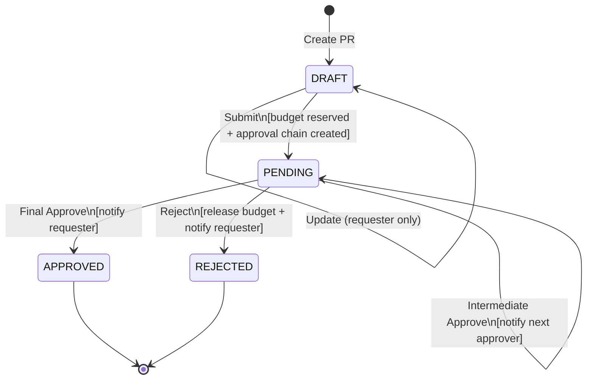
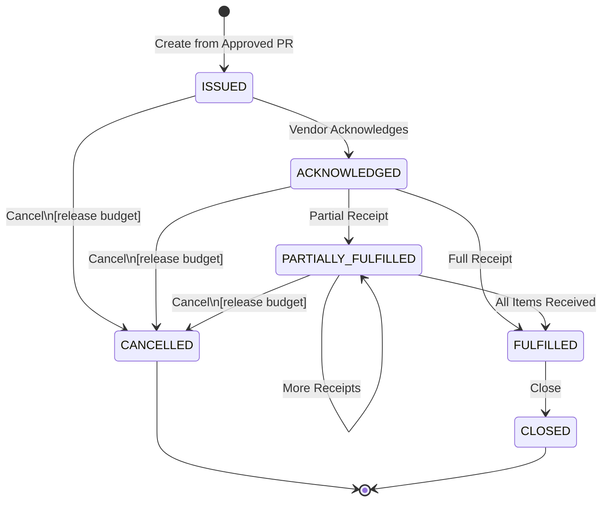
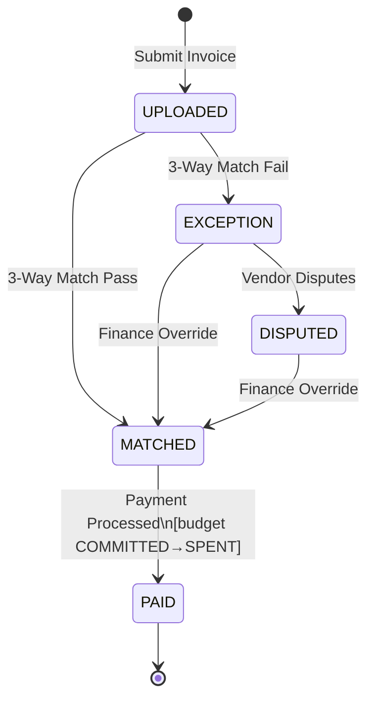
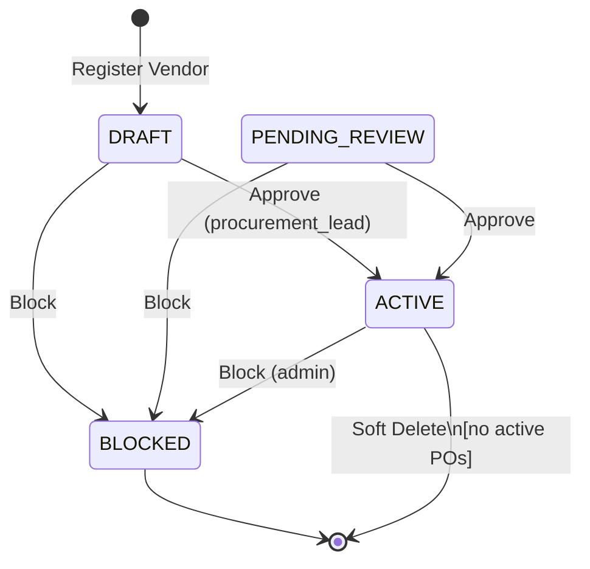
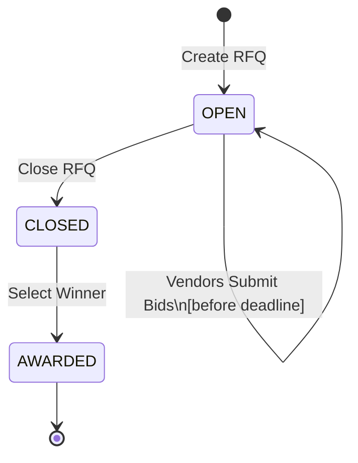
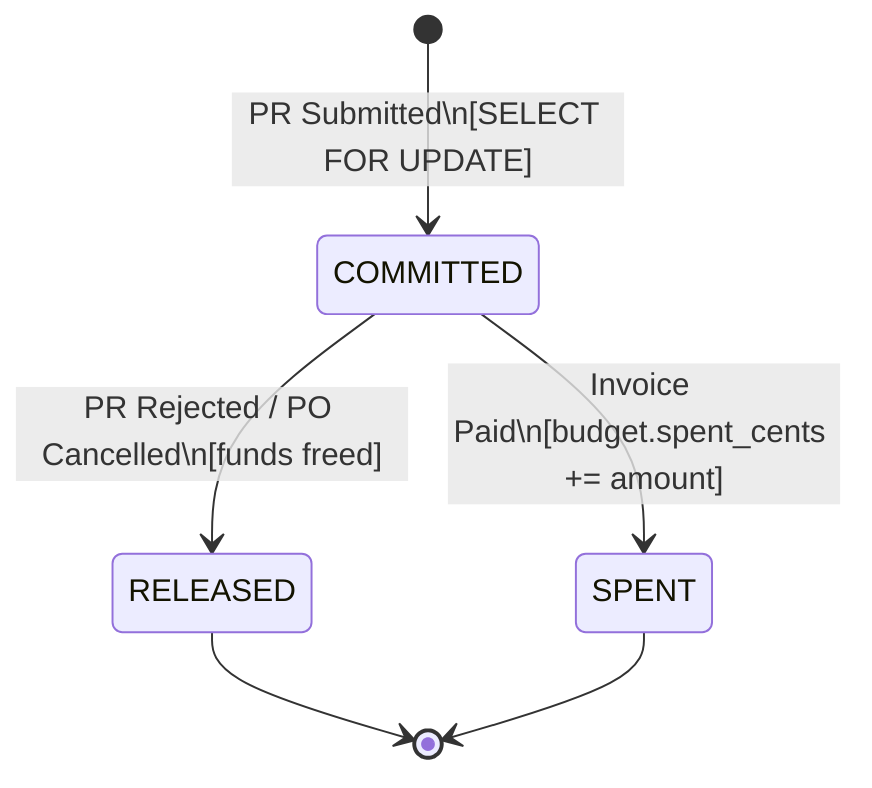
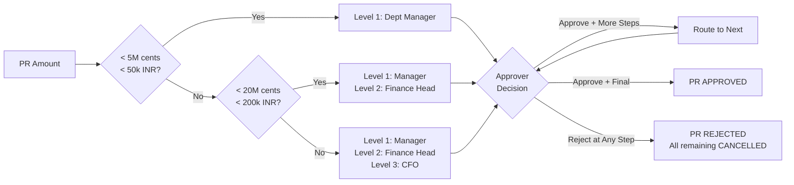
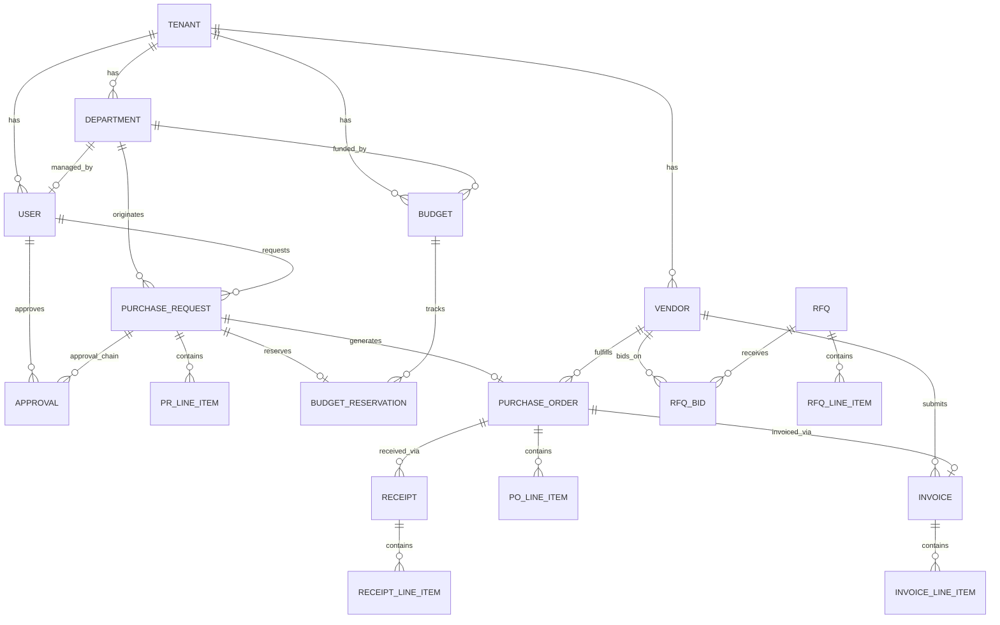

# SVPMS — System Logical Flow

## 1. End-to-End Procurement Lifecycle

```mermaid
flowchart TD
    subgraph AUTH["Authentication"]
        A1[User Login / Register] --> A2[JWT RS256 Token]
        A2 --> A3{Role?}
    end

    subgraph SETUP["Setup & Onboarding"]
        A3 -->|admin| S1[Create Tenant]
        S1 --> S2[Create Departments]
        S2 --> S3[Create Users & Assign Roles]
        S3 --> S4[Set Department Managers]
        S4 --> S5[Create Budgets per Dept/Quarter]

        A3 -->|procurement| V1[Register Vendor - DRAFT]
        V1 --> V2{Approve?}
        V2 -->|Yes| V3[Vendor ACTIVE]
        V2 -->|No / Block| V4[Vendor BLOCKED]
    end

    subgraph PR_FLOW["Purchase Request Flow"]
        A3 -->|procurement / manager / finance| PR1[Create PR - DRAFT]
        PR1 --> PR2[Add Line Items]
        PR2 --> PR3[Submit PR]
        PR3 --> BUD1{Budget\nAvailable?}
        BUD1 -->|No| PR_FAIL[422 Budget Exceeded]
        BUD1 -->|Yes| BUD2[Reserve Budget\nSELECT FOR UPDATE]
        BUD2 --> APR1[Create Approval Chain]
        APR1 --> PR4[PR Status: PENDING]
        PR4 --> NOTIFY1[Email First Approver]
    end

    subgraph APPROVAL["Approval Chain"]
        NOTIFY1 --> APR2{Amount\nThreshold?}
        APR2 -->|< 50k INR| APR3[Manager Only]
        APR2 -->|50k - 200k| APR4[Manager → Finance Head]
        APR2 -->|>= 200k INR| APR5[Manager → Finance Head → CFO]

        APR3 & APR4 & APR5 --> APR6{Current Approver\nDecision}
        APR6 -->|Approve| APR7{More Steps?}
        APR7 -->|Yes| APR8[Notify Next Approver]
        APR8 --> APR6
        APR7 -->|No - Final| PR5[PR Status: APPROVED]

        APR6 -->|Reject| PR6[PR Status: REJECTED]
        PR6 --> BUD3[Release Budget\nReservation]
        PR6 --> NOTIFY2[Email Requester\nwith Reason]
        PR5 --> NOTIFY3[Email Requester\nApproved]
    end

    subgraph PO_FLOW["Purchase Order Flow"]
        PR5 --> PO1[Create PO from PR\nCopy Line Items]
        V3 -.->|Vendor must be ACTIVE| PO1
        PO1 --> PO2[PO Status: ISSUED]
        PO2 --> PO3{Vendor\nAction}
        PO3 -->|Acknowledge| PO4[PO: ACKNOWLEDGED]
        PO3 -->|Cancel by Procurement| PO5[PO: CANCELLED]
        PO5 --> BUD4[Release Budget]
    end

    subgraph RFQ_FLOW["RFQ Flow - Optional"]
        PR5 -.->|Optional| RFQ1[Create RFQ]
        RFQ1 --> RFQ2[RFQ: OPEN]
        RFQ2 --> RFQ3[Vendors Submit Bids]
        RFQ3 --> RFQ4[Close RFQ]
        RFQ4 --> RFQ5[Select Winner]
        RFQ5 -.-> PO1
    end

    subgraph RECEIPT_FLOW["Goods Receipt"]
        PO4 --> REC1[Create Receipt / GRN]
        REC1 --> REC2[Update PO Line\nReceived Qty]
        REC2 --> REC3{All Lines\nFulfilled?}
        REC3 -->|Partial| PO6[PO: PARTIALLY_FULFILLED]
        PO6 --> REC1
        REC3 -->|Complete| PO7[PO: FULFILLED]
    end

    subgraph INVOICE_FLOW["Invoice & Payment"]
        PO7 --> INV1[Vendor Submits Invoice]
        INV1 --> INV2[Invoice: UPLOADED]
        INV2 --> INV3{3-Way Match\nPO vs Receipt\nvs Invoice}
        INV3 -->|Pass| INV4[Invoice: MATCHED]
        INV3 -->|Fail| INV5[Invoice: EXCEPTION]
        INV5 --> INV6{Action?}
        INV6 -->|Vendor Disputes| INV7[Invoice: DISPUTED]
        INV6 -->|Finance Override| INV4
        INV7 -->|Finance Override| INV4
        INV4 --> INV8[Process Payment - STUB]
        INV8 --> BUD5[Budget: COMMITTED → SPENT]
    end

    subgraph AUDIT["Cross-Cutting Concerns"]
        direction LR
        AUD1[Audit Logs\nAll State Changes]
        AUD2[Email Notifications\nBrevo API]
        AUD3[RLS Multi-Tenancy\ntenant_id on all tables]
    end

    style AUTH fill:#e1f5fe
    style SETUP fill:#f3e5f5
    style PR_FLOW fill:#e8f5e9
    style APPROVAL fill:#fff3e0
    style PO_FLOW fill:#fce4ec
    style RFQ_FLOW fill:#f1f8e9
    style RECEIPT_FLOW fill:#e0f2f1
    style INVOICE_FLOW fill:#fff8e1
    style AUDIT fill:#f5f5f5
```

## 2. State Machine — Purchase Request

## 3. State Machine — Purchase Order

## 4. State Machine — Invoice

## 5. State Machine — Vendor

## 6. State Machine — RFQ

## 7. Budget Reservation Lifecycle

## 8. Approval Chain Decision Tree

## 9. Entity Relationship Overview

